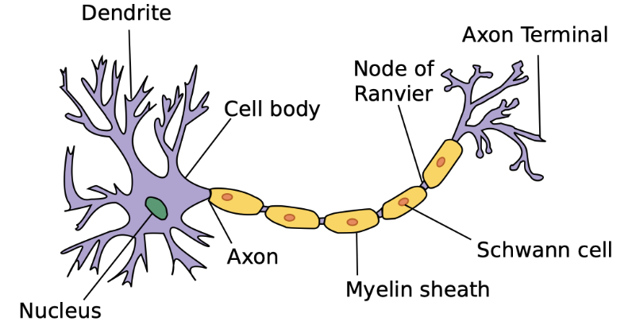
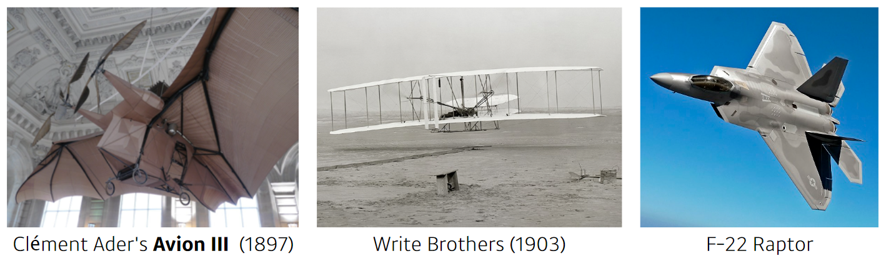
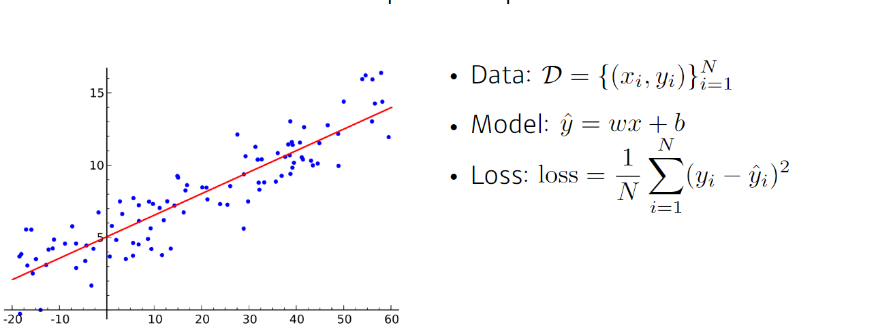
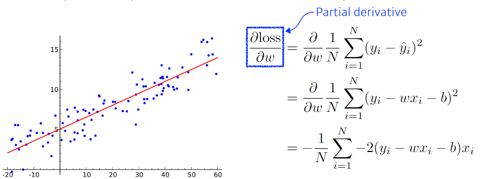
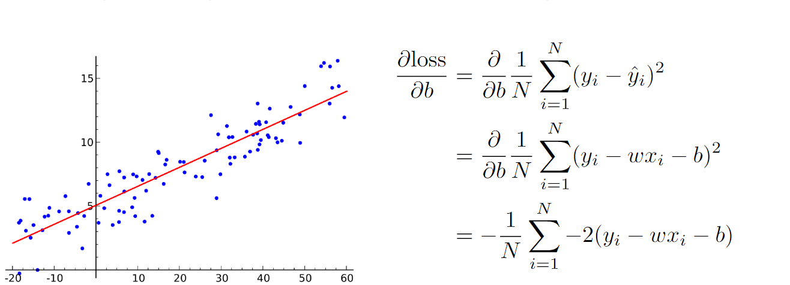
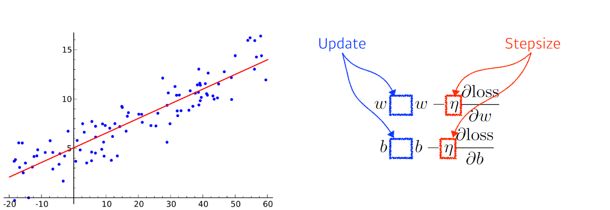
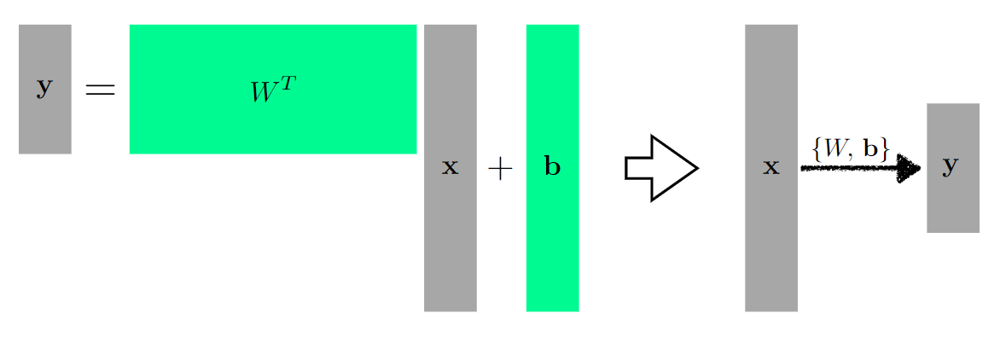
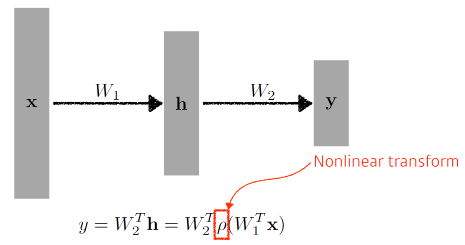
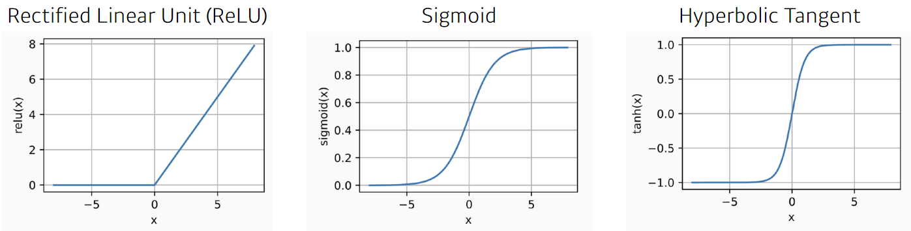
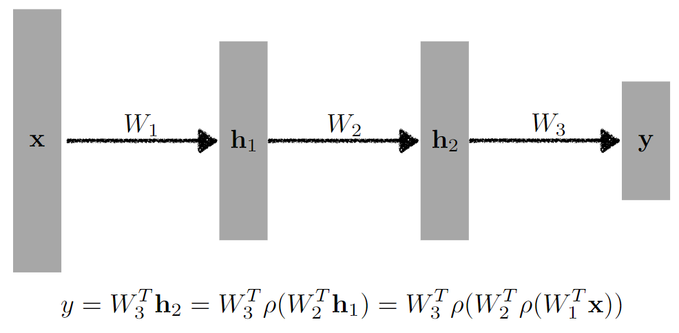

# 2강 뉴럴 네트워크 - MLP(Multi-Layer Perceptron)
**신경망(Neural Networks)**
간단한 Linear neural networks 를 예시로 Data, Model, Loss, Optimization algorithm 을 정의해보는 시간을 가집니다.
**Deep Neural Networks**
Deep Neural Netowkrs란 무엇이며 Multi-layer perceptron와 같이 더 깊은 네트워크는 어떻게 구성하는지에 대해 배웁니다.

## Neural Networks
- 신경망은 뇌의 모방?
    
- 하늘을 날고 싶다고 해서 항상 새처럼 날 이유는 없다!
    
    - 시작은 인간의 뇌를 모방하기 위해설진 모르겠지만,
    - 너무 많이 달라진 것이 사실
- 신경망은 비선형 변환을 가진 affine transformation을 쌓아서 만든 function approximator임
    - affine transformation: `Y=WX+b`

## Linear Neural Networks
- 간단한 선형회귀 문제를 신경망으로 풀어보자!
    - 예측값과 실제값의 차이를 줄이자! (차이는 보통 제곱으로 모델링하죠?)
    
- 가중치의 변화로 얼마나 loss를 줄일 수 있을까? (어떤 방향?)
    
- 편향의 변화로 얼마나 loss를 줄일 수 있을까? (어떤 방향)
    
- gradient descent로 parameter를 업데이트!
    - 방향은 편미분으로 구했어! 얼마나 갈지, 이전 state를 얼마나 반영할지는 step size와 최적화 알고리즘으로 정하자!
    
- 세상이 모수 하나로만 설명 가능하진 않아요 ㅎㅎ
    

## Beyond Linear NN
- Stacking and Add Non-linear transformation
    - 왜? 비선형 변환없이 쌓으면 단층 선형변환이랑 다를 바가 없음...
    - 네트워크가 표현할 수 있는 표현력을 극대화해야 함!
    
- 다양한 activation function 고려 가능
    
    - 겔루도 있음! 케바케
- 왜 잘되는가?
    - 인간의 뇌를 모방했기 때문에?
    - Universal Approximation Theorem
        - There is a single hidden layer feedforward network that approximates any measureable function to any desired degree of accuracy on some compact set K.
        - 이렇게 근사를 할 수 있는 function이 어딘가에 있다라는 거지 내가 만든 nn이 그렇다고 말해주는 것은 아님...

## Multi-Layer Perceptron

