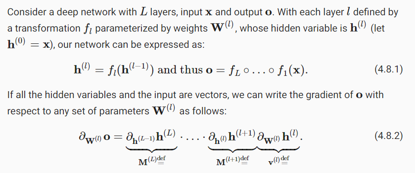
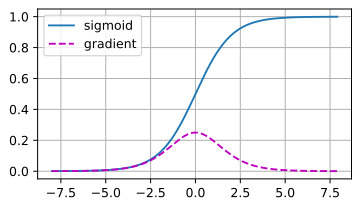
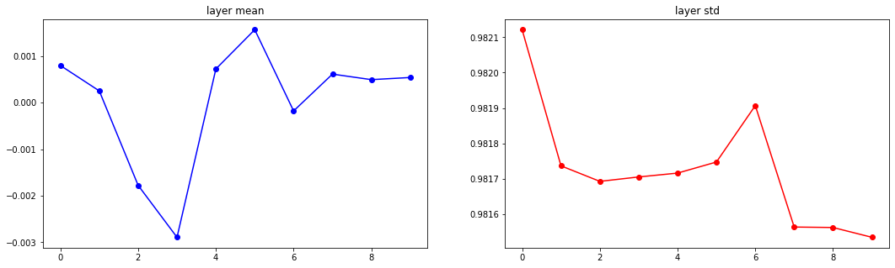
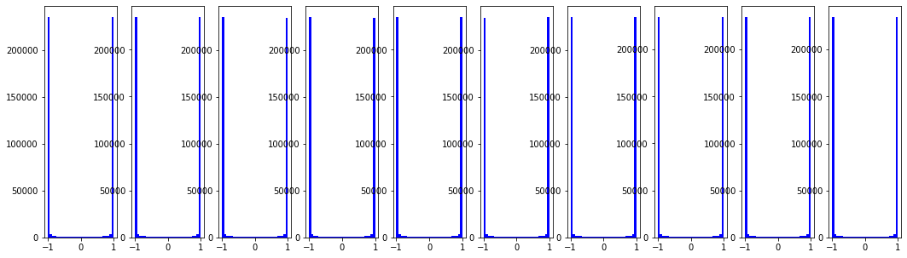
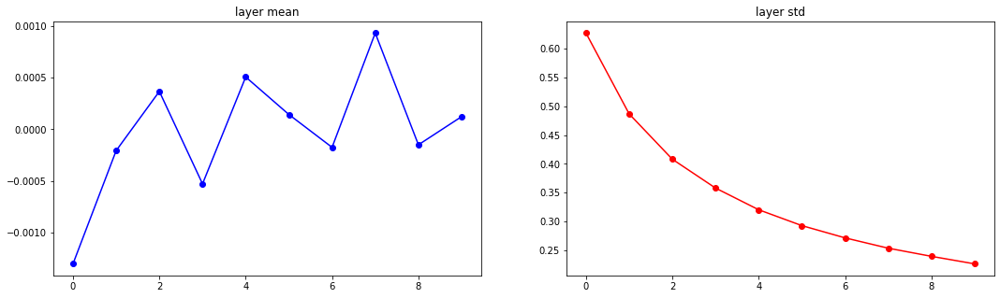
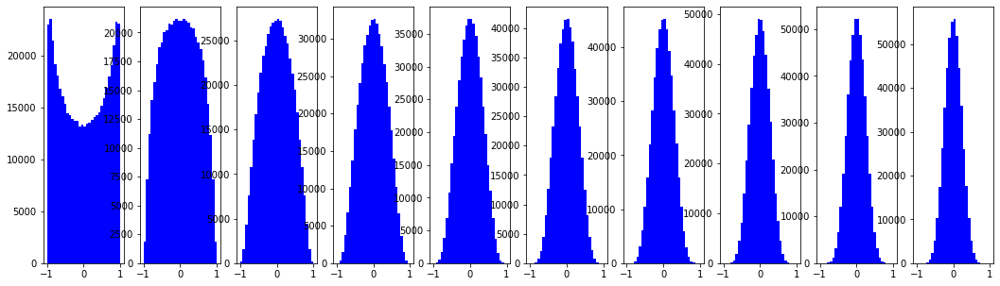
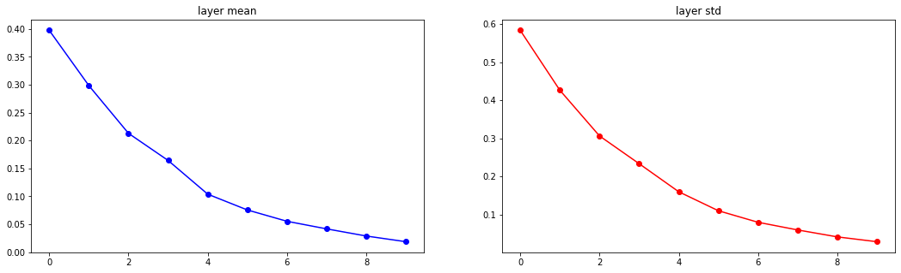
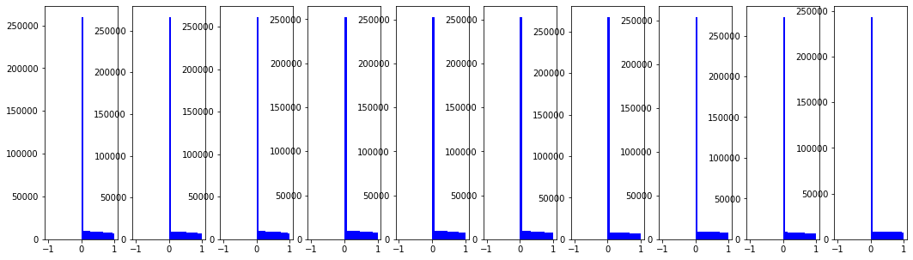

# Numerical Stability and Initlalization
- `박현병 멘토님`께서 가중치 초기화에 대한 내용을 첨언해주셔서 이에 대해 추가 학습, 공부하도록 하자!
- https://d2l.ai/chapter_multilayer-perceptrons/numerical-stability-and-init.html
- 보니까, CS231n에 나오는 내용이네...?
    - https://www.youtube.com/watch?v=wEoyxE0GP2M&list=PLC1qU-LWwrF64f4QKQT-Vg5Wr4qEE1Zxk&index=6

## why do this?
- 왜 학습 전에 가중치를 초기화해주는 걸까?
- 딥러닝 학습의 어려움을 극복하기 위한 방법 중 하나!
    - 오늘 강의 때 배운 `residual connection`이 될 수도 있다!
- 최적화에서 어떤 초기값에서 출발하느냐에 따라 local minimum 혹은 global minimum에 빠지느냐가 결정되기도 함
    - reference?
- 딥러닝은 거대한 feature space를 가지고 있음!
- 때문에 아래와 같이 조금은 다른 목적으로 사용됨
    - forward 시에는 전달되는 값이 너무너무 작아지거나 커지지 않도록
    - backward 시에는 gradient 값이 너무 작아지거나 (gradient vanishing) 너무 커지지 않도록 (gradient exploding)
- 가중치의 값을 적절히 초기화해야 한다!
- 경험에 의존해서 초기화!

### 추가적인 설명
- `d2l`에 의하면, random initialization 선택은 `Numerical Stability`를 유지하는데 중요하고
- 이는 `Nonlinear Activation`의 선택과 맞물려 흥미로운 선택으로 이어질 수 있다고 한다.
- 어떻게 잘 선택할 수 있을까?

## Vanishing and Exploding Gradients


- 위 setting에 의하면, 출력에 대해 `l`번째 layer 가중치에 대한 gradient는 `l`까지의 gradient들을 연쇄법칙으로 모두 곱한 값이 된다.
- 그러므로 많은 확률값을 곱할 때 발생하는 `underflow` 수치적 취약점이 존재한다.
- 보통은 위의 문제를 `log-scale`로 변환하여 해결하지만,... 우리의 문제는 더더욱 심각하다.
- 행렬 $M^{(l)}$을 초기화하는 것은 더 넓고 다양한 eigenvalues를 가지게 되고
- 그 값들의 분포가 커질수록 그 곱은 점점 아주아주 커지거나 아주아주 작아질 것이다.

#### unstable gradient
- 위의 불안정한 기울기 risk는 numerical representation 범위를 넘어선다.
- 왜냐? 예측할 수 없기에 이는 algorithm의 stability를 위협함
- `Exploding Gradient`: 지나치게 커서 모델을 파괴하는 parameter update에 직면
- `Vanishing Gradient`: 지나치게 작아서 update가 일어나지 않아 학습이 불가능

### Vanishing Gradient
- 많은 원인이 있겠지만, 보통은 활성화 함수 $\sigma$를 `sigmoid` 혹은 `tanh`를 사용하기에 나타난다.
- 왜 역사적으로 `sigmoid` 함수가 인기가 많았는가?
    - 이는 threshold function의 역할을 수행했기 때문
- 신경망의 초기엔 biological neural network에 영향을 받았기에 신경망을 활성화시킬지 아닐지를 정하는 threshold activation function이 선정되었음
- 이게 문제였던 것.

```python
%matplotlib inline
import torch
from d2l import torch as d2l

x = torch.arange(-8.0, 8.0, 0.1, requires_grad=True)
y = torch.sigmoid(x)
y.backward(torch.ones_like(x))

d2l.plot(x.detach().numpy(), [y.detach().numpy(), x.grad.numpy()],
         legend=['sigmoid', 'gradient'], figsize=(4.5, 2.5))
```


- sigmoid는 입력이 크거나 작을 때 모두 사라짐
- 더욱이 많은 입력이 0에 가까운 goldilocks 존에 있지 않으면 결국에 전체적인 gradient는 계속해서 사라질 것
- 이에 대한 해결책으로 `ReLU`가 제시됐었음

### Exploding Gradient
- 이를 설명하기 위해서 100개의 `Gaussian Random Matrix`와 `Initial Matrix`를 곱한다.
- 분산이 1일 때, 위 행렬곱은 explode한다

```python
M = torch.normal(0, 1, size=(4, 4))
print('a single matrix \n', M)
for i in range(100):
    M = torch.mm(M, torch.normal(0, 1, size=(4, 4)))

print('after multiplying 100 matrices\n', M)
```
```python
a single matrix
 tensor([[ 2.3130,  0.4845,  2.4217,  1.5831],
        [ 1.0648,  0.5190,  1.5449,  0.9124],
        [ 1.4851,  0.5607,  1.2543,  2.3616],
        [-0.4565, -0.2609,  2.2370,  0.5013]])
after multiplying 100 matrices
 tensor([[ 4.2615e+25, -1.7832e+25,  3.8954e+25, -2.8061e+25],
        [ 1.1544e+25, -4.8303e+24,  1.0552e+25, -7.6013e+24],
        [ 4.5788e+25, -1.9160e+25,  4.1855e+25, -3.0151e+25],
        [-2.1569e+25,  9.0252e+24, -1.9716e+25,  1.4203e+25]])
```

### Symmetry Breaking
- 멘토님 왈, uniform, normal로 가중치를 초기화를 해주는 이유가 `symmetry breaking`이라고 한다.
    - 아래의 레퍼런스들을 참고하면 좋을 것 같다!
    - https://stats.stackexchange.com/questions/45087/why-doesnt-backpropagation-work-when-you-initialize-the-weights-the-same-value
    - https://towardsdatascience.com/neural-network-breaking-the-symmetry-e04f963395dd
    - https://machinelearning.wtf/terms/symmetry-breaking/
    - https://stackoverflow.com/questions/20027598/why-should-weights-of-neural-networks-be-initialized-to-random-numbers
    - https://arxiv.org/abs/1710.06096
    - https://arxiv.org/abs/2003.09077
    - https://machinelearningmastery.com/why-initialize-a-neural-network-with-random-weights/
    - https://www.deeplearning.ai/ai-notes/initialization/
- 만일 모든 가중치가 동일한 값으로 시작하고 solution에서 동일하지 않은 가중치를 개발해야 하는 경우, system은 결코 학습할 수 없다
- 왜냐? 가중치 값에 비례하여 가중치를 통해 오차가 다시 전파되기 때문!
    - 가중치와 bias로 편미분된 값을 전파한다.
- zero initialization은 dead neuron problem을 야기시키고
- 모든 neuron의 값이 같다면 결국 같은 값을 출력하고 끝나게 된다.
    - 이를 `symmetry` 현상이라고 한다.
- 즉, `symmetry breaking`이란 기계학습 모델에 초기화의 필요성을 요구하는 것을 의미한다.
- 서로 서로에 대해 독립적인 weight로 학습을 시켜야 된다는 얘기
- 만약 layer의 모든 unit의 값이 전부 같다면, 각 unit은 정확이 같은 `error signal`을 받게 될 것임
- 다르게 학습되어야 한다. 즉, `symmetry`를 부셔야(`break`)한다.
- constant로 동일한 weight 기반으로 학습하면 역전파되는 값도 같고, hidden unit을 많이 두는 의미가 없음!
- 이걸 깨기 위해서 random initialization이 필요한거고
- 이렇게 깨더라도 too small 혹은 too big하게 될 수 있음

#### d2l의 설명
- 신경망 설계의 또 다른 문제!
    - 매개변수화에 내재된 대칭성 (`symmetry`)
- 각 layer의 hidden unit 간에 permutation symmetry가 있음
- 이 경우 hidden layer는 마치 하나의 unit이 있는 것처럼 동작함
- dropout regularization이 이 `symmetry`를 깨뜨리는 요인이 될 수 있음!


## Initialization Methods
- Glorot Xavier vs Kaiming He
- 초기화는 아래 두 원칙으로 해주는 것을 추천
    - `mean`은 0으로
    - `variance`는 각 layer별로 같게

### Theorical
- https://stats.stackexchange.com/questions/319323/whats-the-difference-between-variance-scaling-initializer-and-xavier-initialize/319849#319849
- `Xavier`은 `sigmoid` activation을 가진 layer에서 잘 동작함
- `He`는 `ReLU` activation을 가진 layer에서 잘 동작함
- `He`, 보통 kaiming이라고 언급하는 이게 수정본!
    - 왜냐, `ReLU`가 나중에 나왔잖아~
- `LeCun` initialization도 있는 모양~! Scaled Exponential Linear Unit


### Practical
아래에서 두 가지를 바꿔가며 가중치 초기화에 대한 실험을 진행
- nonlinearity
    - Xavier가 ReLU에선 효과가 미미하다는 것을 보이기 위해
- fan_in, fan_out randomize

```python
import numpy as np
import matplotlib.pyplot as plt

# assume some unit gaussian 10-D input data
D = np.random.randn(1000, 500)
hidden_layer_sizes = [500] * 10
nonlinearities = ["tanh"] * len(hidden_layer_sizes)
# nonlinearities = ["relu"] * len(hidden_layer_sizes)


def relu(x):
    return np.maximum(x, 0)


act = {"relu": relu, "tanh": np.tanh}
Hs = {}
for i in range(len(hidden_layer_sizes)):
    X = D if i == 0 else Hs[i-1] # input at this layer
    fan_in = X.shape[1]
    fan_out = hidden_layer_sizes[i]
    # ==================================================
    #          Write Your Initialization Code
    # ==================================================
    W = np.random.randn(fan_in, fan_out) * 0.01
    # ==================================================
    H = np.dot(X, W) # matrix multiply
    H = act[nonlinearities[i]](H) # nonlinearity
    Hs[i] = H # cache result on this layer

# look at distributions at each layer
print(f"input layer had mean {np.mean(D):.5f} and std {np.std(D):.5f}")
layer_means = [np.mean(H) for i, H in Hs.items()]
layer_stds = [np.std(H) for i, H in Hs.items()]
for i, H in Hs.items():
    print(f"hidden layer {i+1} had mean {layer_means[i]:.5f} and std {layer_stds[i]:.5f}")

# plot the means and standard deviations
plt.figure(figsize=(18, 5))
plt.subplot(121)
plt.plot(Hs.keys(), layer_means, 'ob-')
plt.title("layer mean")
plt.subplot(122)
plt.plot(Hs.keys(), layer_stds, 'or-')
plt.title("layer std")

# plot the raw distributions
plt.figure(figsize=(18, 5))
for i, H in Hs.items():
    plt.subplot(1, len(Hs), i+1)
    plt.hist(H.ravel(), 30, range=(-1,1), color='b')
plt.show()
```

- Small random numbers
    - gaussian with zero mean and `1e-2` standard deviation
    ```python
    W = 0.01 * np.random.randn(fan_in, fan_out)
    ```
    ```
    input layer had mean 0.00072 and std 0.99878
    hidden layer 1 had mean 0.00010 and std 0.21314
    hidden layer 2 had mean -0.00002 and std 0.04746
    hidden layer 3 had mean -0.00001 and std 0.01053
    hidden layer 4 had mean 0.00000 and std 0.00234
    hidden layer 5 had mean -0.00000 and std 0.00052
    hidden layer 6 had mean 0.00000 and std 0.00012
    hidden layer 7 had mean 0.00000 and std 0.00003
    hidden layer 8 had mean 0.00000 and std 0.00001
    hidden layer 9 had mean 0.00000 and std 0.00000
    hidden layer 10 had mean -0.00000 and std 0.00000
    ```
    

    

    - All activations become zero!

- Large random numbers
    - gaussian with zero mean and `1.0` standard deviation
    ```python
    W = 1.0 * np.random.randn(fan_in, fan_out)
    ```
    ```
    input layer had mean -0.00158 and std 0.99979
    hidden layer 1 had mean 0.00080 and std 0.98212
    hidden layer 2 had mean 0.00025 and std 0.98174
    hidden layer 3 had mean -0.00178 and std 0.98169
    hidden layer 4 had mean -0.00289 and std 0.98170
    hidden layer 5 had mean 0.00072 and std 0.98172
    hidden layer 6 had mean 0.00157 and std 0.98175
    hidden layer 7 had mean -0.00018 and std 0.98191
    hidden layer 8 had mean 0.00061 and std 0.98156
    hidden layer 9 had mean 0.00049 and std 0.98156
    hidden layer 10 had mean 0.00054 and std 0.98153
    ```
    

    

    - Almost all neurons completely saturated, either -1 and 1
    - Gradient들이 전부 0이 될거임

- `Xavier Initialization` with `tanh`
    - Glorot et al., 2010
    - Reasonable Initialization (Mathematical derivation assumes linear activations)
    ```python
    W = np.random.randn(fan_in, fan_out) / np.sqrt(fan_in)
    ```
    ```
    input layer had mean 0.00029 and std 0.99883
    hidden layer 1 had mean -0.00130 and std 0.62751
    hidden layer 2 had mean -0.00021 and std 0.48695
    hidden layer 3 had mean 0.00037 and std 0.40813
    hidden layer 4 had mean -0.00053 and std 0.35797
    hidden layer 5 had mean 0.00051 and std 0.32023
    hidden layer 6 had mean 0.00014 and std 0.29264
    hidden layer 7 had mean -0.00017 and std 0.27133
    hidden layer 8 had mean 0.00093 and std 0.25339
    hidden layer 9 had mean -0.00015 and std 0.23924
    hidden layer 10 had mean 0.00012 and std 0.22615
    ```
    

    

    - 합리적인 수학적 초기화 방법!!

- `Xavier Initialization` with `ReLU`
    - 하지만 ReLU와의 결과는...
    ```python
    W = np.random.randn(fan_in, fan_out) / np.sqrt(fan_in)
    ```
    ```
    input layer had mean 0.00116 and std 0.99877
    hidden layer 1 had mean 0.39760 and std 0.58348
    hidden layer 2 had mean 0.29851 and std 0.42625
    hidden layer 3 had mean 0.21297 and std 0.30635
    hidden layer 4 had mean 0.16434 and std 0.23351
    hidden layer 5 had mean 0.10390 and std 0.15980
    hidden layer 6 had mean 0.07563 and std 0.11001
    hidden layer 7 had mean 0.05533 and std 0.07977
    hidden layer 8 had mean 0.04175 and std 0.05965
    hidden layer 9 had mean 0.02895 and std 0.04146
    hidden layer 10 had mean 0.01876 and std 0.02879
    ```
    

    

    - ReLU를 사용하면 값이 또 깨지기 시작함...
    - Collapse 현상 발생...

- `Kaiming He Initialization` with `ReLU`
    - Note that: additional `/2`
    - He et al., 2015
    ```python
    W = np.random.randn(fan_in, fan_out) / np.sqrt(fan_in)
    ```
    ```
    input layer had mean 0.00044 and std 1.00103
    hidden layer 1 had mean 0.56302 and std 0.82658
    hidden layer 2 had mean 0.54113 and std 0.81089
    hidden layer 3 had mean 0.55475 and std 0.82147
    hidden layer 4 had mean 0.58443 and std 0.83353
    hidden layer 5 had mean 0.58926 and std 0.85054
    hidden layer 6 had mean 0.61146 and std 0.89148
    hidden layer 7 had mean 0.58671 and std 0.88133
    hidden layer 8 had mean 0.61084 and std 0.90233
    hidden layer 9 had mean 0.55894 and std 0.85416
    hidden layer 10 had mean 0.64876 and std 0.88908
    ```
    

    

    - 이렇게 바꿔준 경우 wow 깨지지 않는 것을 확인 가능함!


### Mathematical
