# 5강 Modern Convolutional Neural Networks
ILSVRC라는 Visual Recognition Challenge와 대회에서 수상을 했던 5개 Network 들의 주요 아이디어와 구조에 대해 배웁니다.

**Network list**

- AlexNet
    - 최초로 Deep Learning을 이용하여 ILSVRC에서 수상.
- VGGNet
    - 3x3 Convolution을 이용하여 Receptive field는 유지하면서 더 깊은 네트워크를 구성.
    - Receptive field 참고 자료
- GoogLeNet
    - Inception blocks 을 제안.
- ResNet
    - Residual connection(Skip connection)이라는 구조를 제안.
    - h(x) = f(x) + x 의 구조
- DenseNet
    - Resnet과 비슷한 아이디어지만 Addition이 아닌 Concatenation을 적용한 CNN.

[back to super](https://github.com/jinmang2/BoostCamp_AI_Tech_2/tree/main/u-stage/dl_basic)

## ILSVRC
- ImageNet Large-Scale Visual Recognition Challenge
    - Classification / Detection / Localization / Segmentation
    - 1,000 different categories
    - Over 1 Million images
    - Training set: 456,567 images

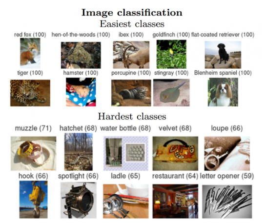

- Human 성능은? Andrew 캇파티... ㅎ

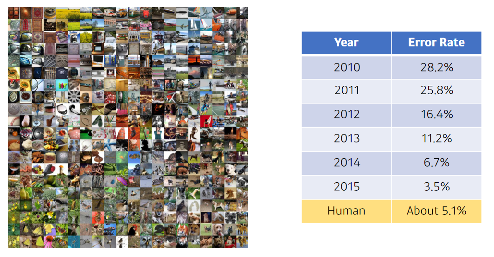

## AlexNet
- Network가 2개로 나뉘어져 있음
- GPU 효율성을 위해서!
- parameter 관점에서 보면 `11 X 11`은 좋은 선택이 아님
    - receptive field는 증가하지만 parameter의 수가 증가

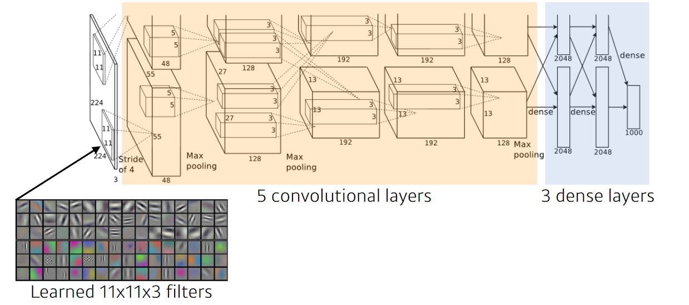

### Key Ideas
지금보면 너무나 당연한 전략들! 그러나 당시엔 당연하진 않았음

- ReLU
    - 선형 모델의 성질을 보존
    - gradient descent로 최적화하기가 쉬움
    - 일반화가 좋음
    - vanishing gradient 문제 극복
    - 더 깊은 depth layer를 쌓을 수 있다!
        - 여기서 depth는 layer의 수를 의미하는 것 같음
- GPI Implementation (2 GPUs)
- Local response normalization, Overlapping pooling
    - 큰 신호에 패널티를 주는 방법
- Data augmentation
- Dropout

## VGGNet
- depth를 `3 X 3`filter로 증가시킴
- fully connected는 `1 X 1` conv
- Dropout
- layer 수에 따라 VGG16, VGG19로 이름이 붙여짐
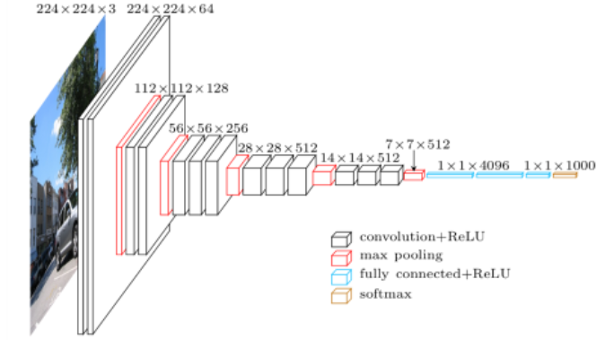

### Why `3 X 3` convolution?
- conv filter의 크기를 키운다?
    - 하나의 conv filter에서 고려되는 input의 size가 커짐
    - receptive field!
- `5 X 5` 하나는 `3 X 3` 두 번의 receptive field 차원에서 동일함!
    - ((receptive field - 3 + 1) -3 +1) = 1
    - 즉, 5
- 동일하다면, layer를 더 많이 쌓는게 더 좋겠죠?
- 그리고 parameter의 수도 더 적음!
    - `3*3*128*128+3*3*128*128=294,912`
    - `5*5*128*128=409,600`
    - parameter의 수를 더욱 줄일 수 있음!

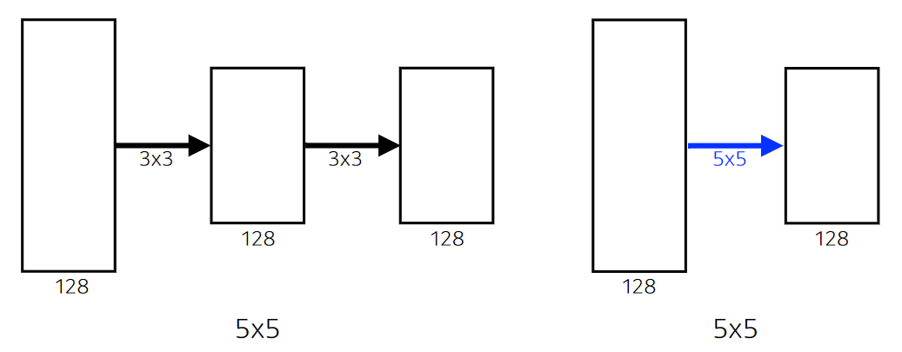

## GoogleNet
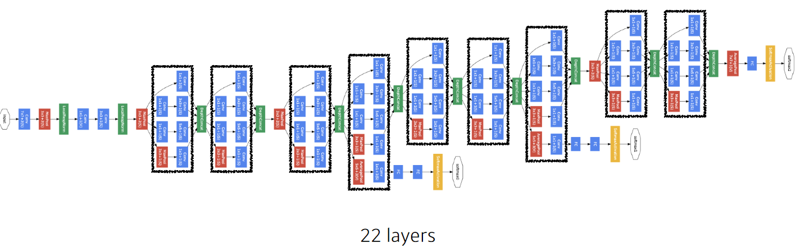

- `1 X 1` conv는 dimension reduction 효과가 있음
- spatial receptive field를 늘리기엔 `1 X 1` conv층을 잘 활용하는 것이 좋음!
- 즉, 아래의 inception block의 `Network in network`을 잘 활용한 모델

### Inception Block

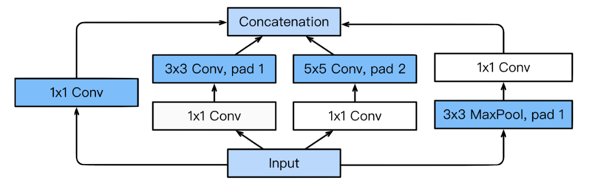

- 여러 개의 결과를 concat하는 것도 중요한 factor
- 여기서 정말 중요한 것은 `1 X 1`!! paramter의 수를 줄이는 효과
- 어떻게?
    - `1 X 1` Convolution은 channel-wise의 dimension reduction로 볼 수 있다.

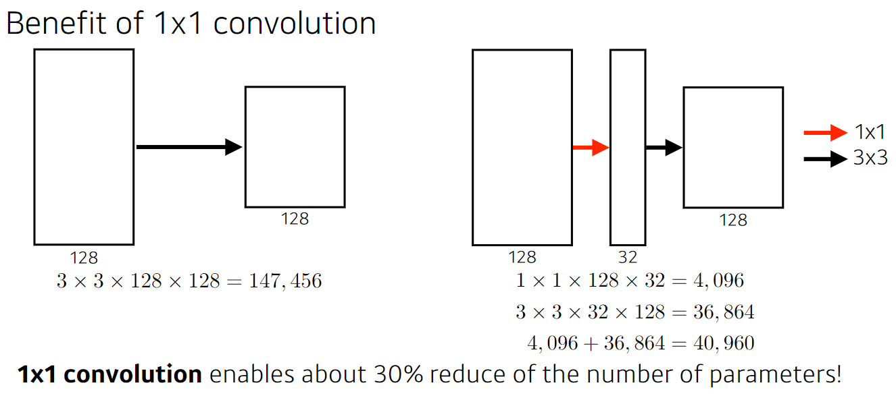

- n_channels가 128
- spatial은 중요하지 않음! parameter의 수와 관계없음

**Quiz!**
- 어떤 CNN 구조가 가장 적은 parameter를 가질까요?
- AlexNet (8-layers) **(60M)**
- VGGNet (19-layers) **(110M)**
- GoogleNet (22-layers) **(4M)**

## ResNet
- NN을 깊게 쌓으면 학습이 힘듦
    - Overfitting이 주로 원인으로 추정되나, 여기선 그게 아님
- 문제는 뭐냐, training error가 더 작음에도 불구하고 saturated된 test error가 더 큰 것
- saturated? 가득찬!!

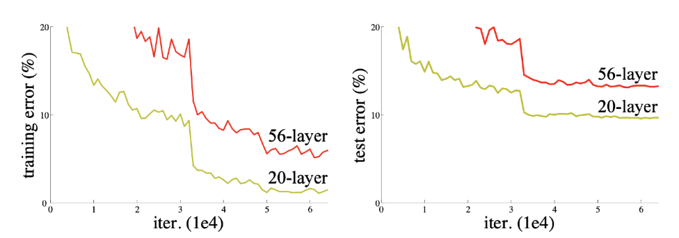

### Residual connection
- Add an identity map  (skip connection)
- 차이만 학습하자!!

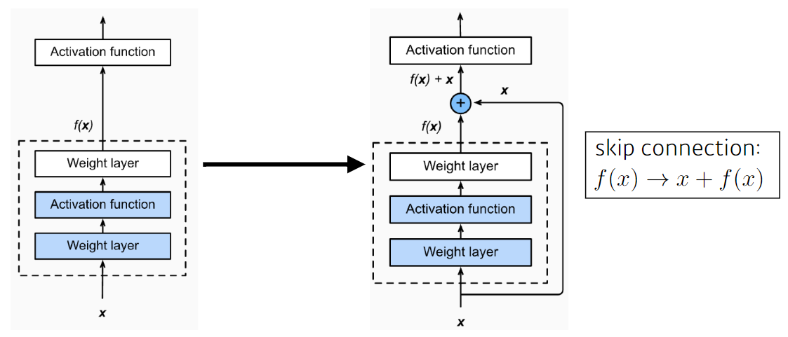

- layer를 더 많이 쌓으면 test error 낮아짐!! 휴우...
    - 학습이 안되던게 훨씬 더 깊게 쌓아도 학습을 가능케!

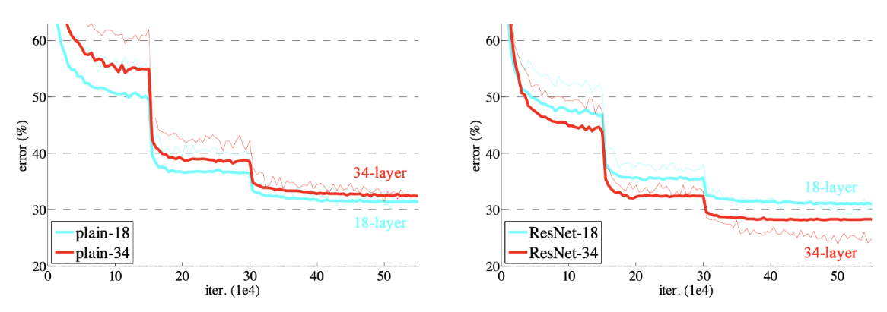

- Add an identity map after nonlinear activations

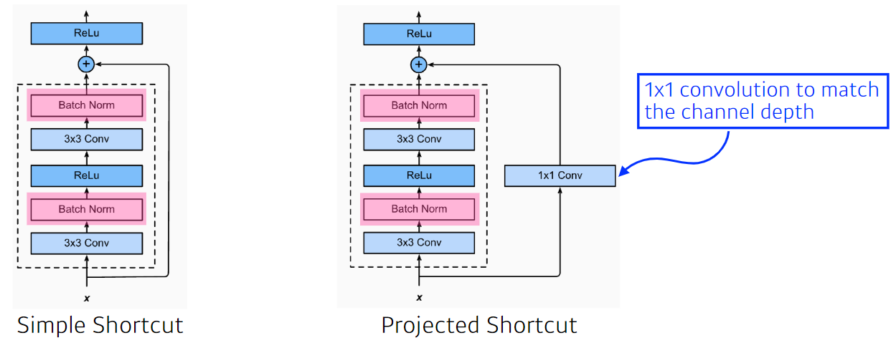

- Bottleneck architecture

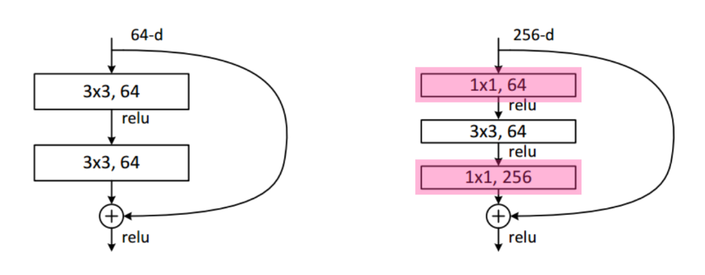

- Performance increases while parameter size decreases

## DenseNet
- addition 대신에 concatenation을 사용

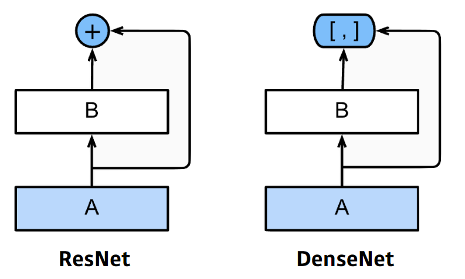

- 문제는 concat하면 차원이 점점 커짐

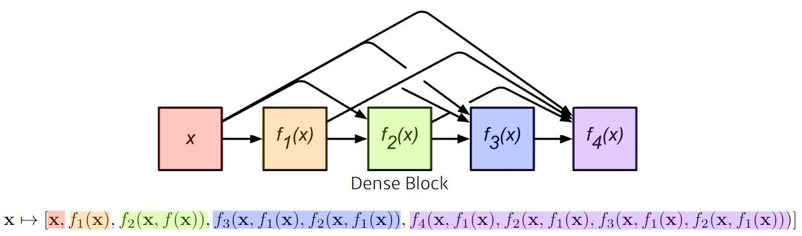

- 중간에 한 번씩 channel을 줄이자!

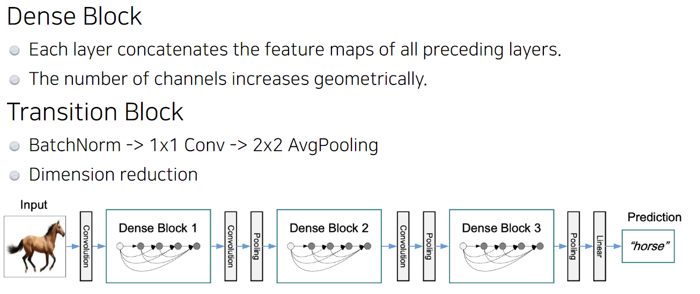

## Summary
- VGG: repeated `3 X 3` blocks
- GoogleNet: `1 X 1` convolution
- ResNet: `skip-connection`
- DenseNet: `concatenation`

## 피어세션 피드백
- (GoogleNet) 파라미터의 숫자가 줄어드는데 왜 모델이 정확해지는지?
    - 그만큼 모델을 더 깊게 쌓을 수 있기 때문
- feature map vs receptive field
    - feature map은 conv의 출력
        - spatial dimension에 종속적
    - receptive field는 kernel 수용 가능 범위
        - spatial dimension과 독립적
