# 6강 Computer Vision Applications

- Computer Vision 에서 CNN을 이용한 분야를 알아보고자 합니다.
- **Semantic segmentation** 의 정의, 핵심 아이디어에 대해 배웁니다.
- **Object detection** 의 정의, 핵심 아이디어, 추가적으로 종류에 대해 배웁니다.

[back to super](https://github.com/jinmang2/boostcamp_ai_tech_2/tree/main/u-stage/dl_basic)

## Semantic Segmentation
- 이미지의 pixel이 어떤 라벨에 속하는지 모두 분류!

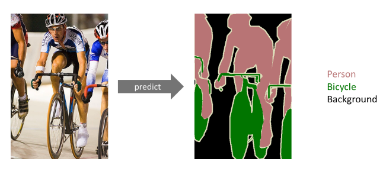

- 감시카메라 등!

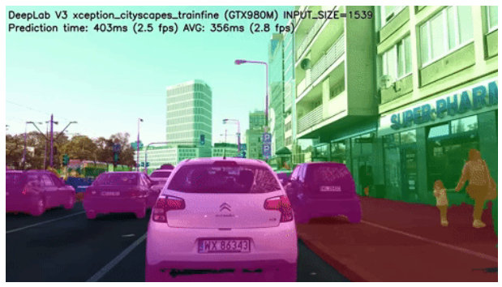

### FCN
- ordinary cnn

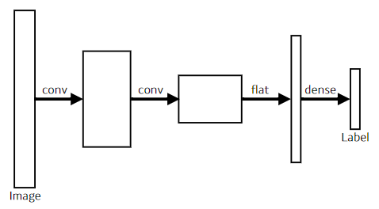

- fully cnn

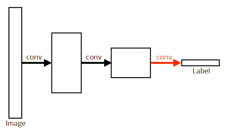

- `Convolutionalization`!
    - left와 right의 parameter는 `4*4*16*10=2,560`으로 동일하다!

- FCN을 conv layer로 고치면 좋은게,
    - spatial dimension에 independent함
    - output이 커지면 그에 따라 뒷 단의 conv가 비례해서 커짐
    - cnn의 shared parameter 효과
    - 그 동작이 heatmap과 같이 나오게 됨
    - `100 X 100`에서 `10 X 10`으로 작아졌지만, (예시)
    - coarse하지만 heatmap을 나눌 가능성이 생김!

        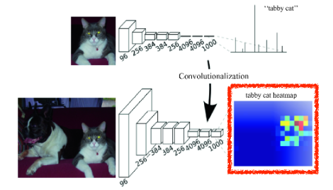

### Deconvolution

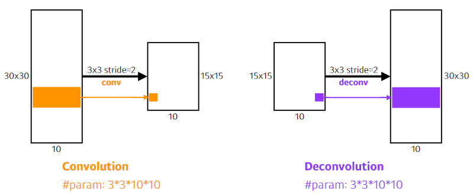

- Conv transpose, Unpooling 등
- 늘려주는 역할을 수행
- interpolation!
- 복원은 불가능함! (이게 convolution의 역은 아님.)
- 3+7=10, 2+8=10, 복원은 불가능함

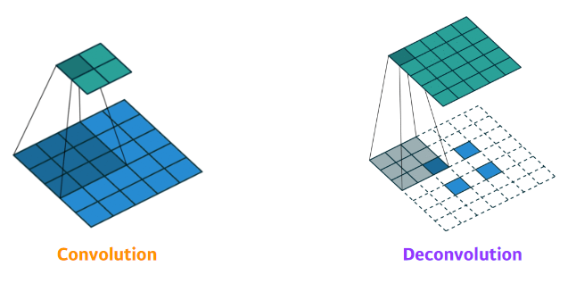

### Results

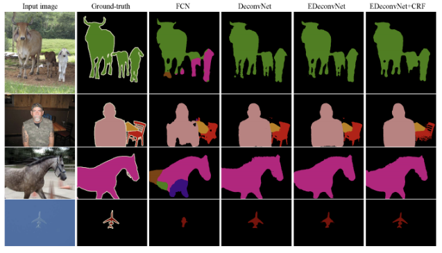

## Detection
- 이미지 안에서 어떤 물체가 어디에 있나?
- pixel이 아니라 bounding box로 구분!

### R-CNN
- 어찌보면 굉장히 무식한 방법

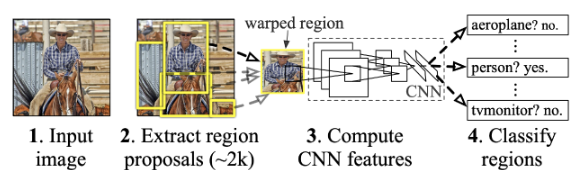

1. input image를 받음
2. 2,000개의 region proposals를 seletive search로 뽑음
    - 저것도 알고리즘
3. 각 proposal을 AlexNet들을 사용하여 feature extraction
4. SVM으로 분류

- 아래 결과! bounding regression은 생략
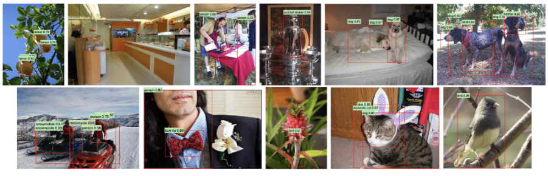

### SPPNet
- R-CNN의 가장 큰 문제? image 안에서 뽑은 2,000개의 patch를 전부 CNN에 태워야 함
- 이미지 안에서 CNN을 한 번만 돌리자!
- 뽑힌 Tensor만, bounding feature를 뜯어오자!
- R-CNN 대비 훨씬 빠름

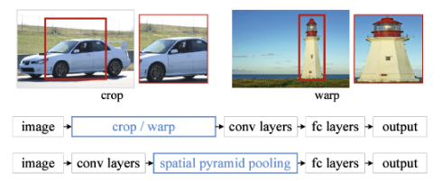

- 뜯어온 feature map을 어떻게 잘 사용하나? 이게 논문 제목인데 관심있으면 읽어볼 것!
- Concept? CNN을 한 번만 돌리자!

### Fast R-CNN
- SPPNet과 동일한 concept

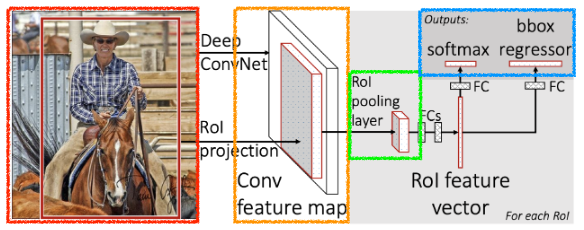

1. semantic search로 bounding box 뽑음
2. Convolution feature map 뽑음
3. 각 region에 대해 `ROI Pooling`으로 고정된 길이의 feature를 얻음
4. NN을 통해 class 분류와 bounding-box regression 실시

### Faster R-CNN
- 아이디어? bounding box를 뽑는 것도 학습시키자!
    - Region Proposal Network

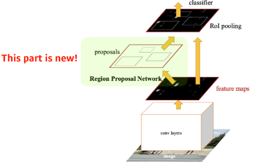

- 즉, Faster R-CNN = Region Proposal Network + Fast R-CNN

#### Region Proposal Network
- 이미지가 있으면 특정 영역이 bounding box로써의 의미가 있을지 없을지를 학습
    - Region Proposal!
- `Anchor Box`: 미리 정해놓은 bounding box의 크기!
    - 미리 template을 만들어놓고 얼마나 바뀔지?
    - 미리 조정해놓는 것이 목적

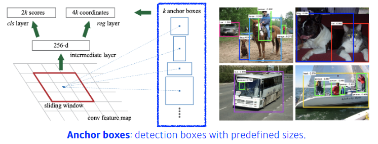

- Fully Convolution Network가 여기서도 사용됨
    - conv feature map을 모든 영역을 돌면서 뽑는 것
    - 어떤 영역에서 뽑을 지를 fully conv가 들고 있음

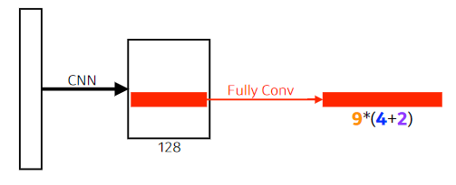

- `9`: 세 개의 다른 region sizes(128, 256, 512)와 세 개의 다른 비율(1:1, 1:2, 2:1)
    - combination으로 계산
- `4`: 각각의 region size마다 bounding box를 얼마나 키울지
    - 상하좌우
- `2`: 박스가 쓸만한지 아닌지 분류 (Yes/No)

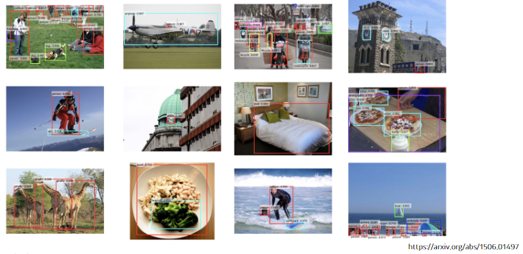

- 결과가 조금 더 잘 나옴
- fine-grained함

### YOLO v1

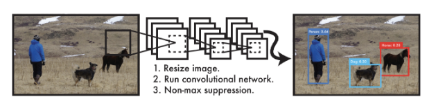

- 굉장히 빠름!
    - basline은 45fps, smaller는 155fps
- 다양한 bounding box들과 class 확률을 동시에 예측! (`simultaneously`)
    - 명시적인 box sampling이 없음
    - 한번에 하기 때문에 속도가 빠름

#### Step 1

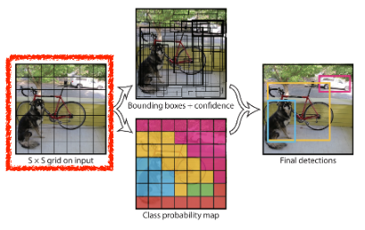

- 이미지가 들어오면, 이미지를 S by S 그리드로 다룸
- 우리가 찾고 싶은 물체가 해당 그리드에 들어있다면,
    - 해당 물체에 대한 bounding box와 해당 물체가 무엇인지를 예측

#### Step 2-1

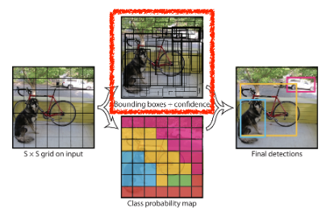

- b개의 bounding box를 예측
    - box refinement (x / y / w / h)
    - box probability예측

#### Step 2-2
- step 2-1과 동시에 일어남!

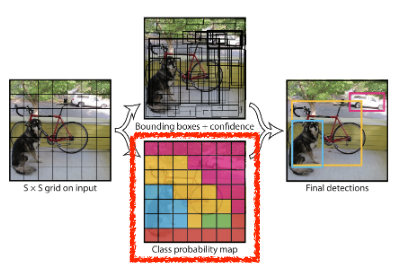

- bounding box, grid cell의 center가 어떤 class일지 확률을 예측

#### Step 3

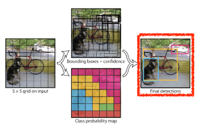

- Step 2의 정보를 취합!
- `S X S X (B * 5 + c)`
    - `S X S`: 그리드 셀의 갯수
    - `B * 5` : bounding box 위치 (x, y, w, h)와 confidence
    - `C`: class의 수

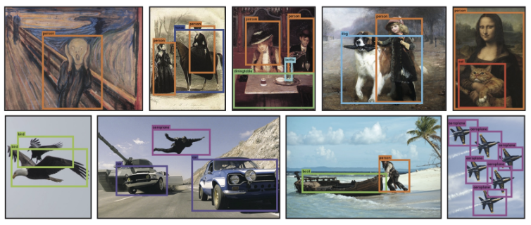
