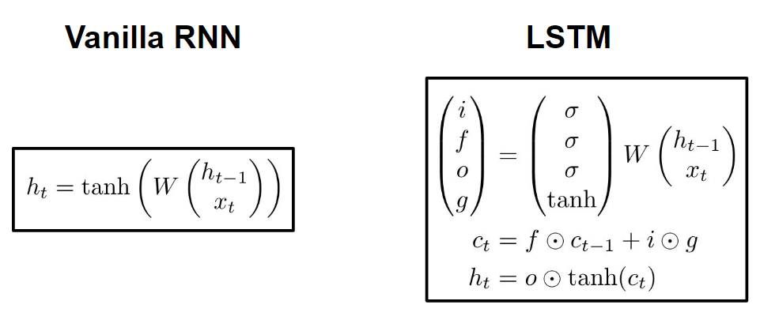
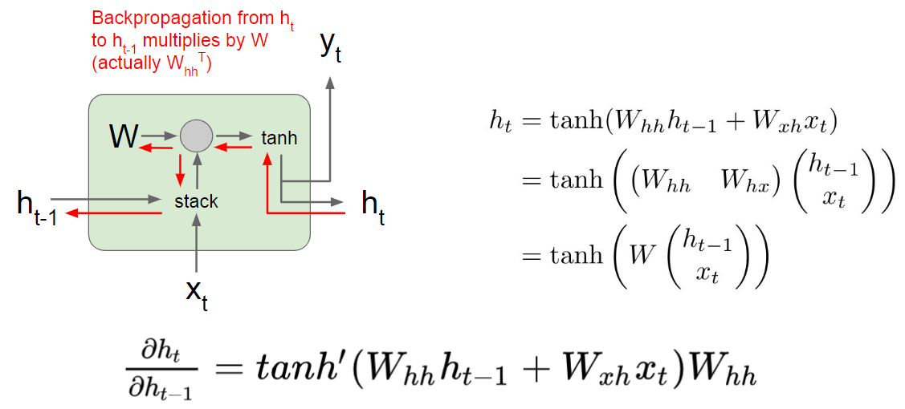
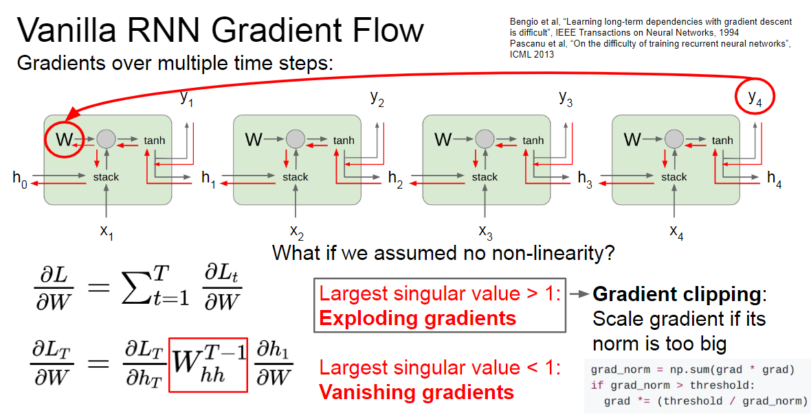
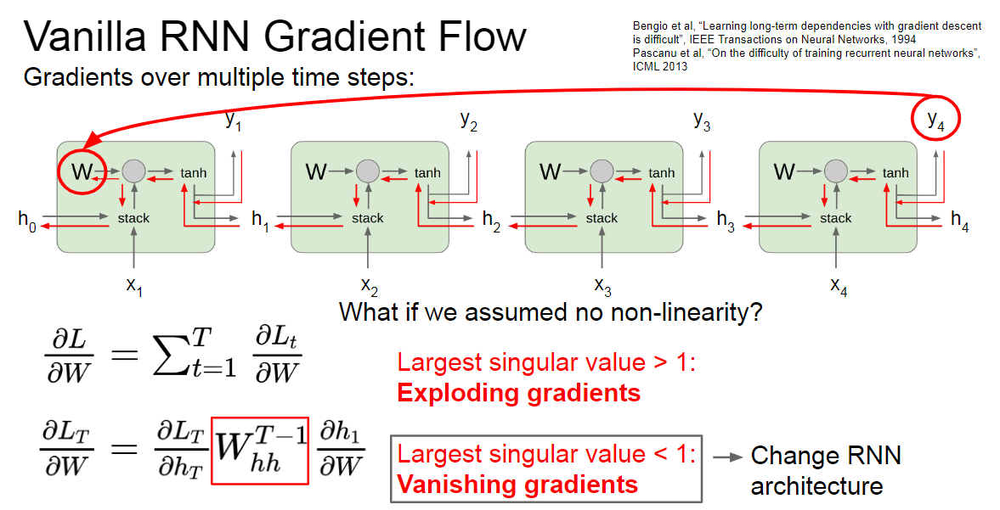
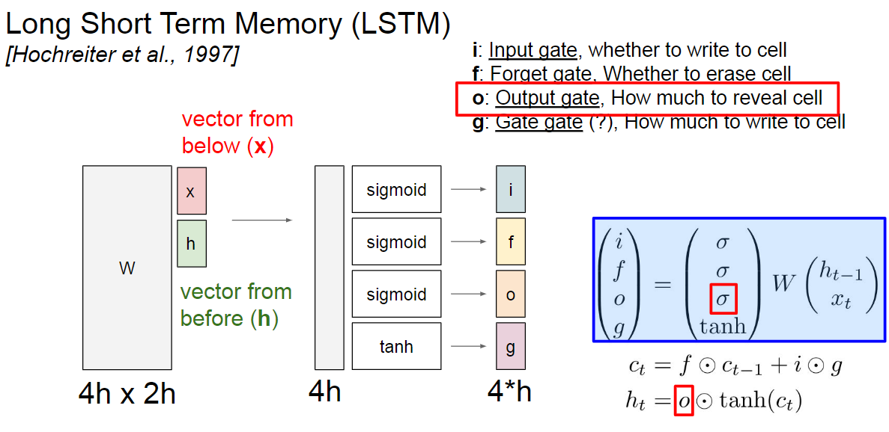
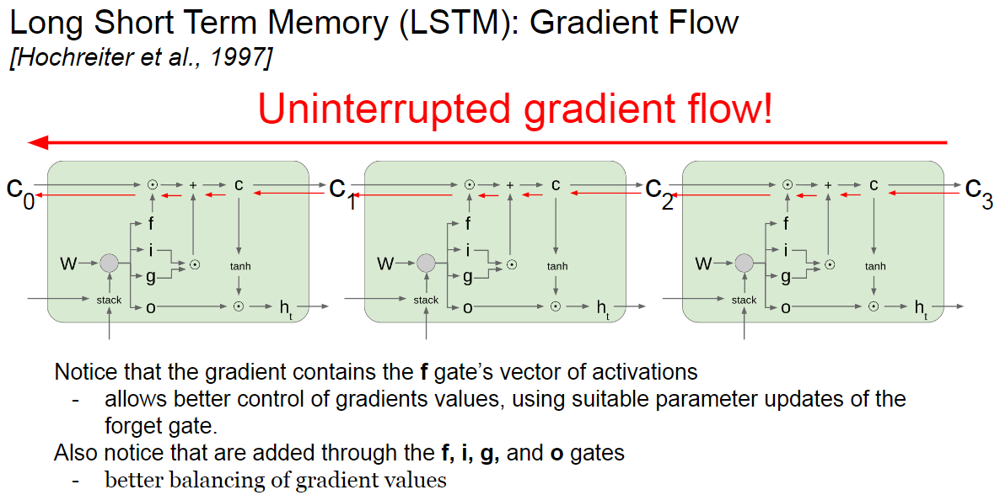
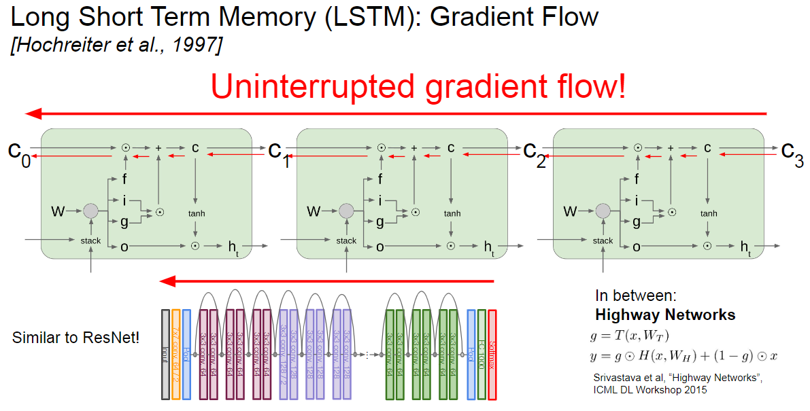
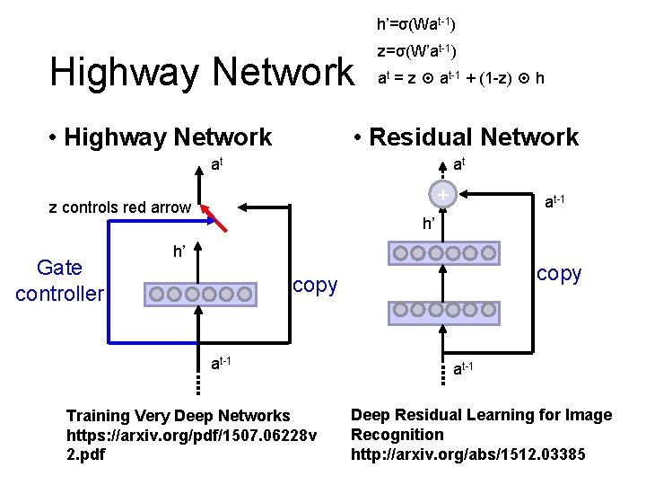

# Further Questions

## RNN
- LSTM에서는 Modern CNN 내용에서 배웠던 중요한 개념이 적용되어 있습니다. 무엇일까요?
- Pytorch LSTM 클래스에서 3dim 데이터`(batch_size, sequence_length, num_features)`, `batch_first` 관련 argument는 중요한 역할을 합니다. `batch_first=True`인 경우는 어떻게 작동되는 걸까요?

## Q1. Residual Connection and LSTM
- LSTM은 우리가 Modern CNN 강의에서 배운 `Residual Connection`과 관련이 깊다!
- 이에 영감을 받아서 나온 `Highway Network`는 residual connection의 상위호환같은 게이트임
    - http://tmmse.xyz/2016/10/15/lstm-resnet/
    - http://cs231n.stanford.edu/slides/2021/lecture_10.pdf

### RNN에서 LSTM으로 가기까지...



### Gradient Flow



- 이게 임성빈 교수님 강의 시간에도 나왔지만, path가 길어지면서 bottleneck이 생김
- 지금 이 현상은 layer를 깊이 안 쌓았는데도 이러는 것! (depth=1임)
- 보면 input에 대해선 summation이지만 hidden state에 대해선 product임


### Why `tanh`?
- `ReLU` 사용하면 되는거 아닌가? 왜 굳이?
- lstm에서 sigmoid는 analog swiching!
- 옮기고자 하는 실질적인 정보는 `tanh`로 담아서 넘긴다!
- 그렇다면 왜 `ReLU`가 아니라 `tanh`인가?
    1. centre value가 0이냐 0.5냐
      hidden state를 time step별로 공유하기 때문에 open boundary가 단방향으로 shift됨
    2. 교체해보니 Exploding 문제가 극복되지 않음...
    3. BackProp시 sigmoid나 tanh나 문제가 되긴 함 ;; 이건 ReLU로도 해결 불가능... 때문에 Residual Learning이나 Clipping 기법이 RNN에서 해결책으로 제시되어 옴
- 그러나 90년대 연구에선 그나마 tanh가 1번의 이유 + BackProp시 계산 효율이 좋았다는 결과가 있음 (LeCun의 Efficient Backprop)
- https://arxiv.org/pdf/1211.5063.pdf (clipping)
- https://arxiv.org/pdf/1607.03474.pdf (residual connection)
- http://yann.lecun.com/exdb/publis/pdf/lecun-98b.pdf (tanh가 그나마 나음)

### Exploding Gradient
- 위에서 언급한대로 `gradient clipping`으로 처리



### Vanishing Gradient
- RNN Variants로 처리



### 드디어 두둥등장한 LSTM
- 파라미터는 Dense layer가 4배로 증가해서 엄청 많아짐
- 보통 concat해서 구현하는 경우가 많음



### Residual Connection과의 관계
- 보면, gradient flow에 방해받는 패스가 없음!
- 불필요하다면, 그냥 cell state타고 슝슝 gradient를 흘려줄 수 있음



- 이는 ResNet과 굉장히 유사해요!!
- LSTM에서 영감을 받아 `Highway Network`가 나왔어요! 자주 쓰이는 친구





- GRU도 동일한 효과를 볼 수 있습니다!
    - https://towardsdatascience.com/illustrated-guide-to-lstms-and-gru-s-a-step-by-step-explanation-44e9eb85bf21


### LSTM만으로 Vanishing Gradient 문제를 해결할 수 있을까?
- `LSTM`은 RNN 대비 많은 timestep이 input으로 들어와도 더 손쉽게 정보를 보존할 수 있음
    - 예를 들어, `f=1`, `i=0`일 때, 정보는 계속 지속됨
    - 대조적으로 Valinna RNN에선 hidden state의 어떤 정보를 지속시켜야 하는지 학습시키기가 어려움
- **LSTM에 Vanishing/Exploding Gradient가 없다고 보장할 순 없음!!**
    - 다만, long-distance dependencies를 학습할 기회를 제공할 뿐!

### Reference
- Learning long-term dependencies with gradient descent is difficult
- On the difficulty of training recurrent neural networks
- Highway Networks

## Q2. batch_first

### torch에서 RNN은 어떻게 구현되어있나?
- torch.nn.modules.rnn.py
- torch에서 제공하는 `RNN`, `LSTM`, `GRU`는 모두 `RNNBase` 객체를 상속받아서 구현됩니다.
- `RNNBase`는 생성될 때 아래의 과정을 거쳐요!
    - `input_size`, `hidden_size`, `num_layers`, `bias`, `batch_first`, `dropout`, `bidirectional` 인자를 받고 attribute에 할당합니다.
        - `input_size`: 입력 차원
        - `hidden_size`: 출력 hidden 차원
        - `num_layers`: RNN을 몇 층 쌓을지
        - `bias`: bias 사용 여부
        - `batch_first`: batch index가 0번인지 1번인지
        - `dropout`: dropout 사용할건지 안할건지
        - `bidirectional`: 양방향 모델로 사용할건지 안할건지
    - bidirection 옵션이 True면 `num_directions`에 2을 할당하고 아니면 1을 할당합니다.
    - mode가 무엇인지에 따라 `gate_size`를 달리 부여합니다.
        - concat으로 구현할거라서 이렇습니다!
        - `LSTM`일 경우 `gate_size = 4 * hidden_size`
        - `GRU`일 경우  `gate_size = 3 * hidden_size`
        - `RNN_TANH` 혹은 `RNN_RELU`일 경우 `gate_size = hidden_size`
    - 입력된 인자를 기반으로 weight(hidden 및 input에 대한)과 bias(hidden 및 input에 대한)를 만듭니다.
    - 가중치를 초기화해줍니다.
    ```python
    def reset_parameters(self) -> None:
        stdv = 1.0 / math.sqrt(self.hidden_size)
        for weight in self.parameters():
            torch.nn.init.uniform_(weight, -stdv, stdv)
    ```
- forward시 여러 처리를 해주는데, 그 중 batch_first에 대한 option은 다음과 같아요
    ```python
    max_batch_size = input.size(0) if self.batch_first else input.size(1)
    ```
- 저도 처음에 많이 실수했던 부분인데, 이 옵션을 주지 않으면 time step별 연산이 batch순으로 걸려버리는 불상사가 발생합니다... 꼭 유의!

### nn.LSTM의 출력 tensor 예시

```python
import torch
import torch.nn as nn


batch_size = 3
sequence_length = 7
input_size = 10
hidden_size = 5
bidirectional = True
num_directions = 2 if bidirectional else 1
num_layers = 2

x = torch.randn(batch_size, sequence_length, input_size)
rnn = nn.LSTM(
    input_size=input_size,
    hidden_size=hidden_size,
    batch_first=True,
    bidirectional=bidirectional,
    num_layers=num_layers,
    bias=True,
)

h0 = torch.zeros(num_layers * num_directions,
                 batch_size,
                 hidden_size,
                 dtype=x.dtype, device=x.device)
c0 = torch.zeros(num_layers * num_directions,
                 batch_size,
                 hidden_size,
                 dtype=x.dtype, device=x.device)

out, (hidden, cell) = rnn(x, hx=(h0, c0))

print(out.size())
# (batch_size, sequence_length, hidden_size * num_directions)
>>> torch.Size([3, 7, 10])

print(hidden.size())
# (num_layers * num_directions, batch_size, hidden_size)
>>> torch.Size([4, 3, 5])
```


## RNN의 가중치 vs init hidden state
- 보통 많이들 헷갈려 하시는데, 모델의 가중치는 xavier init으로 초기화를 해주고
- 첫 time step에서 계산하기 위한 초기 hidden state는 입력이 없을 경우 0, 있을 경우 해당 값으로 hidden state를 넣어주게 됩니다.
