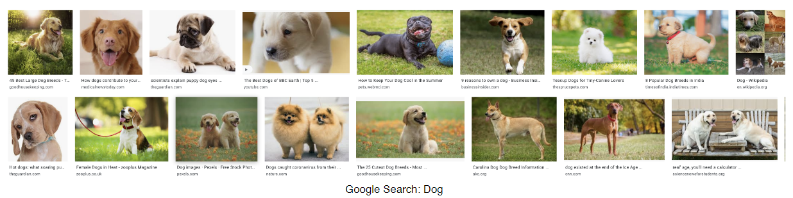
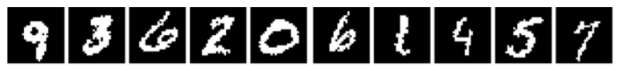
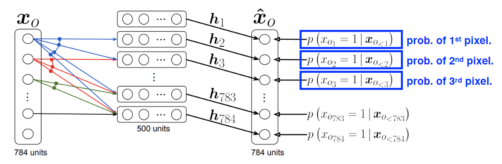
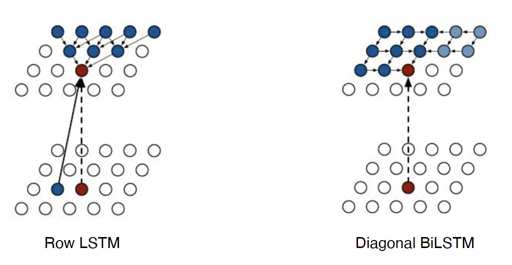

# 9강 Generative Models 1

- 머신러닝, 딥러닝에서 의미하는 **Generative model이 무엇인지**
- **기본적인 통계 이론, 다양한 Generative model의 아이디어, 구조** 학습

[back to super](https://github.com/jinmang2/boostcamp_ai_tech_2/tree/main/u-stage/dl_basic)

## Introduction
- Richard Feynman
  - 페이만 칵 정리 ㄷㄷ
- 생성 모델을 알면 굉장히 많은 일을 할 수 있음!
- 나도 NLG에 관심이 큰 만큼 어떤 의미를 갖는지 잘 공부하도록 하자!
- https://deepgenerativemodels.githun.io/

**What does it mean to learn a generative model?**
- 단순히 생성만 하는 모델은 아님. 더 큰 의미를 내포!
- 엄밀히 말하면, 생성 모델은 Discriminator모델도 포함함

## Learning a Generative Model
- 강아지 이미지가 주어졌다고 가정해보자.

- 아래를 만족하는 확률 분포 $p(x)$를 학습하고 싶다!
  - **Generation**: $x_{new}\sim p(x)$가 강아지와 같도록 sampling하고 싶다
  - **Density estimation**: $x$가 강아지와 비슷하면 $p(x)$가 높고 아니라면 낮다! (anomaly detection)
    - 특히, 이런 모델을 `explicit model`이라고 부름
  - **Unsupervised representation learning**: image들이 공통된 특징을 가지고 있는지 학습한다 (feature learning)
- Then, how can we **represent** $p(x)$?

## Basic Discrete Distributions
- **Bernoulli distribution**: (biased) coin flip
  - $D=\text{\{Heads,Tails\}}$
  - $P(X=\text{Heads})=p$, then $P(X=\text{Tails})=1-p$
  - $X\sim \text{Ber}(p)$
- **Categorical distribution**: (biased) m-sided dice
  - $D=\{1,\cdots,m\}$
  - $P(Y=i)=p$ such that $\sum_{i=1}^{m}{p_i}=1$
  - $X \sim \text{Cat}(p_1,\cdots,p_m)$

### Example
- RGB를 모델링한다고 하면?
- 경우의 수는? `256 x 256 x 256`
- 얼마나 많은 모수가 필요한가? `256 x 256 x 256 - 1`
- Binary로 넘어오자. 경우의 수는? $2^n$
- $p(x_1,\cdots,x_n)$을 모델링하기 위해 필요한 모수의 수는? $n$
- $2^n$은 $n$개로 표현 가능!
- 만일 $n$개가 independent하다면?
  - 말도 안되는 가정... 그러나 모든 것을 표현할 수 없기에!

## Conditional Independence
- Three important rules
  - Chain rule
    $$p(x_1,\dots,x_n)=p(x_1)p(x_2|x_1)p(x_3|x_1,x_2)\cdots p(x_n|x_1,\dots,x_{n-1})$$
  - Bayes' rule
    $$p(x|y)=\cfrac{p(x,y)}{p(y)}=\cfrac{p(y|x)p(x)}{p(y)}$$
  - Conditional independence (Assumption)
    $$\text{if }x\perp y,\text{ then }p(x|y,z)=p(x|z)$$

- Using the chain rule,
  $$p(x_1,\dots,x_n)=p(x_1)p(x_2|x_1)p(x_3|x_1,x_2)\cdots p(x_n|x_1,\dots,x_{n-1})$$
- 얼마나 많은 파라미터가 필요한가?
  - $p(x_1)$: 1 parameter
  - $p(x_2|x_1)$: 2 paramters
  - $p(x_3|x_1,x_2)$: 4 paramters
  - Hence, $1+2+2^2+\cdots+2^{n-1}=2^n - 1$
- 이건 달라진 것이 하나도 없음...

### Markov assumption
$$X_{i+1}\perp X_1, \dots, X_{i-1}|X_i$$

- 그러면 chain rule에서 중첩되는 부분을 날려버릴 수 있음
$$p(x_1,\dots,x_n)=p(x_1)p(x_2|x_1)p(x_3|x_2)\cdots p(x_n|x_{n-1})$$

- 몇 개의 parameter가 필요한가? $2n-1$
- chain rule로 쪼갠 다음에 markov assumption을 적용하면 모수의 수를 exponential하게 줄일 수 있음.
- 이것도 줄이고 싶다!
- **Autoregressive model**
    - `conditional independence`를 어떻게 이용하느냐!

## Auto-regressive Model

- `28 x 28`의 binary pixel 이미지를 가지고 있다고 가정하자
- 우리의 목적은? $p(x)=p(x_1,\dots,x_{784})$ over $x\in \{0,1\}^{784}$
- 어떻게 $p(x)$를 parameterize할건가?
  - Let's use `chain rule` to factor the joint distribution (joint 분포를 연쇄 법칙으로 나누자!)
  - $p(x_{1:784})=p(x_1)p(x_2|x_2)p(x_3|x_{1:2})\cdots$
  - autoregressive model!
  - 모든 변수에 대해 `ordering`를 해줘야 함!

#### 생각해보기!
- `chain rule` 입장에서 `markobian assumption` 혹은 `conditional independent assumption`을 주는 것이 joint distribution을 쪼개는데 어떠한 영향을 주는가?

### NADE: Neural Autoregressive Density Estimator

- $i$번째 pixel의 확률 분포는
  $p(x_i|x_{1:i-1})=\sigma(\alpha_i h_i+b+i)$ where $h_i=\sigma(W_{<i}x_{1:i-1}+c)$
- `NADE`는 `explicit` 모델임!
  - 주어진 입력에 대한 `density`를 계산할 수 있음
  - `inplicit` model은 생성만 가능함
- 어떻게 계산할 수 있을까?
  - 784의 binary pixel을 가진 이미지를 가정 $\{x_1,x_2,\dots,x_{784}\}$
  - 조건부 확률 분포는 아래와 같이 계산됨
    $$p(x_1,\dots,x_{784})=p(x_1)p(x_2|x_1)\cdots p(x_{784}|x_{1:783})$$
  - 결합확률은 아래와 같이 계산
    $$p(x_1,\dots,x_{784})=p(x_1)p(x_2|x_1)\cdots p(x_{784}|x_{1:783})$$
    - where each conditional probability $p(x_i|x_{1:i-1})$ is computed independently
- 연속 확률 변수를 모델링하고 싶을 경우, `mixture of gaussian`을 사용하여 가능

### Pixel-RNN
- auto-regressive model을 정의하기 위해 `RNN` 사용
- 예를 들어, `n x n` RGB image에 대해
  $$p(x)=\prod_{i=1}^{n^2}p(x_{i,R}|x_{<i})p(x_{i,G}|x_{<i},x_{i,R})p(x_{i,B}|x_{<i},x_{i,R},x_{i,G})$$
- chain의 `ordering`에 따라 아래 두 architecture로 나뉨
  - Row LSTM
  - Diagonal BiLSTM
- https://arxiv.org/abs/1601.06759

