# 10강 Generative Models 2

- Practical한 Generative Model인 VAE를 중심으로 Latent variable model에 대해 학습

[back to super](https://github.com/jinmang2/boostcamp_ai_tech_2/tree/main/u-stage/dl_basic)

## Latent Variable Models
- D.Kingma, "Variational Inference and Deep Learning: A New Synthesis"
  - Adam과 VAE의 창시자!

### Question
Is an `autoencoder` a generative model?
- 그렇지 않음.

## Variational Auto-encoder
- Variational inference (VI)
  - `VI`의 목적은 아래 가장 알맞은 posterior distribution을 찾는 `variational distribution`을 최적화 하는 것!
    - `posterior distribution`: $p_\theta(x|x)$
      - observation이 주어졌을 때 관심있는 random variable의 확률 분포
      - $z$는 random variable
    - `variational distribution`: $q_\phi(z|x)$
      - posterior distribution은 계산할 수 없는 경우가 대다수기 때문에 근사하자!
    - 무언가를 잘 찾겠다!! 필요한게 뭐야? objective!
    - KL-divergence 사용

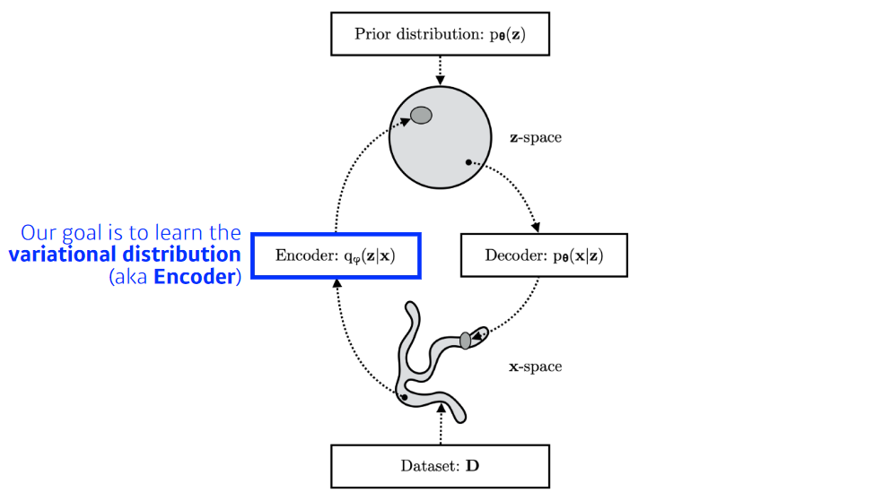

- But, how?
  - 학부수준 확률론이면 아래 수준 이해 가능
  - `variational distribution`과 `posterior distribution` 사이의 분포 거리를 좁히는게 목적!
  - 그런데 위도 사실 불가능함. 뭔지 모르니까! target을 몰라요... 근데 잘하고싶어
  - 그래서 어떻게 하냐!
    - ELBO(Evidence Lower Bound)를 계산, 얘를 키워서 우리가 원하는 objective를 얻고자 함
  - 결과적으로 우리가 뭔지도 모르고 계산할 수도 없는 분포와 우리가 가진 분포 사이의 거리를 최소화 가능!
  - 어떻게? ELBO를 maximize함으로써!

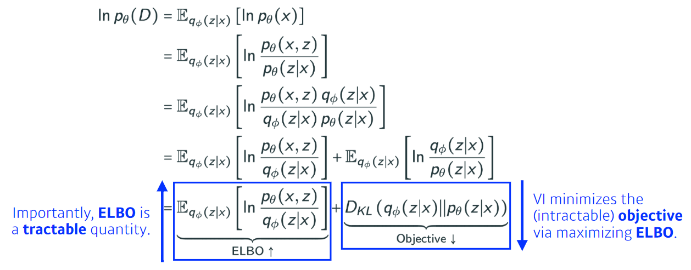

- `ELBO`는 아래처럼 decomposition 가능
  - `reconstruction term` + `prior fitting term`
  - `z`라는 latent space를 찾고 싶음!
  - posterior는 근데 모름...
    - encoder로 위를 근사하고 싶음!
    - 근데 모르니까... 근사조차 못해
    - 근데 ELBO를 최대화시키면 위 분포 사이의 거리를 좁혀주는 효과가 있더라!

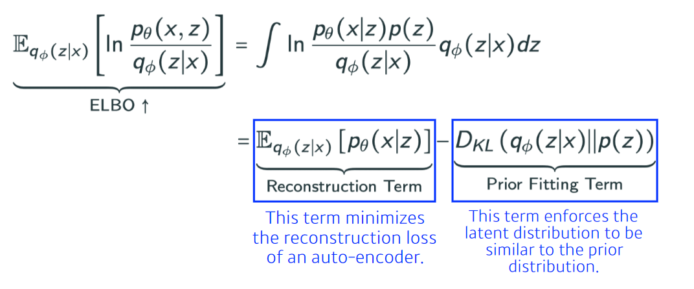

- `reconstruction term`: x -> encoder -> z -> decoder -> _x 입력과 출력의 차이를 최소화
- `prior fitting term`: x라는 image들을 잔뜩 latent space로 올림. 이 점들의 분포와 latent space의 prior distribution와 비슷하게 만들어 주는!

### 그래서,
- Key limitation:
  - It is an `intractable` model (hard to evaluate likelihood)
    - VAE는 explicit한 모델이 아님.
    - 우도 평가가 힘듦
  - The `prior fitting term` must be differentiable, hence it is hard to use diverse latent prior distributions
    - KL-Divergence는 gaussian을 제외하고는 closed term이 나오는 경우가 거의 없음
    - 대부분의 VAE는 Gaussian을 사용해야함
  - In most cases, we use an isotropic Gaussian
    $$D_{KL}(q_\phi(z|x)\vert\vert\mathcal{N}(0,1))=\frac{1}{2}\sum_{D}{i=1}(\sigma_{z_i}^2+\mu_{z_i}^2-\ln(\sigma_{z_i}^2)-1)$$

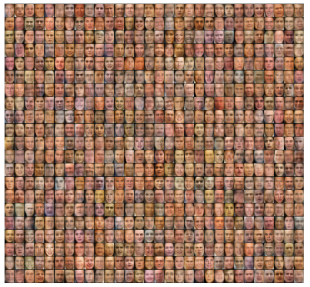

## Adversarial Auto-encoder

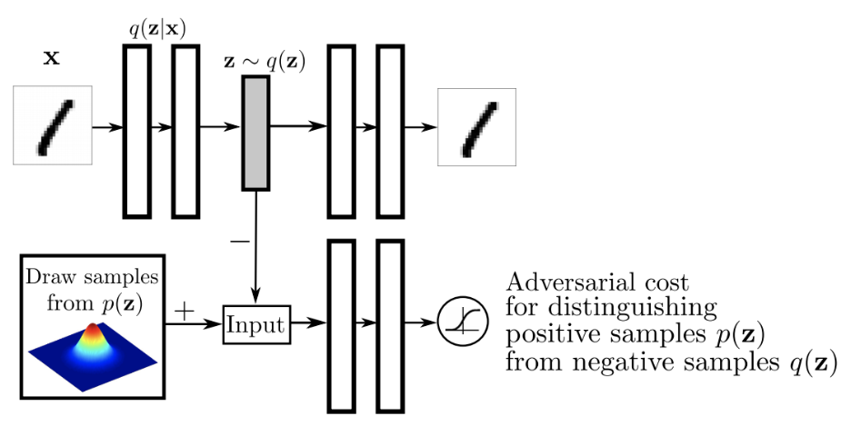

- GAN을 사용해서 latent distribution 사이의 분포를 맞춰줌
- prior fitting term을 GAN objective로 바꿔버림
- uniform distribution, 등등 복잡한 그리고 다양한 분포를 latent distribution으로 활용 가능
- `Wasserstein AutoEncoder`와 `AAE`가 포함되어 있음!

## GAN

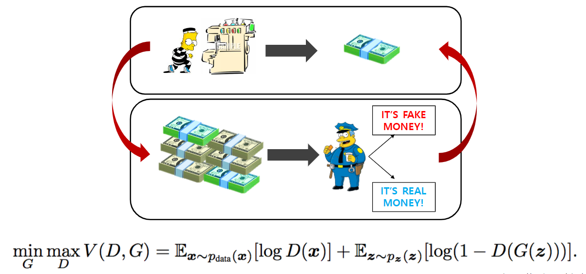

- `generator`가 우리가 원하는 것
- `discriminator`가 점차점차 좋아지는 것이 이 모델의 장점
- implicit model임

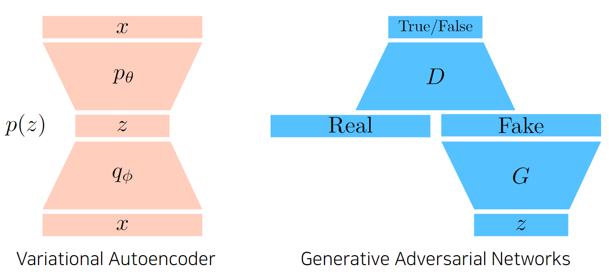

### GAN Objective
- A two player minimax game between `generator` and `discriminator`
- For `Discriminator`,
  $$\max_D V(G,D)=\mathbb{E}_{x\sim p_{data}}[\log D(x)] + \mathbb{E}_{x\sim p_G}[\log (1-D(x))]$$
  - `optimal discriminator`은
    $$D_G^* (x)=\cfrac{p_{data}(x)}{p_{data}(x)+p_G(x)}$$
- For `Generator`,
  $$\min_G V(G,D)=\mathbb{E}_{x\sim p_{data}}[\log D(x)]+ \mathbb{E}_{x\sim p_G}[\log (1-D(x))]$$
  - Plugging in the `optimal discriminator`, we get

  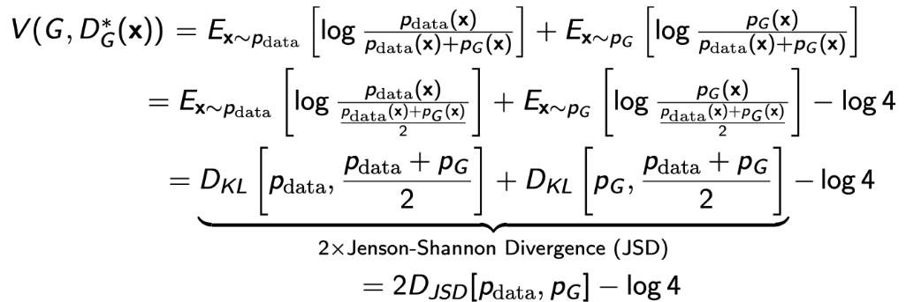

## DCGAN
- 처음의 GAN은 Dense layer로 만듦
- 이를 Image domain으로!
- 여러 좋은 technique를 알려줌!
  - leakyrelu, 여러 hyperparamter들
  - deconvolution으로 만드는게 성능이 좋다

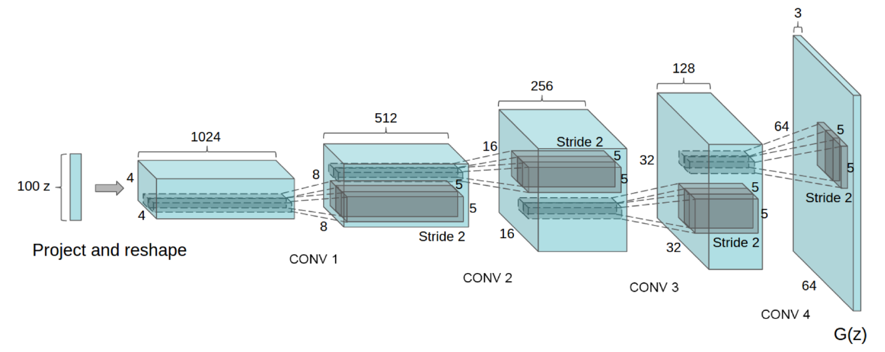

## Info-GAN
- class c를 random하게 집어넣어줌
- 생성을 할 때 GAN이 feature mode에 집중할 수 있게 만들어줌
- 마치 multimodal distribution 학습

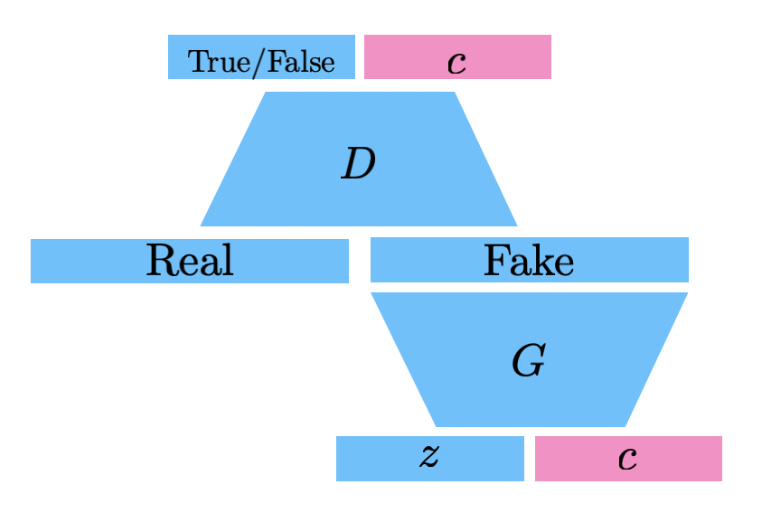

## Text2Image
- OpenAI의 Dall-E에도 이 논문 기입
- Network가 굉장히 복잡함

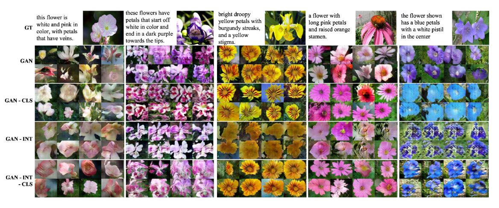

## Puzzle-GAN
- 최성준 교수님이 저자로 참여한!

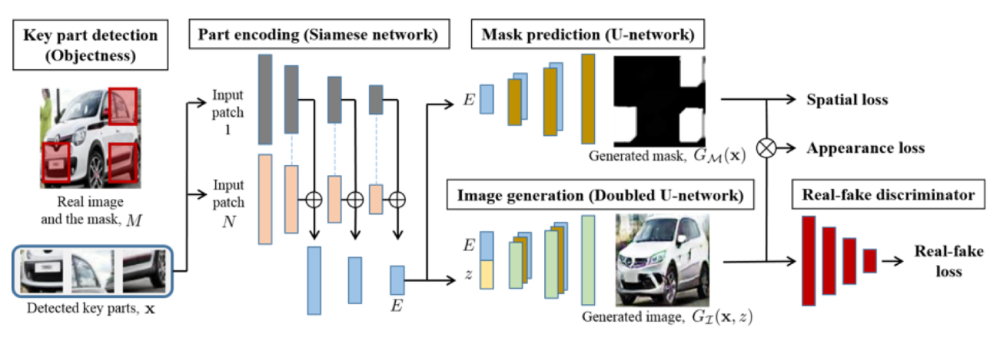

## CycleGAN
- image 사이의 두 도메인을 바꿀 수 있음!

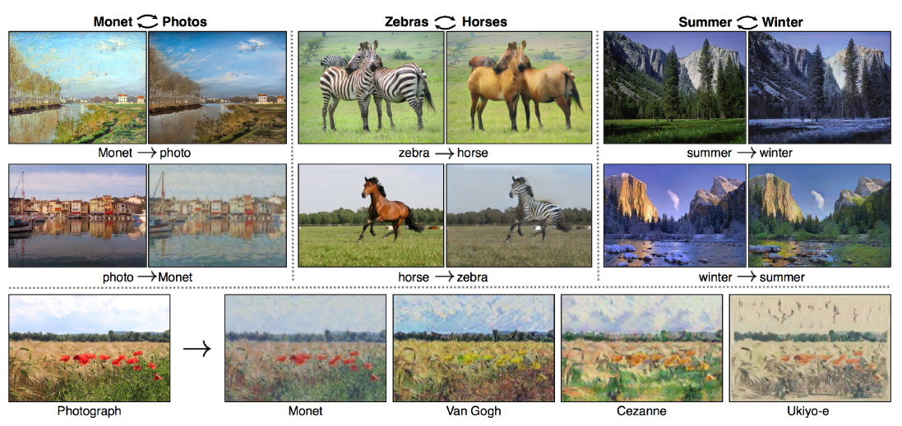

- Cycle-consistency loss는 굉장히 중요한 개념임
  - 알아서 임의의 말 이미지를 얼룩말 이미지로 바꿔줌

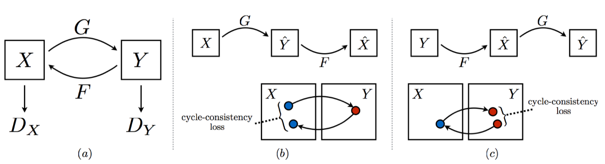

## Star-GAN
- 한국에서 나온 논문
- Controllable

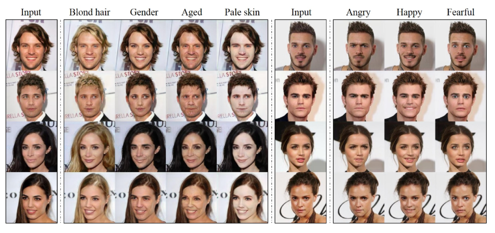

## Progressive-GAN

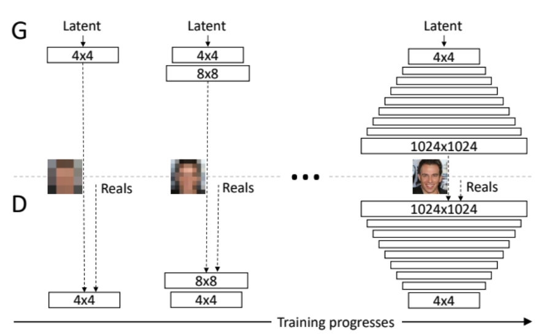

## and WAY MORE...

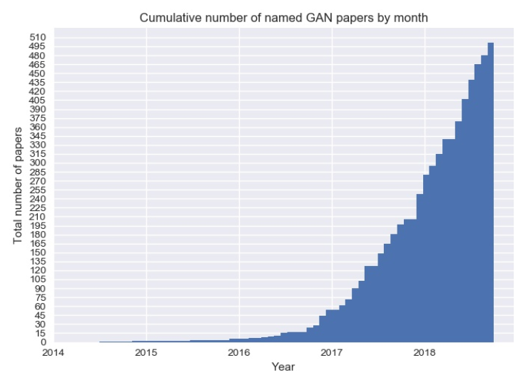
