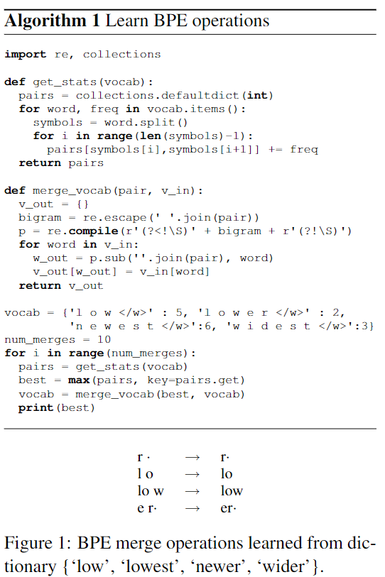
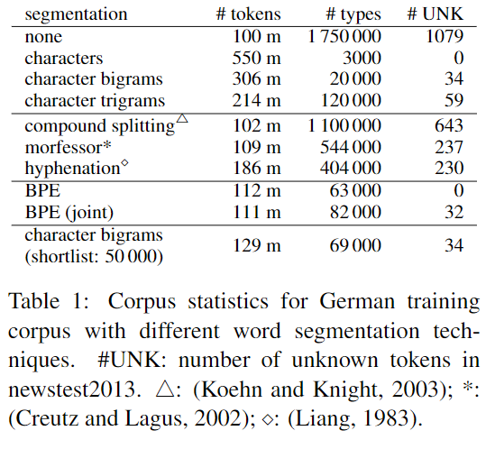

# Byte Pair Encoding

선택 과제 BPE를 수행하기 전, 아예 공부 다 해버리고 정리한 문서

아래 라이브러리 사용법 및 동작과정 상세도 정리
- VKCOM, `YouTokenToMe`
- huggingface, `Tokenizers`

## What is BPE?
- 일반적으로 하나의 단어에 대해 하나의 Embedding을 생성할 경우, Out-of-vocabulary(OOV)라는 치명적인 문제가 생긴다.
- 추론 시 학습 때 없던 단어가 등장하면 해당 위치에 `[UNK]` 토큰이 들어가서 전체적인 모델 성능이 하락할 수 있다.
    - uncased를 많이 만들어서 대응할 수 있지만, 부족하다
- 반면 모든 단어의 embedding을 만들기에는 필요한 embedding parameter의 수가 너무 많다.
    - ZeRO-offload에서도 embedding matrix는 내리기가 안된다고 한다 (현웅이 피셜)
- 위 문제 해결을 위해 컴퓨터가 이해하는 단어를 표현하는 데에 데이터 압축 알고리즘 중 하나인 `Byte Pair Encoding` 기법을 적용한 sub-word tokenization이라는 개념이 등장

## BPE 소개 논문 (subword unit에 적용된 버전)

[Neural Machine Translation of Rare Words with Subword Units](https://aclanthology.org/P16-1162/)

필요한 부분만 발췌해서 읽기

- Main Contribution
    1. Open Vocabulary NMT는 subword unit으로 encoding하는 것으로 가능함
        - large vocab 혹은 back-off dictionaries를 사용하는 것보다 효과가 좋음
    2. Byte Pair Encoding을 word segmentation task 알고리즘에 적용
        - NMT에 아주 적절한 word segmentation 전략
        - BPE, Philip Gage.  1994.  A New Algorithm for Data Com-pression.C Users J., 12(2):23–38, February.
- Hypothesis: a segmentation of rare words into appropriate subword units는 아래를 하기 충분함
    - to allow for the NMT to learn transparent translations
    - to generalize this knowledge to translate and produce unseen words
- BPE 알고리즘 설명
    - Gage가 1994년에 발표한 간단한 데이터 압축 전략
        - iteratively replaces the most frequent pair of bytes in a sequence with a single, unused byte
    - 본 연구에선 Word Segmentation에 BPE를 적용
        1. char-vocab으로 symbol vocab을 초기화하고 단어를 sequence of characters로 표현
            - 여기서 special end-of-word symbol '·'를 추가해준다.
            - 이는 복원을 위해 넣어주는 special token
        2. 아래 task를 반복한다
            a. symbol pair들을 센다
            b. 가장 빈번히 등장하는 ('A', 'B')를 새로운 symbol 'AB'로 대체한다
                - 위 과정은 `merge operation`이라 부른다
                - 이 연산으로 char-n-gram에 해당하는 새로운 symbol이 생산된다
                - 빈번한 char-n-gram은 결국 단일 기호로 병합되므로 BPE에는 shortlist(후보 목록)이 필요없다
        3. 최종 symbol vocab size는 초기 vocab size + number of merge operation와 동일하다
            - 후자는 유일한 BPE의 hyperparameter



- 논문에서 평가의 목적
    - NMT에서 subword unit으로 rare, unseend word에 대한 번역률을 올릴 수 있을까? -> 가능
    - vocab size, text size, 번역 품질 측면세어 가장 잘 수행되는 subword segmentation은 무엇? -> BPE



- 진짜 압도적으로 적은 UNK tokens... ㄷㄷ

## Optional Homework
- 위 알고리즘 1을 참고하여 BPE를 구축하라!
- 과제 코드를 여기에 작성하기는 그렇기 때문에, 정확히 이해한 다음 나만의 코드 느낌으로 코드 작성
- 과제 코드 class, 함수 이름, test case를 수정하여 bpe.py에다 수행 내역 기록
- testcase는 올리지 않음

## 💥 Tokenizers
- https://github.com/huggingface/tokenizers
- Fast SOTA Tokenizers optimized for Research and Production

### Main features
- Rust 구현으로 매우 빠름 (in train and tokenization)
- 서버 CPU에서 1GB의 텍스트를 토큰화하는데 20초 미만이 걸림
- 사용하기 쉽지만 다양한 종류의 tokenizer있음
- research and production용
- Normalization은 alignment tracking과 함께 제공
- 주어진 token에 해당하는 원래 문장의 일부를 얻는 것이 가능
- 아래의 모든 전처리가 가능
    - Truncate
    - Pad
    - Add the special tokens your model needs

### Quick example using Python
BPE, WordPiece or Unigram 중 하나를 고른다
```python
from tokenizers import Tokenizer
from tokenizers.models import BPE

tokenizer = Tokenizer(BPE())
```

pre-tokenization을 customize 가능 (e.g., splitting into word)
```python
from tokenizers.pre_tokenizers import Whitespace

tokenizer.pre_tokenizer = Whitespace()
```

아래 두 줄로 학습 가능

```python
from tokenizers.trainers import BpeTrainer

train_data_path = ["train_data.txt"]
# train_data_path = ["wiki.train.raw", "wiki.valid.raw", "wiki.test.raw"]

trainer = BpeTrainer(special_tokens=["[UNK]", "[CLS]", "[SEP]", "[PAD]", "[MASK]"])
tokenizer.train(files=train_data_path, trainer=trainer)

print(dict(sorted(tokenizer.get_vocab().items(), key=lambda x: x[1])))
```
```
[00:00:00] Pre-processing files (0 Mo)              ████████████                100%
[00:00:00] Tokenize words                           ████████████ 4        /        4
[00:00:00] Count pairs                              ████████████ 4        /        4
[00:00:00] Compute merges                           ████████████ 12       /       12

{'[UNK]': 0, '[CLS]': 1, '[SEP]': 2, '[PAD]': 3, '[MASK]': 4, 'd': 5, 'e': 6, 'i': 7,
 'l': 8, 'n': 9, 'o': 10, 'r': 11, 's': 12, 't': 13, 'w': 14, 'es': 15, 'est': 16,
 'lo': 17, 'low': 18, 'ew': 19, 'new': 20, 'newest': 21, 'dest': 22, 'idest': 23,
 'widest': 24, 'er': 25, 'lower': 26}
```

허깅페이스 토크나이저의 장점? hub에 올릴 수 있다!
sentencepiece도 올리던데 yttm도 올릴 수 있나?

## YouTokenToMe
- https://github.com/VKCOM/YouTokenToMe
- Unsupervised text tokenizer focused on a computational efficiency
- Fast BPE를 구현
- [huggingface의 Tokenizer](https://github.com/huggingface/tokenizers), [fastBPE](https://github.com/glample/fastBPE), [Sentencepiece](https://github.com/google/sentencepiece)보다 빠르다고 함

### Key advantages
- Multithreading for training and tokenization
- The algorithm has `O(N)` complexity, wher `N` is the length of training data
- Highly efficient implementation in C++
- Python wrapper and command-line interface

### Extra features
- BPT-dropout (as described in [Provikov et al., 2019](https://arxiv.org/abs/1910.13267))

BPE 논문과 동일하게 cross word boundaries에 대해선 고려하지 않는다. Sentencepiece와 같이 모든 space symbol은 meta symbol  "▁" (U+2581)로 대체된다. 이를 통해 모든 sequence token을 text로 다시 변환하고 word boundary를 복원할 수 있다.

### Installation

```
pip install youtokentome
```

자세한 사용 방법은 youtokentome readme 참고!

이 번 과제를 `YouTokenToMe`로 푼다면,

```python
import youtokentome as yttm

train_data_path = "train_data.txt"
model_path = "example.model"

corpus = ['low'] * 5 + ['lower'] * 2 + ['newest'] * 6 + ['widest'] * 3

with open(train_data_path, "w") as fout:
    for word in corpus:
        print(word, file=fout)

# Training model
yttm.BPE.train(data=train_data_path, vocab_size=5000, model=model_path)
```
```
Training parameters
  input: train_data.txt
  model: example.model
  vocab_size: 5000
  n_threads: 8
  character_coverage: 1
  pad: 0
  unk: 1
  bos: 2
  eos: 3

reading file...
learning bpe...
number of unique characters in the training data: 10
number of deleted characters: 0
number of unique characters left: 10
WARNING merged only: 30 pairs of tokens
model saved to: example.model
<youtokentome.youtokentome.BPE object at 0x7fef35f5c700>
```

```python
# Loading model
bpe = yttm.BPE(model=model_path)
bpe.vocab()
```
```
['<PAD>', '<UNK>', '<BOS>', '<EOS>', '▁', 'e', 'w', 't', 's', 'o', 'l', 'n', 'i',
 'd', 'r', 'es', 'est', 'lo', 'low', '▁low', 'west', '▁n',
 'ewest', '▁newest', 'dest', '▁w', 'idest', '▁widest', '▁lowe', '▁lower']
```
