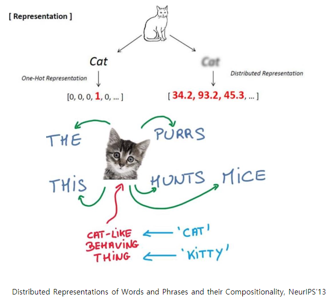
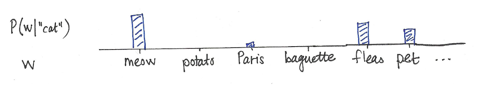
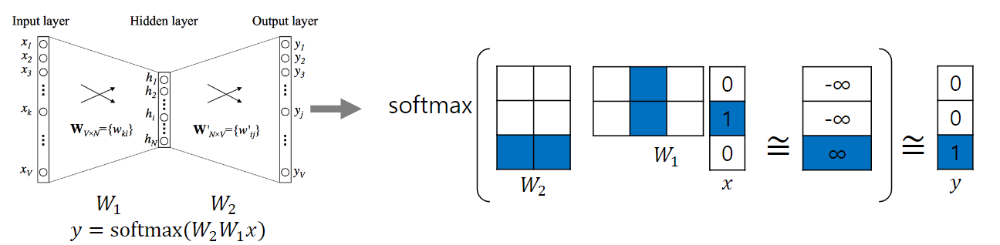

# 2강 Word Embedding

단어를 벡터로 표현하는 또 다른 방법인 Word2Vec과 GloVe를 소개합니다.

Word2Vec과 GloVe는 최근까지도 자주 사용되고 있는 word embedding 방법입니다. Word2Vec과 GloVe는 하나의 차원에 단어의 모든 의미를 표현하는 one-hot-encoding과 달리 단어의 distributed representation을 학습하고자 고안된 모델입니다. Word2Vec과 GloVe가 단어를 학습하는 원리를 중심으로 강의를 들어주시면 감사하겠습니다

[back to super](https://github.com/jinmang2/boostcamp_ai_tech_2/tree/main/u-stage/nlp)

## What is Word Embedding?
단어를 벡터로 표현! 왜 벡터로? 단어의 의미에 따라 거리를 둘 수 있다!

## Word2Vec
주어진 context words (adjacent words)로부터 단어의 vector representation을 학습시키는 알고리즘

**assumption** 동일한 context의 단어는 비슷한 의미를 지닐 것이다!

"You shall know a word by the company it keeps" - J.R. Firth 1957

### How Word2Vec algorithm works?
- input과 output은 one-hot vector
- hidden unit의 수는 embedding vector의 차원 수와 동일

### Word2Vec Visualization

https://ronxin.github.io/wevi/

https://word2vec.kr/search/

https://github.com/dhammack/Word2VecExample

### Application of Word2Vec
- Word Similarity
- Machine Translation
- PoS Tagging
- NER
- Sentiment Analysis
- Clustering
- Semantic Lexicon Building
- Image Captioning

## GloVe
- 두 단어가 학습 window 상에서 얼마나 같이 등장하는지 미리 계산

$$J(\theta)=\cfrac{1}{2}\sum_{W}{i,j=1}f(P_{ij})(u_i^Tv_j - \log P_ij)^2$$

- 이 외에도 적용된 여러 technique이 있음!
