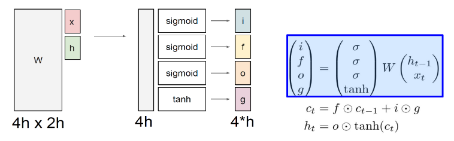
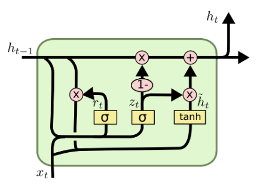
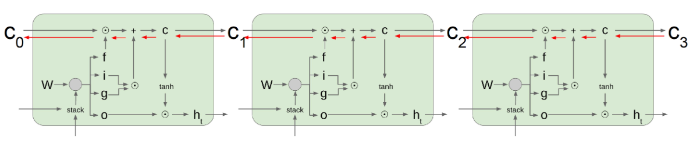

# 4강 LSTM and GRU

RNN을 개선한 알고리즘으로 등장했던 LSTM과 GRU에 대해서 다시 한번 살펴봅니다.

LSTM과 GRU가 gradient flow를 개선할 수 있는 이유에 대해 조금 더 고민하는 시간이 됐으면 좋겠습니다.

[back to super](https://github.com/jinmang2/boostcamp_ai_tech_2/tree/main/u-stage/nlp)

## LSTM
- Core Idea: pass cell state information straightly without any transformation

## GRU
-

## Uninterrupted gradient flow!

## Code implementation
이번 강의는 최성준 교수님 강의 시간에 기초적인 이론 및 torch code wrap-up을 했습니다.

때문에 이번주 학습 기간에는 직접 내부 구현 및 역전파에 대해 확실하게 이해해보고자 코드를 작성했습니다.

[해당 파일](https://github.com/jinmang2/boostcamp_ai_tech_2/tree/main/u-stage/nlp/ch04_rnn_variant/rnn_variant.py)에서는 LSTM와 GRU에 대한 torch 구현체에서의 forward/backward에 대한 상세한 수식이 코드로 작성되어 있습니다.
