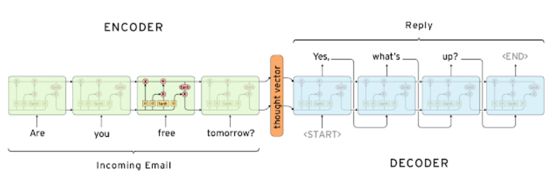
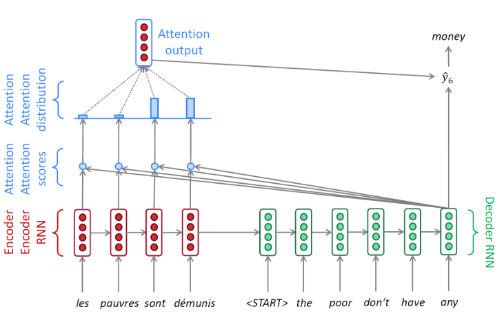
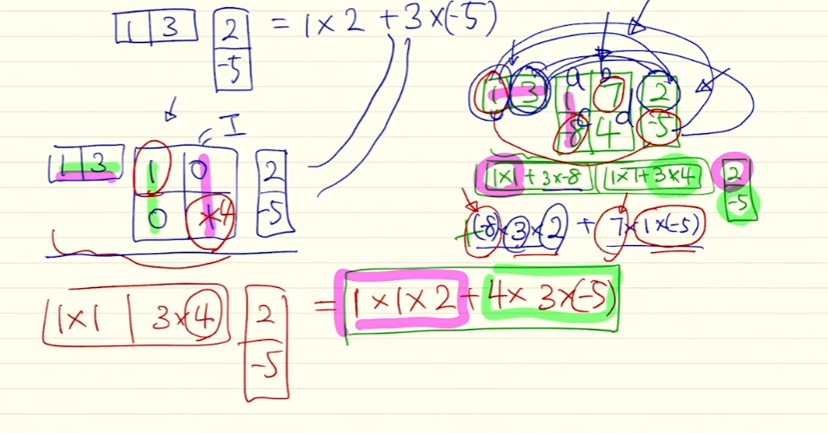
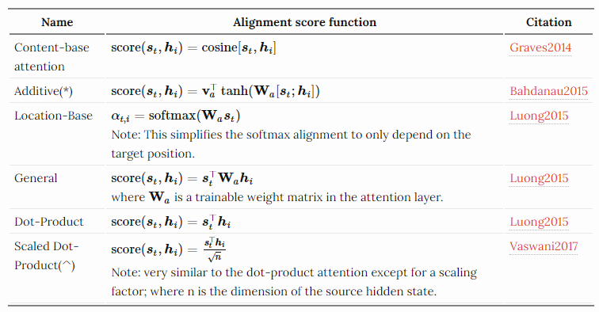

# 5강 Sequence to Sequence with Attention

Sequence를 Encoding와 Decoding할 수 있는 sequence to sequence에 대해 알아봅니다.

Sequence to sequence는 encoder와 decoder로 이루어져 있는 framework으로 대표적인 자연어 처리 architecture 중 하나입니다. Encoder와 Decoder로는 다양한 알고리즘이 사용될 수 있지만 이번 시간에는 RNN과 Attention을 결합한 sequence to sequence 모델을 학습합니다.

앞선 강의에서 설명드렸던 것처럼 RNN 모델이 갖고 있는 단점을 보완하고자 Attention(논문에서는 alignment로 표현되고 있습니다) 기법이 처음 등장했습니다. 다양한 Attention의 종류와 이를 활용한 translation task에 대해서 알아봅니다

[back to super](https://github.com/jinmang2/boostcamp_ai_tech_2/tree/main/u-stage/nlp)

## Seq2Seq
- sequence of words를 input으로, sequence of words를 output으로!

- Many to Many 문제임

## Seq2Seq Model with Attention
- 위 sequence to sequence는 고정된 vector 표현으로 정보를 압축 및 생성해야하는 bottleneck 문제가 있음
- Core idea: At each time step of the decoder, focus on a particular part of the source sequence

- Attention은 추가적인 Module임!

- Linear Algebra로 이해

## Different Attention Mechanisms

**Luong Attention**
- time t에서 decoder의 hidden state를 얻고 attention score를 계산
- 위 attention score로 context vector을 얻고
- decoder hidden state와 연결하여 다음 출력을 예측
- different types of alignments (Location-Base, General)

**Bahdanau Attention**
- time t에서 time t-1의 decoder hidden state를 고려
- alignment, context vector를 계산
- 위 context를 time t-1의 decoder hidden state와 연결
- 즉, softmax 이전에 연결된 vector가 LSTM 내부로 들어감
- Only a concat-score alignment model (Additive)

## Attention is Great!
- Attention은 NMT Performance를 엄청나게 올려줬습니다!
    - decoder가 encoder의 특정 부분에 집중하도록 사용 가능해요
- Attention은 Fix-sized vector의 bottleneck problem을 해결해줬습니다
    - Attention은 decoder가 source에서 bottleneck을 지나쳐 바로 집중하는 것이 가능하게 해줬어요!
- Attention은 지름길과도 같아요! Vanishing Gradient 문제 또한 도움을 줘요
- Attention은 해석력도 제공합니다!
    - 근데 XAI쪽 보면 Attention보단 Attribution기반으로 해석하는게 더 정확한 것 같아요!

## Further Reading
- Attention에 대한 자료는 이 분 자료가 레전드임
    - https://lilianweng.github.io/lil-log/2018/06/24/attention-attention.html
- [Sequence to sequence learning with neural networks, ICML’14](https://arxiv.org/abs/1409.3215)
- [Effective Approaches to Attention-based Neural Machine Translation, EMNLP 2015](https://arxiv.org/abs/1508.04025)
- [CS224n(2019)_Lecture8_NMT](https://web.stanford.edu/class/cs224n/slides/cs224n-2019-lecture08-nmt.pdf)
