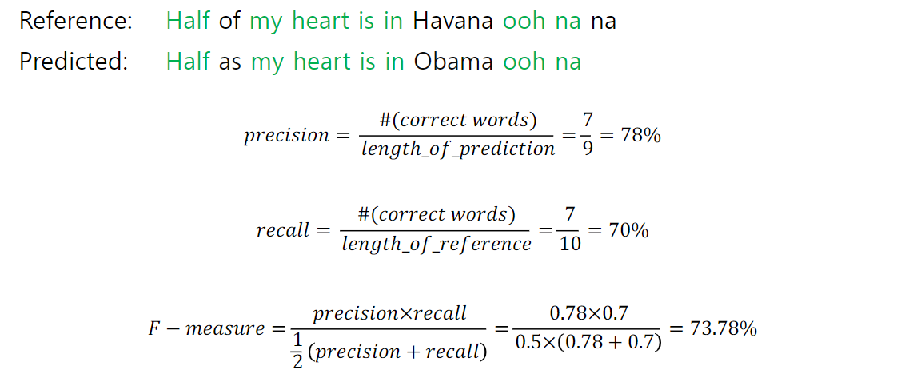
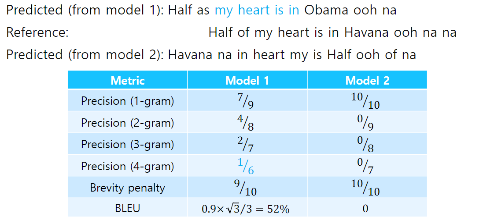

# 6강 Beam Search and BLEU score

문장을 decoding 하는 데에 사용하는 대표적인 알고리즘인 Beam Search와 번역 task에서 번역된 문장을 평가하는 대표적인 metric인 BLEU score를 소개합니다.

언어 모델이 문장을 generation할 때에는 확률값에 기반한 다양한 경우의 수가 존재합니다. 모든 경우의 수를 고려하는 것은 비효율적이며 너무 작은 확률값까지 고려한다면 생성된 문장의 quality가 떨어질 수 있습니다. 가장 높은 확률값을 고려하는 방법 역시 모델이 단순한 generation을 하도록 하게 만드는 단점이 있을 수 있습니다. 이러한 문제의 대안으로 제안된 Beam Search를 알아봅니다.

자연어는 컴퓨터가 이해할 수 있는 방식으로 변환되어 모델의 입력 및 출력으로 활용되기 때문에 적절한 metric을 이용해 모델을 평가해야 합니다. 다양한 자연어처리 관련 metric이 있지만, 그중에서도 번역 task에서 가장 대표적인 BLEU score를 소개합니다. 번역에 있어서 BLEU score가 precision을 고려하는 이유에 대해서 고민하면서 강의를 들어주시면 좋을 것 같습니다.

[back to super](https://github.com/jinmang2/boostcamp_ai_tech_2/tree/main/u-stage/nlp)

## Beam Search

### Greedy Decoding
- Greedy Decoding은 잘못된 결정을 돌릴 방법이 없다!
    - he hit me with a pie인데
    - he hit a ~ 로 예측을 했다면?
    - 고칠 수 없다...

### Exhaustive Search
- 이론적으로, 우리는 아래 수식을 최대화하는 translation y을 찾길 원한다.

$$P(y|x)=P(y_1|x)P(y_2|y_1,x)P(y_3|y_2,y_1,x)\dots P(y_T|y_{T-1},\dots,y_1,x)=\prod_{1}^{T}P(y_t|y_1,\dots,y_{t-1})$$

- joint probability의 최대화를 위해서 $P(y_1|x)$가 최대가 아닌 경우를 골라야하는 경우가 있을 수 있다.
- 즉, 모든 가능한 수를 계산해야 이론적인 최대 값을 계산 가능하다.
- 실제 모든 Search space를 탐색하는 것은 불가능. 그럼 어떻게?

### Beam Search
- Core Idea: decoder에서 매 타임마다 k개의 가장 확률이 높은 부분 translation을 유지
    - 이를 `hypothesis`라 부름
    - k는 beam size이며 실용적으로 5~10의 값을 사용
- hypothesis $y_1,\dots,y_t$는 log 확률을 가짐

$$score(y_1,\dots,y_t)=\log P_{LM}(y_1,\dots,y_t|x)=\sum_{i=1}^{t}\log P_{LM}(y_i|y_1,\dots,y_{i-1},x)$$

- 로그의 성질로, 확률의 곱을 로그 확률의 합으로 쵸현 가능
- Score는 전부 negative임! (log function 생김새 기억할 것)
- 때문에 가장 높은 점수를 가지는 hypothesis가 제일 좋음
    - **이게 사실 문제점임. 모델 입장에선 짧으면 짧을 수록 좋음**
- 각 time step에서 top k개의 가장 높은 가설을 탐색
- Beam Search는 globally optimal solution을 보장하지 않음!
- 그러나 Exhaustive Search보단 효율적
    - 어찌보면 당연한 얘기임...

### Beam Search: Stopping Criterion
- In greedy decoding, `<END>` token 등장 시 종료
- In beam search decoding, 서로 다른 hypothesis들은 서로 다른 timestep 에 `<END>`를 생성할 수 있음
    - `<END>`를 생성한 가설은 종료
    - 끝난 가설은 임시 메모리에 저장 후 다른 가설 지정
- Beam Search는 보통 아래의 조건으로 끝나게 된다.
    - 미리 설정한 time step T까지 진행
    - 완료 hypothesis가 n개 이상일 경우

### Beam Search: Finishing up
- 최종적으로 골라진 hypothesis 중 joint probability의 값이 가장 큰 가설을 채택
- longer hypothesis는 낮은 값을 가지게 될 수 밖에 없다.
- 이를 Length로 Normalize하긴 하지만 그래도 사실 부족하다. repeat error도 존재한다.

    $$score(y_1,\dots,y_t)=\cfrac{1}{t}\sum_{i=1}^{t}\log P_{LM}(y_i | y_1, \dots, y_{i-1}, x)$$

## BLEU Score

- precision: 예측 값 중 얼마나 많이 맞았는가? (in this case, overlapping)
- recall: 실제 값 중 얼마나 많이 맞았는가? (in this case, overlapping)

- **단점**: reordering에 대한 페널티가 없다.

### BiLingual Evaluation Understudy (BLEU)
- N-gram overlap을 평가
- 1~4-gram precision을 계산
- Add Brevity penalty (너무 짧은 문장 배제하기 위해서)

$$BLEU=min(1,\cfrac{\text{length of prediction}}{\text{length of reference}})(\prod_{i=1}^4 precision_i)^{\frac{1}{4}}$$

- 보통, 단일 문장이 아닌 전체 corpus에 대해 계산됨
- 산술 평균이 아니라 기하 평균임!
- brevity penalty로 recall도 어느 정도는 고려를 하게 된다.

- deeplearning.ai-Beam Search
    - https://youtu.be/RLWuzLLSIgw
- deeplearning.ai-Refining Beam Search
    - https://youtu.be/gb__z7LlN_4
- OpenNMT-beam search
    - https://opennmt.net/OpenNMT/translation/beam_search/
- CS224n-NMT
    - https://web.stanford.edu/class/cs224n/slides/cs224n-2019-lecture08-nmt.pdf
- Sequence to sequence learning with neural networks, ICML’14
    - https://arxiv.org/abs/1409.3215
- Effective Approaches to Attention-based Neural Machine Translation, EMNLP 2015
    - https://arxiv.org/abs/1508.04025

## Discussion
- [Beam Search Error Analysis](https://www.youtube.com/watch?v=ZGUZwk7xIwk)

Q) beam search에서 결과가 k개? 한 번에 보이는 것이 k개?
A) 한번에 보는 것이 k개로 가져가는 것이 정설입니다. 보고 있던 hypothesis가 end가 되면 그 hypothesis를 제외하고 다른 것들을 포함하여 4개를 보게 됩니다.

- [김수환님 Beam Search](https://blog.naver.com/PostView.nhn?blogId=sooftware&logNo=221809101199&from=search&redirect=Log&widgetTypeCall=true&directAccess=false)
- [김기현님 코드 구현](https://kh-kim.gitbooks.io/pytorch-natural-language-understanding/content/neural-machine-translation/beam-search.html)

Q) recall, precision에 대한 설명 부탁드립니다.
A) 아래 링크로 설명
- [김동화님 BLEU Score](https://donghwa-kim.github.io/BLEU.html)
- [허훈님 ROUGE 성능 지표의 이해](https://huffon.github.io/2019/12/07/rouge/)

## Further Reading
- [Deep learning.ai-BeamSearch](https://www.youtube.com/watch?v=RLWuzLLSIgw)
- [Deep learning.ai-RefiningBeamSearch](https://www.youtube.com/watch?v=gb__z7LlN_4)
- [OpenNMT-beam search](https://opennmt.net/OpenNMT/translation/beam_search/)
