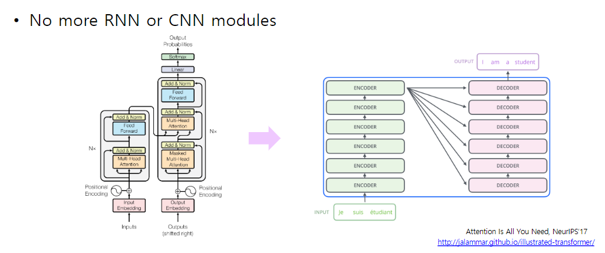
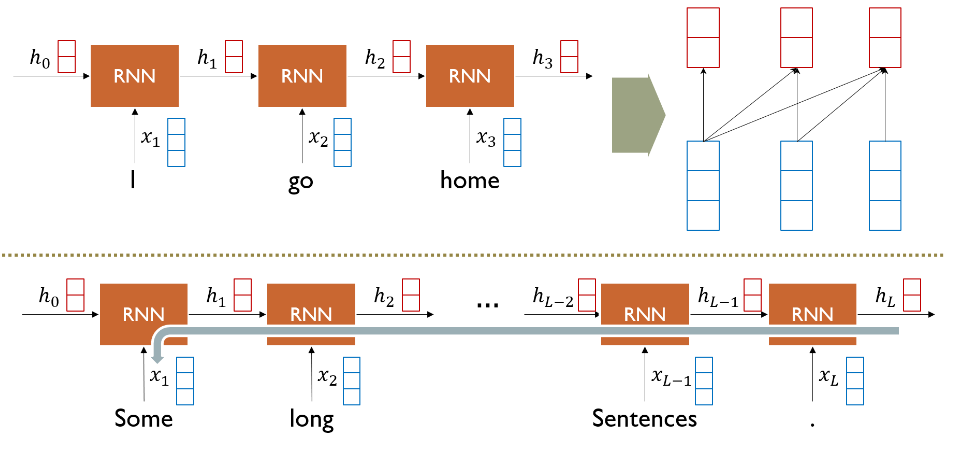
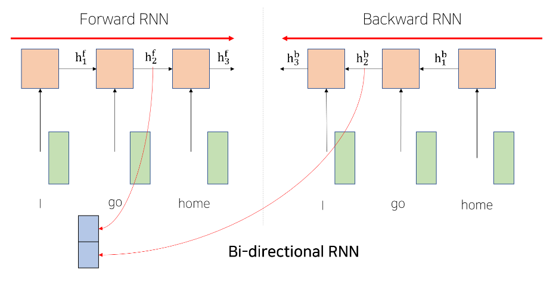
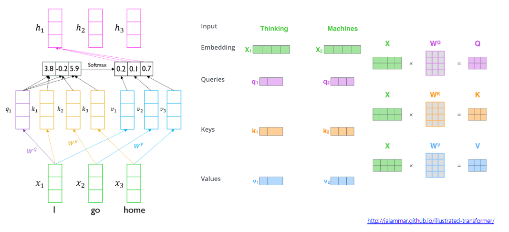
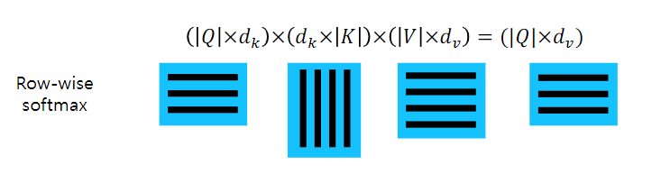
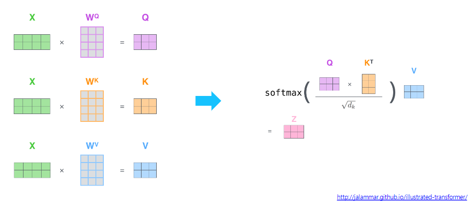
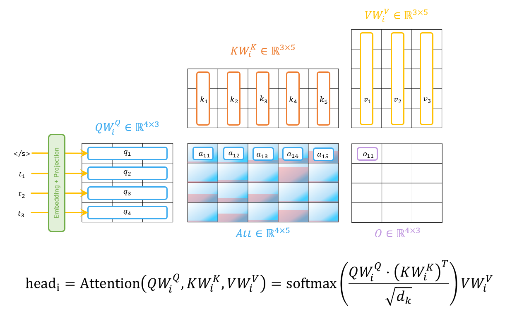
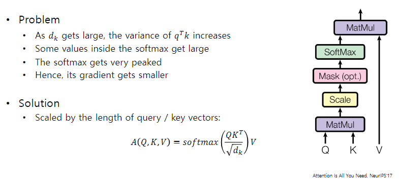

# 7장 Transformer (1)

이번 강의에서는 현재 NLP 연구 분야에서 가장 많이 활용되고 있는 Transformer(Self-Attention)에 대해 자세히 알아봅니다. Self-Attention은 RNN 기반 번역 모델의 단점을 해결하기 위해 처음 등장했습니다. RNN과 Attention을 함께 사용했던 기존과는 달리 Attention 연산만을 이용해 입력 문장/단어의 representation을 학습을 하며 좀 더 parallel한 연산이 가능한 동시에 학습 속도가 빠르다는 장점을 보였습니다

[back to super](https://github.com/jinmang2/boostcamp_ai_tech_2/tree/main/u-stage/nlp)

## Transformer: High-level view

- Recurrent, Convolution 엔진을 거둬내자!

## RNN: long-term dependency

- forward, backward 연산 path가 너무 길어서 장기 의존성 포착이 힘들다...
- attention은 그저 carry out의 재료로 사용됨
- dimension에 대한 계산 복잡도가 quadratic이라 hidden unit을 늘리기는 부담
- stacking하자니 vanishing 문제가 더욱 심각해짐

- sequence를 forward or backward로 구성
    - 위에서는 순전파, 역전파를 의미
    - 여기서는 sequence를 어느 방향으로 볼 것인지를 의미
- `torch.nn.modules.rnn.py`의 `RNNBase` 객체를 상속받아 만들어진 친구들 전부 위처럼 concat함!

## Transformer: Long-Term Dependency

- transformer는 어떻게 long-term dependency를 포착하는가?
- Query-Key-Value로 information retrieval
- 사실 Self-Attention만으로 구성된거라 recurrent module based seq2seq with attn와 유사하게 계산하게 된다.
- 자기 자신에 큰 가중치가 걸리도록 encoding을 수행
- (in self-attention) 각 vector가 query도 하고 key도 하고 value도 하면서 역할이 바뀌게 됨
    - 근데 설명이 찌끔 애매한게... key에 대한 value를 가져오는 개념이라
    - Query랑 key-value 두 역할을 한다고 이해하는 게 맞지 않나 싶음
    - 아닌가...? $W_k$, $W_v$로 다르게 만들어주니까... 역할로 보는게 맞나?
    - 3가지 역할로 보는 것이 맞을 듯
- 그림 설명 간단하게 이해하기 좋은 듯! 근데 코딩이랑 매칭시키기엔 어렵지 않을까...
- long time-step에 대해서도 잘 포착함!
    - 다만 연산량이 quadratic으로 증가해서 이를 처리하는 논문들이 후속으로 나오게 됨

## Transformer: Scaled Dot-Product Attention

- Inputs: a query $q$ and a set of key-value ($k$, $v$) pairs to an output
- Query, Key, Value, and output is all vectors
- Output is weighted sum of values
- Weight of each value is computed by an inner product of query and corresponding key
- Queries and keys have same dimensionality $d_k$, and dimensionality of value is $d_v$

$$A(q,k,v)=\sum_t\cfrac{\exp(q\cdot k_i)}{\sum_j \exp(q\cdot k_j)}v_i$$

- When we havce multiple queire $q$, we can stack them in matrix $Q$

$$A(Q,K,V)=\text{softmax}(QK^T)V$$

- softmax는 row-wise 연산을 취해준다는 점! 꼭 기억!
    - 양변에... 로그를... 아! 취한다~

- 위 그림들 갠적으로는 내가 만든 게 더 나은 듯

- why scaling?

