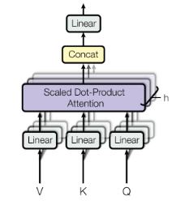
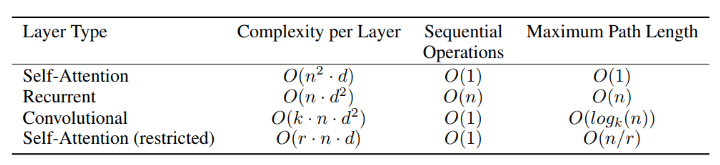
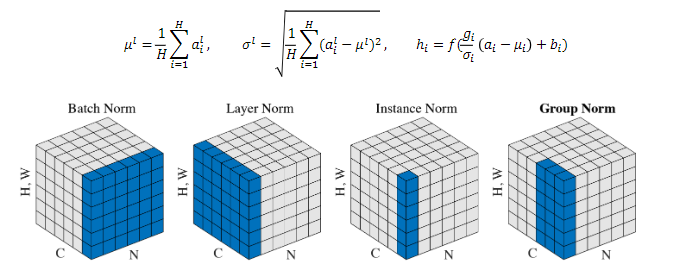
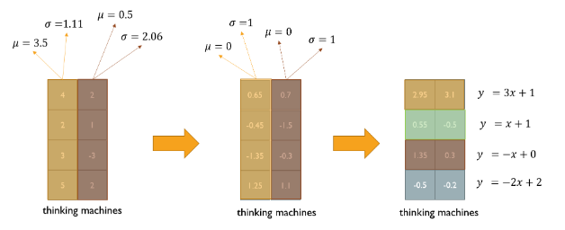
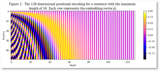
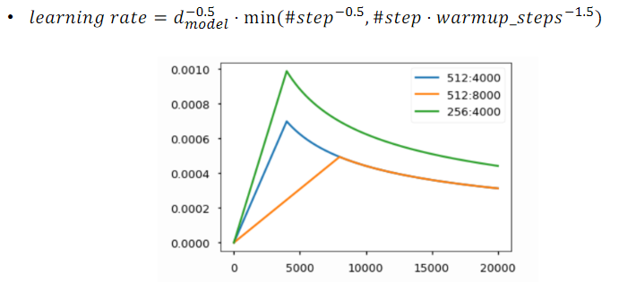
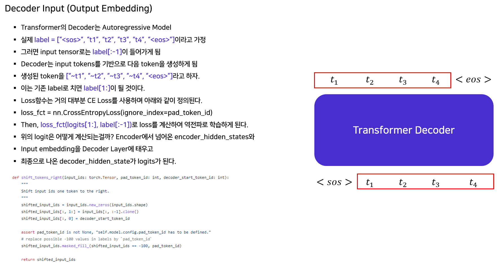
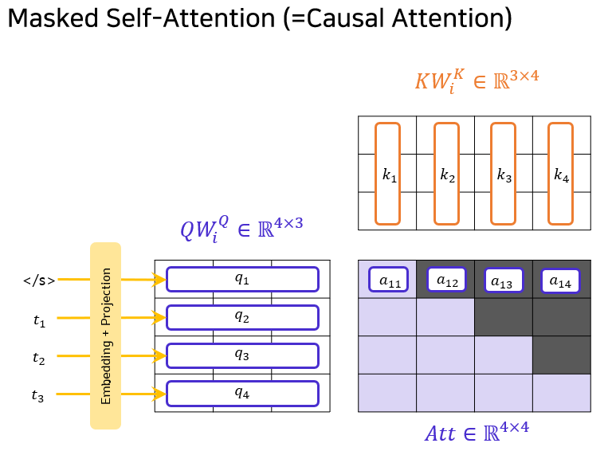

# 8장 Transformer (2)

Transformer(Self-Attention)에 대해 이어서 자세히 알아봅니다.

[back to super](https://github.com/jinmang2/boostcamp_ai_tech_2/tree/main/u-stage/nlp)

## Transformer: Multi-Head Attention
- input word vector: queries, keys and values
- Problem of single attention
    - Only one way for words to interact with one another
- Solution
    - Multi-head attention maps $Q$, $K$, $V$ into the $h$ number of lower-dimensional spaces via $W$ matrices

서로 다른 측면으로 여러 정보를 뽑아올 필요가 있음

$$\text{MultiHead}(Q,K,V)=\text{Concat}(\text{head}_1,\dots,\text{head}_h)W^o$$

$$\text{where }\text{head}_i=\text{Attention}(QW_i^Q,KW_i^K,VW_i^V)$$



- Complexity table
    - $n$: sequence length
    - $d$: dimension of representation
    - $k$: kernel size of convolutions
    - $r$: size of the neighborhood in restricted self-attention



- `Complexity per Layer`: 레이어 별 메모리/시간 복잡도
    - d는 hyperparameter
    - n은 variable-length
    - 좀 더 긴 Sequence에 대해서 Self-Attn은 더 많은 메모리 공간을 필요로 하게 된다.
- `Sequential Operations`: sequence를 몇 번 만에 계산하는가? (병렬화 가능 측면)
    - Self-Attn은 GPU core수가 무한정 많다는 계산 하에 한 번에 계산 가능
- `Maximum Path Length`: Long-term dependency와 관련이 있음

## Transformer: Block-wise module
- Each Block has two sub-layers
    - MHSA와 FFN
- Each of these two steps also has
    - $LayerNorm(x+sublayer(x))$

## Transformer: Layer Normalization
- https://github.com/allenai/allennlp/blob/main/allennlp/modules/layer_norm.py

```python
import torch

from allennlp.nn import util


class LayerNorm(torch.nn.Module):

    """
    An implementation of [Layer Normalization](
    https://www.semanticscholar.org/paper/Layer-Normalization-Ba-Kiros/97fb4e3d45bb098e27e0071448b6152217bd35a5).
    Layer Normalization stabilises the training of deep neural networks by
    normalising the outputs of neurons from a particular layer. It computes:
    output = (gamma * (tensor - mean) / (std + eps)) + beta
    # Parameters
    dimension : `int`, required.
        The dimension of the layer output to normalize.
    # Returns
    The normalized layer output.
    """  # noqa

    def __init__(self, dimension: int) -> None:
        super().__init__()
        self.gamma = torch.nn.Parameter(torch.ones(dimension))
        self.beta = torch.nn.Parameter(torch.zeros(dimension))

    def forward(self, tensor: torch.Tensor):
        mean = tensor.mean(-1, keepdim=True)
        std = tensor.std(-1, unbiased=False, keepdim=True)
        return (
            self.gamma * (tensor - mean) / (std + util.tiny_value_of_dtype(std.dtype)) + self.beta
        )
```



- 각 Word Vector가 zero mean과 one std를 가지도록 정규화
- 학습 가능 parameter로 각 sequence vector의 Affine transformation



## Transformer: Positional Encoding



```python
import torch
import numpy as np
import matplotlib.pyplot as plt
from mpl_toolkits.axes_grid1 import make_axes_locatable

plt.rcParams['font.family'] = 'serif'
plt.rcParams['font.serif'] = ['Times New Roman'] + plt.rcParams['font.serif']

d = d_model = 128
sl = seq_length = 50


def positional_embedding(sl: int, d: int):
    # generate positional embedding tensor
    p = torch.empty(sl, d)
    # positional encoding index
    ts = torch.arange(sl).float().view(-1, 1)
    # weight per each dimensions
    # Note that d is divisible by 2
    w_k = 1/(10000**(2*torch.arange(d//2).float()/d)).view(1, -1)
    # sin part (even number)
    even_sin = torch.sin(ts@w_k)
    # cos part (odd number)
    odd_cos = torch.cos(ts@w_k)
    # store
    p[:, 0::2] = even_sin
    p[:, 1::2] = odd_cos
    return p


pe = positional_embedding(sl, d)

plt.figure(figsize=(10, 8), facecolor='w')
ax = plt.gca()
im = ax.imshow(pe.numpy(), cmap=plt.get_cmap('RdBu'))
divider = make_axes_locatable(ax)
cax = divider.append_axes("right", size="2%", pad=0.5)
ax.set_xlabel('Depth', fontsize=9)
ax.set_ylabel('Position', fontsize=9)
ax.set_title("Figure 2 - The 128-dimensional positional encoding for a sentence with the maximum \n"
             r"length of 50. Each row represents the embedding vector $\vec{p_t}$",)
plt.colorbar(im, cax=cax)
plt.show()
```

## Transformer: Warm-up Learning Rate Scheduler



## Transformer: Encoder Self-Attention Visualization

https://colab.research.google.com/github/tensorflow/tensor2tensor/blob/master/tensor2tensor/notebooks/hello_t2t.ipynb

## Transformer: Decoder






## Further Reading
- [Attention is all you need, NeurIPS'17](https://arxiv.org/abs/1706.03762)
- [Illustrated Transformer](http://jalammar.github.io/illustrated-transformer/)
- [Annotated Transformer](http://nlp.seas.harvard.edu/2018/04/03/attention.html)
- [Group Normalization](https://openaccess.thecvf.com/content_ECCV_2018/papers/Yuxin_Wu_Group_Normalization_ECCV_2018_paper.pdf)
