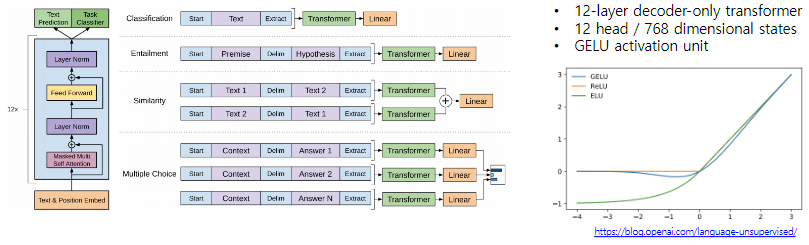
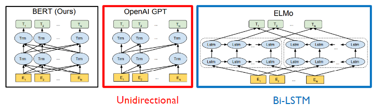
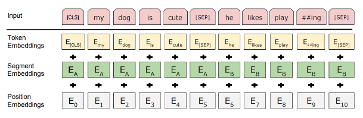
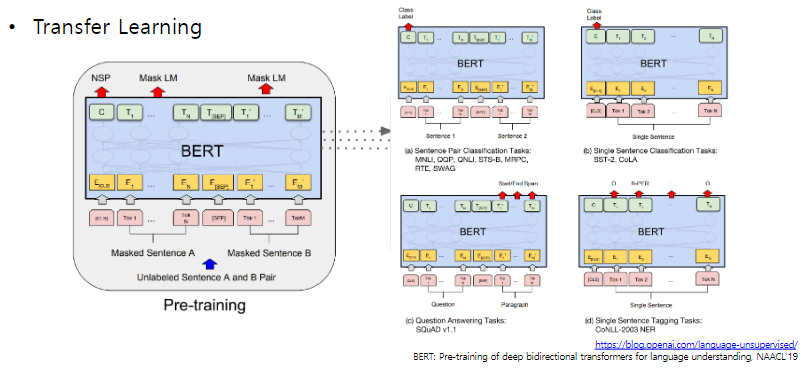

# 9장 GPT-1 and BERT

자연어 처리 분야에 한 획을 그은 GPT-1과 BERT를 소개합니다.

GPT-1과 BERT는 Transfer Learning, Self-supervised Learning, Transformer를 사용했다는 공통점이 있습니다. 세가지의 강력한 무기를 이용해 대용량의 text를 학습한 모델을 target task에 적용해 거의 모든 기존 자연어처리 task를 압도하는 성능을 보여주었습니다. 세 가지의 키워드를 통해 두 모델을 자세히 알아봅니다.

[back to super](https://github.com/jinmang2/boostcamp_ai_tech_2/tree/main/u-stage/nlp)

## GPT-1

### Improving Language Understanding by Generative Pre-training

- It introduces special tokens, such as `<S>` `<E>`, to achieve effective transfer learning during fine-tuning
- It does not need to use additional task-specific architectures on top of transferred

## BERT

### Pre-training of Deep Bidirectional Transformers for Langauge Understanding

- Learn through masked language modeling task
- Use large-scale data and large-scale model

### Masked Language Model: Motivation
- 언어 모델은 오직 left-to-right context만 모델링
- 그러나 NLU는 bi-directional
- Cheating을 하지 않고 양 방향 고려 가능?

### Pre-training Tasks in BERT
- NSP
    - Sentence A와 Sentence B가 IsNext인지 아닌지를 분류하는 task
    - 사실 그렇게 중요한 task는 아님
- MLM
    - input token의 일부를 `[MASK]` token으로 변환
    - Too little masking: Too expensive to train
    - Too much masking: Not enough to capture context
    - 문제점: Mask token은 fine-tuning 당시엔 관찰되지 않음
    - 해결책: 총 15 %를 아래처럼 변환
        - 80%는 `[MASK]`로 대체
        - 10%는 random token으로 대체
        - 10%는 그냥 그래도 둠

### BERT: Input Representation

### BERT: Fine-tuning process

## BERT vs GPT-1

**Training Data Size**

- GPT-1: BookCorpus (800M words)
- BERT: BookCorpus and Wikipedia (2,500M words)

**Training special tokens during training**
- BERT: `[SEP]`, `[CLS]`

**Batch size**
- GPT-1: 32,000 words
- BERT: 128,000 words

**Task-specific fine-tuning**
- GPT-1: same learning rate `5e-5`
- BERT: choose a task-specific fine-tuning learning rate

## Further Reading
- [GPT-1](https://openai.com/blog/language-unsupervised/)
- [BERT : Pre-training of deep bidirectional transformers for language understanding, NAACL’19](https://arxiv.org/abs/1810.04805)
- [SQuAD: Stanford Question Answering Dataset](https://rajpurkar.github.io/SQuAD-explorer/)
- [SWAG: A Large-scale Adversarial Dataset for Grounded Commonsense Inference](https://leaderboard.allenai.org/swag/submissions/public)
