# BERT 논문 리뷰

- [BERT: Pre-training of Deep Bidirectional Transformers for Language Understanding](https://aclanthology.org/N19-1423/)
- Jacob Devlin, Ming-Wei Chang, Kenton Lee, Kristina Toutanova
- Google AI Language

## 세 줄 요약
- Deep Bidirectional! ELMo, GPT-1과 다르게 양방향을 MLM으로 학습
- Cloze task로부터 영감을 받은 Masked Langauge Modeling 소개
- Transformer는 이렇게 사용하는 것이라는 것을 엄청나게 성능 향상시켜 보여줬음! @ All SOTA

---

## Abstract
- BERT: Bidirectional Encoder Representations from Transformers
- ELMo, GPT-1과 다르게 deep bidirectional!
- Pre-training and Fine-tune! + additional output layer
- BERT는 개념적으로 간단하고 실제로 강력함!
- 어마어마하게 성능 향상을 시켰음!!

## Introduction
- PLM은 근 4년간 (2018년 기준) NLP의 표준이 됐음 (word, sentence, paraphrase-level 전부)
- 이 중 ELMo, GPT-1이 정리를 잘 해놨고, 두 접근 방식이 다름
    - ELMo: feature-based, task-specific 구조
    - GPT-1: fine-tune-based, all pre-trained parameters update
- ELMo와 GPT-1은 둘 다 Causal Language Modeling을 pre-training objective fn으로 사용했음
- 하지만 CLM은 pre-trained representation의 힘에 제한을 걸어 버림.. ㄷㄷ (대충 록리 짤)
    - 왜? CLM은 self-attn으로 단 방향으로만 집중할 수 있음
- 본 논문에선 위 Bi-directional한 표현을 배울 수 있는 BERT를 소개!
- 이게 사실 Encoder part에서 self-attn을 배우려면 cheating을 안해야 함
- 위를 위해 `Masked Language Modeling`을 제안! (Cloze task에서 영감)
    - 쩌리로 `Next Sentence Prediction`도 있음 ㅎㅎ

본 논문의 Contribution은?
1. PLM에서 bidirectional 중요성을 시사
2. MLM으로 bidirectional 표현 배움 (ELMo, GPT-1 훠이훠이)
3. PLM은 강력해! task-specific model 만들 이유가 없음

## Related Word

### Unsupervised Feature-based Approaches
- Non-Neural 방식 e.g., 1992~2006
- Neural 방식 e.g., Word2Vec, GloVe
- 보통 PLM을 학습시킬 때 Causal LM을 학습시키거나 word2vec처럼 window 안의 context를 학습시켜왔음
- word뿐만 아니라 sentence, paragraph-level로 일반화되기도 함
    - sentence embedding 학습을 위해선 아래 objective를 사용했다고 함
        1. rank candidate next sentences
        2. left-to-right generation of next sentence words given repr of the previous sentence
        3. denoising autoencoder derived objectives
- ELMo가 대표적인 Feature-based 접근 방식. 여러 접근들을 일반화하여 잘 정리한 논문!
    - left-to-right, right-to-left로부터 context-sensitive한 표현을 추출
    - 이를 새로운 모델에 feeding해줌 (추가적인 task-specific model parameter 발생)
    - ELMo가 여러 기법을 다 활용해서 다양하게 SOTA를 달성했었음
- Fedus et al., 2018은 cloze task가 text generation model을 견고히 만들어 준다는 것을 보고
- Feature-based의 장점: 미리 계산 가능, task-specific 구조 가능

### Unsupervised Fine-tuning Approaches
- semi-sup (Dai and Le, 2015)
- ULMFiT (Howard and Ruder, 1028)
- GPT-1 (Radford et al., 2018)
- 위 방법의 장점: scratch보다 더 적은 parameter의 추가만 요구
- GPT-1가 ELMo처럼 여러 분야에서 SOTA도 받음
- 보통 CLM으로 pre-training 수행

### Transfer Learning from Supervised Data
- ImageNet 얘기

## BERT

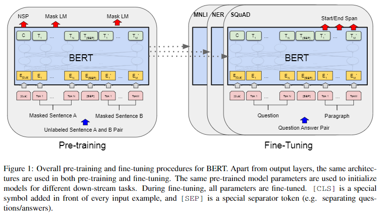
- `pre-training` and `fine-tuning`
- pre-training의 목적: Good Initialized point 찾기!
- fine-tune: head classifier만 바꿔주기!
    - 어찌보면 단점일지도

### Model Architecture
- Transformer Encoder
- GPT-1과의 실험 비교를 위해 BERT_BASE는 GPT-1과 비슷하게 맞춰주고
    - L=12, H=768, A=12, TOTAL Params=110M (대략 400Mb)
- Large는 엄청 키웠다!
    - L=24, H-1024, A=16, TOTAL Params=340M (대략 1.2Gb)

### Input/Output Representations

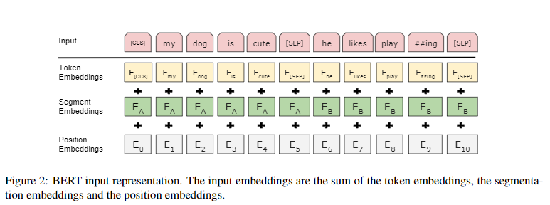

- GPT-1의 `task-aware input transformation`처럼 변환시켜준다
- 다만, BERT는 task-head가 더 중요하기 때문에, 아래 두 종류만 사용한다
    - `[CLS] Sentence A [SEP]`
    - `[CLS] Sentence A [SEP] Sentence B [SEP]`
- GNMT의 WordPiece를 사용, `30,000` token vocab!
- `[CLS]`는 classification token의 약자. 분류에 쓸 special token임
- `word embedding` + `position embedding` + `segment embedding`으로 input 계산!

### Pre-training BERT

#### Task #1: Masked LM
- ELMo, GPT-1과의 가장 큰 차이점: MLM으로 양방향 학습!
- see itself를 방지하기 위해서 Cloze task에서 영감을 받음
- 항상 코드로 기억!
- https://github.com/jinmang2/boostcamp_ai_tech_2/tree/main/u-stage/nlp//ch09_gpt_and_bert/mlm.py

#### Task #2: Next Sentence Prediction
- `IsNext`, `NotNext`인지 판별하는 이진 분류 문제
- 논문에 어떻게 data select하는지 appendix에 있음
- 호옥시 from scratch부터 뜯어볼 일이 있다면 나중에 보자 ㅎㅎ
- 그닥 효용이 없는 task

#### Pre-training data
- BookCorpus 800M
- English Wikipedia 2,500M
- 1B Word Benchmark는 사용 X (NSP에 못 쓰나봄)

### Fine-tuning BERT

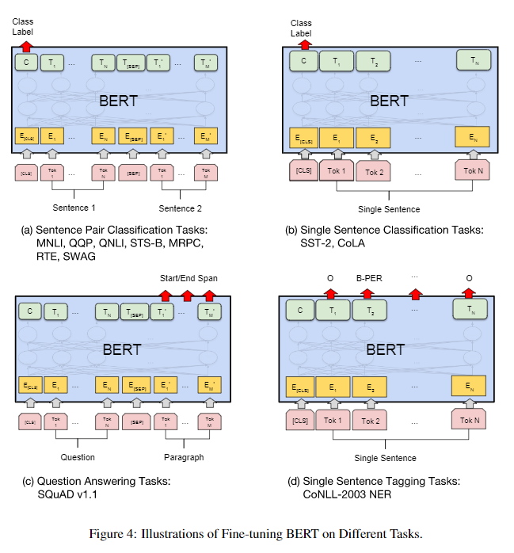

- 코드 뜯어보면 명확해짐
- 논문의 설명을 추가할 부분이 있다면,
    - 이전 `Decomposable Attention`이나 `Bidirectional Attention Flow`의 경우 bidirectional cross attention을 적용하기 전에
    - text pair를 독립적으로 encoding해줬다고 함
- BERT의 self-attn이 cross-attn을 대체한다고 설명
- 논문에서 pooler 설명이 조금 빠져있음
- fine-tune은 상대적으로 가벼운 연산

## Experiments

- 특이한 점
    - GPT-1과 다르게 task별 learning rate를 달리 해줬다는 점
    - Catastrophic forgetting을 피해주기 위해 여러 세팅을 달리함
        - https://datascience.stackexchange.com/questions/49313/how-does-bert-deal-with-catastrophic-forgetting
        - Random Restart
        - 3 epochs
        - 적용은 아니지만, Bias Compensation을 위해 기본 Adam, AdamW 사용
        - https://github.com/huggingface/transformers/issues/1019
- 데이터셋 마다 batch도 조금씩 다르고 input setting, head 모양도 조금씩 다름
- 그런 것들은 문제 풀 때마다 봐도 충분함
- 우리는 결과만 보자 일단

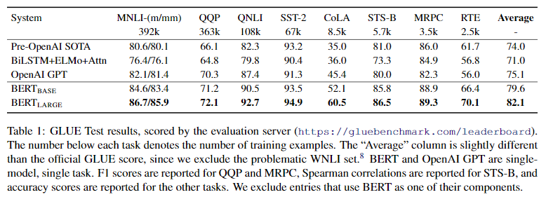
- GLUE의 결과
- 걍 압도 ㄷㄷ 이건 뭐 1~2%도 아니고 거의 평균 4~5% 정도 오른 듯

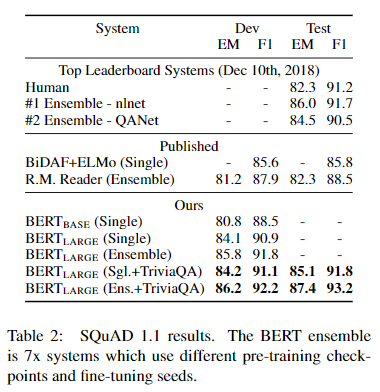
- SQuAD v1.1의 결과
- 여기도 압도적인 결과

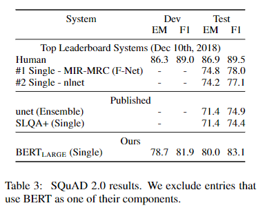
- SQuAD v2.0의 결과
- Human은 못 이기지만 기존 기법들 대비 거의 8% 올랐다 ㄷㄷ

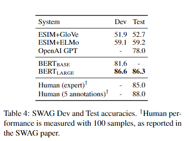
- SWAG는 multiplechoice 문제라고 함
- BERT좌 못하는 것이 무엇이오?

## Ablation Study

- NSP와 MLM은 큰 도움이 됨! (NSP는 ... ㅎㅎ 실험 제대로 한게 맞나?)
    - NSP는 보면 MRPC, SST, SQuAD에선 비슷비슷함

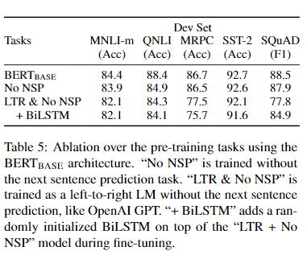

- Model은 키우면 키울수록 더 좋아짐
    - 실제로 RoBERTa 논문에서 BERT는 underfitting이라고 지적
    - ELMo에서 1,000으로 키우면 모델 성능이 떨어진다고 보고한 바가 있는데
    - BERT에선 downstream data가 적더라도 pre-train and fine-tune의 이점으로 모델 hidden dim을 키워도 학습이 잘된다고 가설을 주장하는데
    - 걍 Transformer써서 잘되는 거라고 생각한다
    - 그리고 ULMFiT 논문에서 fine-tuning도 어느 정도 데이터가 많이 필요하다는 것을 보여줬고... ㄷㄷ

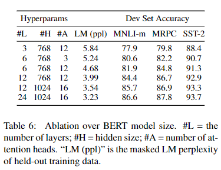

- Feature-based 장점도 있지만 Fine-Tuning의 성능은 무시할 수 없다.

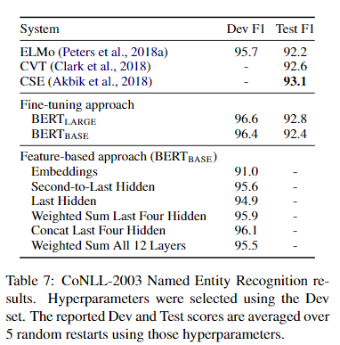

- MLM은 거의 필수

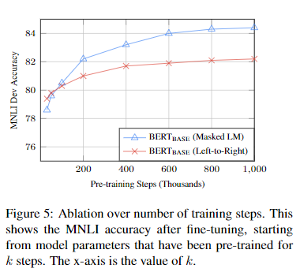

- Masking의 적절한 비율이 필요함

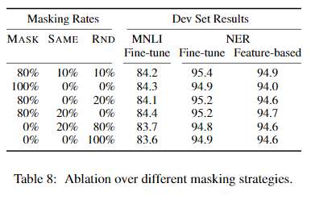

## GPT-1 VS BERT

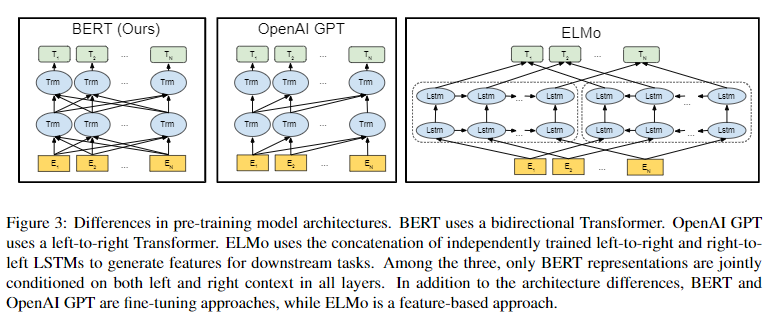

- GPT는 BookCorpus 800M vs BERT는 거기에 Wikipedia 2,500M까지 태움
- GPT는 `[CLS]`과 `[SEP]`을 fine-tuning 단계에서, BERT는 pre-training 단계에서 학습
- GPT는 1M step에서 32,000 words 가량의 batch size로 학습 vs BERT는 동일 스탭 12,8000 words 학습
- GPT는 모든 fine-tuning 실험에 learning rate를 `5e-05`로 통일 vs BERT는 task마다 달리
