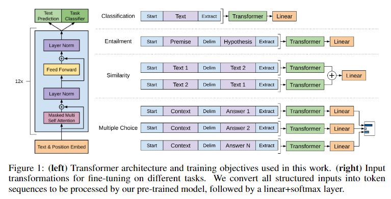
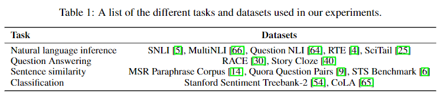
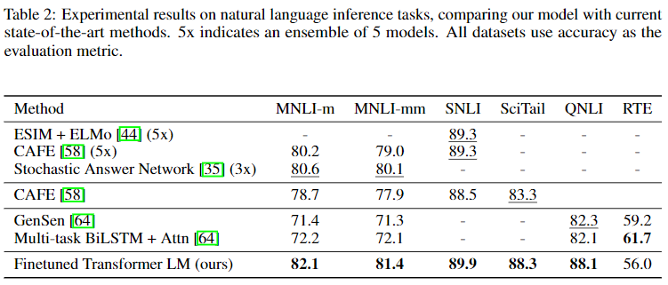
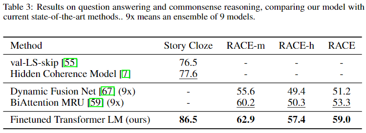
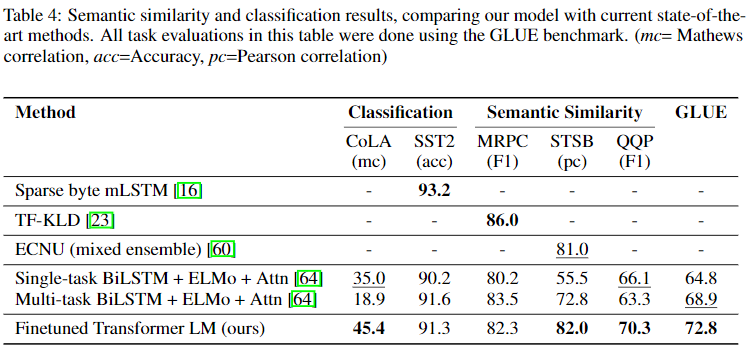
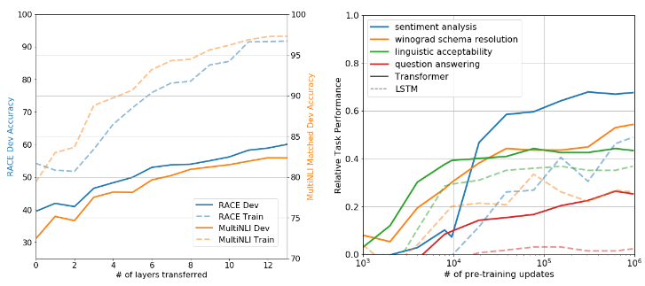
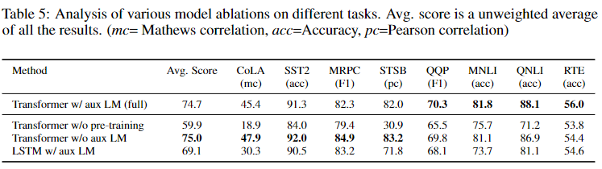

# Generative Pre-Training 1

# GPT-1 논문 리뷰

- [Improving Language Understandingby Generative Pre-Training](https://openai.com/blog/language-unsupervised/)
- Alec Radford, Karhik Narasimhan, Tim Salimans, Ilya Sutskever
- OpenAI

## 세 줄 요약
- Transformer Decoder로 Pre-Training and Fine-tuning! (With GELU)
- PLM: Causal Language Modeling, Fine-tune: Task-specific input transformations (DeepMind 논문에서 영감)
- 4종류의 총 12개의 NLU Task 중 9개에서 New Sota 달성! Transformer w/o pre-training에 대한 실험도 진행

---

## Abstract
- NLU Tasks: NLI, QA, STS, CLS
- 생성모델로 위 문제 풀고 싶음! 어떻게?
    - large unlabeled data 활용
    - task-aware input transformation
- 12 개 중 9개 task New SOTA

## Main Figure

## Introduction

- 일반적으로 labeled data는 부족함 (특히 당시 nlp)
- 그치만 unlabeled data는 많음
    - 이를 활용할 수만 있다면 performance boost가능할 것
- 위 사실을 뒷받침하는 최근 연구들 있었음 e.g., word2vec, GloVe
- 그치만 unlabeled text에서 word-level information을 다루는 데에는 두 가지 문제가 있음
    1. 어떻게 학습할지 애매함 (objective function 어떻게 정의?)
    2. 어떻게 전이시킬지 애매함
- 이 전에 크게 세 가지 접근 방식이 있었음
    1. Make task-specific model architectures (Pre-ELMo, ELMo)
    2. Use intricate learning schemes (ULMFiT)
    3. Add auxiliary learning objectives
- 뭔가 중구난방이고 합의된 consensus가 없음
- 그걸 우리가 semi-supervised approach 탐험을 하고 제안하겠음! 이름하야 `pretraining and fine-tuning`
- Transformer의 Decoder 사용할 것임. Self-Attention으로 더 크게 모델을 키울 수 있음
- transfer에는 DeepMind의 `Reasoning about entailment with neural attention`의 Traversal-style task-specific input adaptation을 사용할 것임
    - structured text input을 single contiguous sequence of tokens로 처리
- 실험 결과 최소한의 변화로 SOTA 달성임!

## Related Work

**Semi-supervised learning for NLP**

- Word2Vec, GloVe 등의 접근 방식은 higher-level semantics 포착 불가능
- Skip-thought vector부터 Lample의 논문에 이르기까지 unlabeled data로 부터 word-level semantic을 학습하려는 연구는 굉장히 많았음
- 다들 효과가 좋았고 굉장히 흥미로운 접근 방식

**Unsupervised pre-training**

- Unsup은 semi-sup의 부분 집합
    - Goal: 좋은 initialization point를 찾는 것
- image classification/regression, speech recognition, entity disambiguation, machine translation 등에서 연구되었음
- 우리 연구에 가장 가까운 방향은 Language Modeling을 사용한 연구들!
- 근데 보통 LSTM을 사용함... 얘는 transformer보다 열등함
    - 모델을 키우는 것도 부담이고 long-term dependency 포착을 못함
- ELMo도 좋은 접근 방식인데, feature-based는 target task를 풀기 위해 추가적인 parameter가 필요함
- 우린 ㄴㄴ ^^

## Framework

2-stage

### stage 1. Unsupervised pre-training

**Causal Language Modeling**

$$\mathcal{L}_1=\sum_i \log{P(u_i | u_{i-k},\dots,u_{i-1};\Theta)}$$

위 수식을 Transformer Decoder로 모델링!

$$\begin{aligned}
h_o&=UW_e+W_p\\
h_1&=\text{transformer\_block}(h_{l-1})\;\forall i\in [1,n]\\
P(u)&=\text{softmax}(h_nW_e^T)
\end{aligned}$$

- $U$는 context vector of tokens, 즉 `nn.Embedding`을 통과한 상태! (수식만 보면)
- $n$은 number of layers
- $W_e$는 token embedding matrix인데 `nn.Linear`로 구현하면 될 듯
- $W_p$는 position embedding matrix
- Transformer Decoder Block: Cross-Attention 제거하고 사용

### stage 2. Supervised fine-tuning

$$P(y|x^1,\dots,x^m)=\text{softmax}(h_l^m W_y)$$

- $x^1,\dots,x^m$: 길이가 m인 input tokens
- $h_l^m$: final transformer decoder output of last token m
- $W_y$: task-specific layer. 이 부분만 유일하게 추가된다! (ELMo와 이 부분이 다름)

아래 수식을 optimize

$$\mathcal{L}_2=\sum_{x,y}\log P(y|x^1,\dots,x^m)$$

### Final loss: Sum over

$$\mathcal{L}=\mathcal{L}_1+\lambda*\mathcal{L}_2$$

- LM Loss를 사용하면 일반화 + 빠른 수렴 가능! (in Pre-ELMo paper)

### Task-specific input transformations

사실 상 GPT-1의 핵심! input을 어떻게 넣어줄 것이냐? Main figure보면 알 수 있음. 간단하게 정리

참고: 이는 DeepMind의 `Reasoning about entailment with neural attention`에서 영감을 얻었다고 함

- Text Classification: `<s> sentence <e>`
- Text entailment: `<s> premise $ hypothesis <e>`
- Similarity: `<s> sentence A $ sentence B <e>`, `<s> sentence B $ sentence C <e>`
- Question Answering and Commonsense Reasoning: `<s> z q & a_1 <e>`, ..., `<s> z q & a_k <e>`
    - `z`: document context, `q`: question, `a_k`: possible answer

## Experiments

### Setup
- BooksCorpus dataset 7,000 unique unpublished books (800M words)
    - ELMo는 1B Word dataset을 썼는데 sentence-level을 섞어줘서 long-range 구조가 망가졌다고 지적
    - 해당 dataset에 대한 실험을 올리진 않았으나 ppl 18.4가 나왔다고 함
- Transformer Decoder
- 768 dinemsional states, 12 attention heads, 3,072 FFN dims
- Cross-Attention X
- Adam Optimizer with max learning rate 2.5e-04, cosine scheduler warm-up step 2000
- 100 epochs, mini-batch size 64, max token 512
- LayerNorm ~ N(0, 0.02)
- BPE vocab 40,000 merges
- residual, embedding, and attention dropouts with rate of 0.1
- L2 Regularization with w=0.01
- Use GELU activation function
- Use learned position embedding
- Use ftfy library for clean text
- Use spaCy tokenizer for standardize some punctuation and whitespace

#### Fine-tune setup
- drpoout: 0.1
- learning rate 6.25e-5
- batch size: 32
- 3 epochs
- warmup ratio 0.2% of training
- linear learning rate scheduler

## Results

- RTE 빼고 다 잘함

- 다 잘함

- SST2, MRPC 빼고 다 잘함

- Ablation Study 진행, 깊게 쌓는 것과 Transformer 사용은 필수

- pre-training없는 transformer는 LSTM보다 훨씬 열등
- aux LM은 효과적

