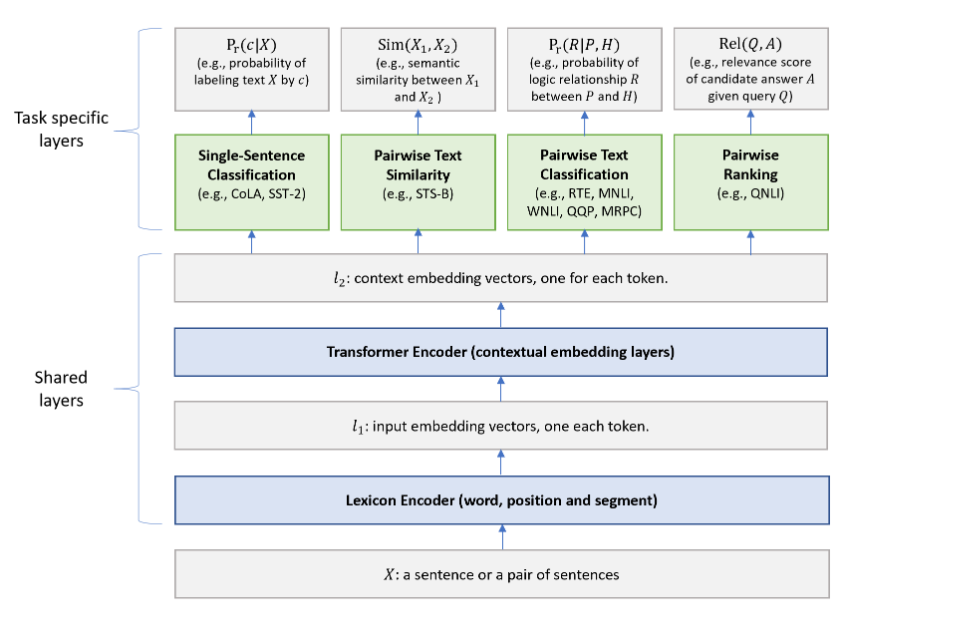
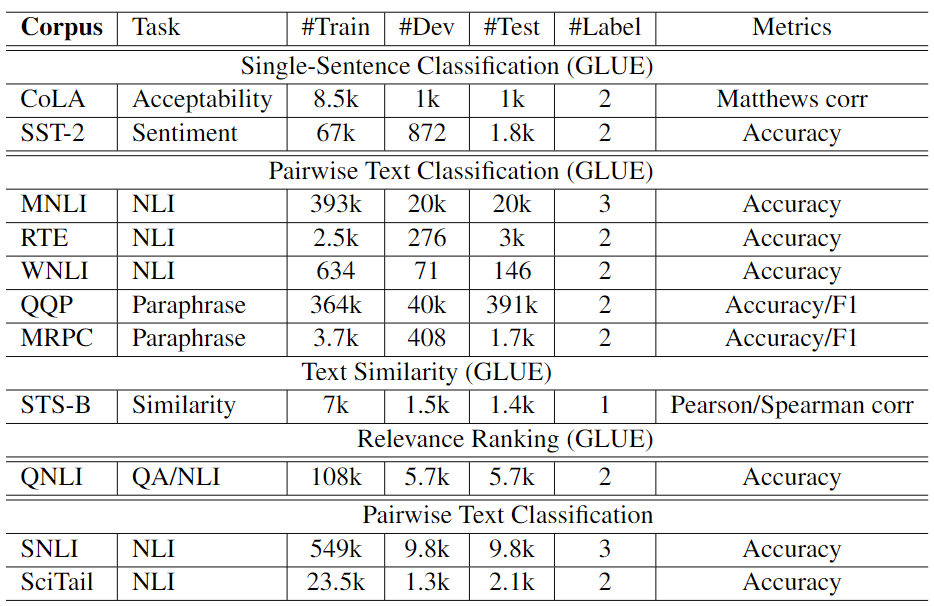
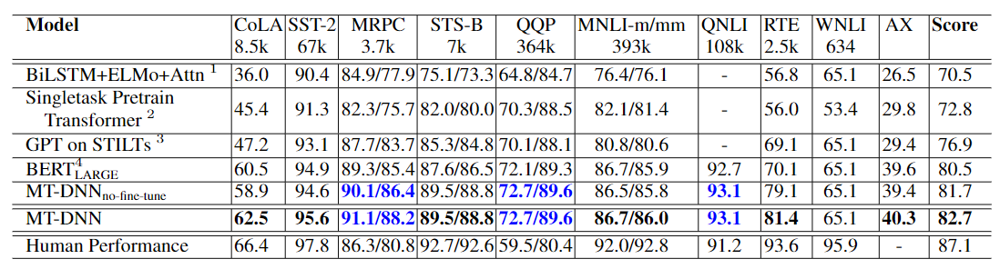
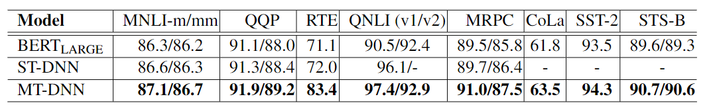
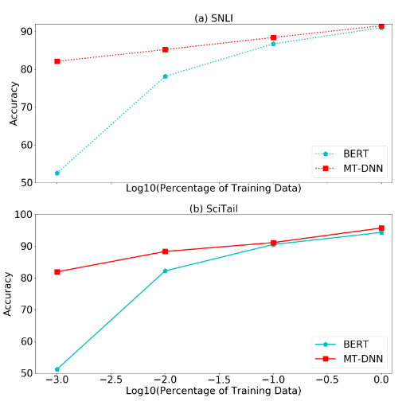
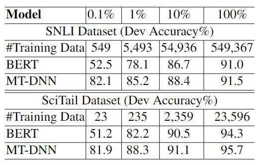
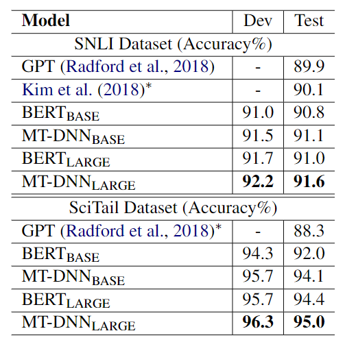

# MT-DNN 논문 리뷰

- [Multi-Task Deep Neural Networks for Natural Language Understanding](https://arxiv.org/abs/1901.11504)
- Xiaodong Liu, Pengcheng He, Weizhu Chen, Jianfeng Gao
- Microsoft

## 세 줄 요약
- MTL + PLM(BERT), 그것이 MT-DNN
- BERT와 차이? pre-training에 MTL도 학습한 점, 4가지 task head를 가짐
- SNLI, SciTail, GLUE 9가지 task에서 New SOTA를 거머쥐었고(19.02.25 기준) 더 적은 데이터로 빠르게 domain adaptation이 가능하다.

---

## Abstract
- 다양한 NLU tasks에 대한 표현을 학습하는 Multi-Task DNN을 제안
- Liu 2015연구에 BERT를 결합한 모델
    - [Representa-tion learning using multi-task deep neural networksfor semantic classification and information retrieval](https://aclanthology.org/N15-1092/)
- SNLI, SciTail, GLUE의 9가지 task에서 SOTA를 달성
    - 19.02.25 GLUE Test dataset
- MT-DNN이 BERT보다 더 적은 in-domain label로 domain adaptation이 가능함을 보임

## 1. Introduction

### Multi-Task Learning
- human learning activities에서 영감을 받음
- MTL + Deep Learning은 효과적
    1. Supervised Learning은 Labeled data를 너무 많이 요구함
    2. Specific task에 overfit되지 않고 여러 task를 고루 학습하여 regularization 효과를 줌

### Language model pre-training
- ELMo, GPT-1, BERT 등 PLM 연구도 성공적
- unsupervised objective를 large unlabeled corpora로 학습된 Neural Net들임
- Specific NLU Task에 적용시키기 위해서는 간단한 head를 달고 labeled task-specific data로 fine-tune시킴


### MTL + PLM
- 위 둘은 서로 보완될 수 있는 기술임
- 이에 MTL의 최신 기술(Liu et. al., 2015)에 BERT를 shard text encoder로 결합
- Backbone으로 BertModel을 공통 encoder로 사용, 각 task-specific한 head를 4개 다는 식으로 모델 아키텍쳐 구성
    - 본 논문에선 `단일 문장 분류`, `쌍으로 된 문장 분류`, `텍스트 유사도`, `관련성 순위 매기기` 태스크에 대한 head를 달았음.
- BERT와 비슷하게 fine-tune시키는 방식이며 차이점은 **PLM에 더하여 MTL을 사용한다는 점**

### MT-DNN SOTA!
- 실험 결과를 보면 알 수 있음. BERT보다 훨씬 잘함 ㅎㅎ
- 그리고 Regularization 효과도 있음을 보여줄 것임

## 2. Tasks
각 NLU Task에 대해서 소개함

### Single-Sentence Classification
- 문장을 본 연구에서는 언어학적으로 가능한 문장보다는 연속된 텍스트 혹은 단어의 수열의 임의 span으로 여기자고 가정
- 위의 Sentence가 주어지면 어떠한 class를 가질지 예측하는 문제
- **CoLA**: 문장이 문법적으로 유창한지 여부 예측
- **SST-2**: 영화 리뷰 문장에 대해 긍부정 예측

### Text Similarity
- Regression task
- 주어진 sentence pair에 대하여, 두 문장 간의 유사도를 실수값으로 예측
- GLUE에서 **STS-B**이 이 task를 가짐

### Pairwise Text Classification
- 주어진 문장 쌍에 대하여 사전 정의된 label로 두 문장의 관계를 결정
- 아래 두 task는 주어진 두 문장이 연관이 있는지(entailment), 모순인지(contradiction), 혹은 아무 상관없는지(neutral)를 예측
    - **RTE**: Recognizing Text Entailment
    - **MNLI**: Multilingual Natural Language Inference
- 아래 두 task는 paraphrase dataset으로 문장 pair가 의미적으로 유사한지 판별
    - **QQP**: Quora Question Pair
    - **MRPC**: Microsoft Research Paraphrase Corpus

### Relevance Ranking
- 주어진 Query와 후보 Answer list로 Query에 가장 연관있을 후보 문장에 rank를 매기는 task
- Poly-Encoder가 푸는 Retrieval 기반 task같은 친구
- **QNLI**: Stanford Question ANswering Dataset Version의 NLI 데이터
- 위 dataset은 GLUE에서 이진 분류 task로 정의되어 있지만 본 연구에선 Relevance Ranking task로 간주하여 풀 것임
- 어떻게? 연관있는 문장과 그렇지 않은 문장들에 순위를 매기는 방식으로!
- 이렇게 푸는 것이 이진 분류 정확도 향상에 크게 기여했다고 얘기함

## 3. The Proposed MT-DNN Model
아키텍처는 정말 단순함.



**Lexicon Encoder** 그냥 BERT의 `Word Embedding` + `Position Embedding` + `Segment Embedding`과 동일함

**Transformer Encoder** 우리가 아는 Transformer의 Encoder.
- BERT와의 차이점은 pre-training에 더해 Multi-task objective를 학습한다는 점
- 위에 단순히 NLU Head 말고 Decoder를 붙여서 Text-Generation과 같은 task를 푸는 것도 가능하다고 함

**Single-Sentence Classification Output**
- $x$를 `[CLS]` 토큰에서 나온 contextual embedding이라고 가정
    - 문장 $X$의 semantic representation으로 해석 가능
- $W_{SST}$가 task-specific parameter일 때, 아래를 모델링

$$P_r(c|X)=\text{softmax}(W_{SST}^{\intercal}\cdot x)$$

**Text Similarity Output**
- $x$를 `[CLS]` 토큰에서 나온 contextual embedding이라고 가정
    - 문장 쌍 $(X_1, X_2)$의 semantic representation
- $W_{STS}$는 task-specific parameter

$$Sim(X_1,\,X_2)=W_{STS}^{\intercal}\cdot x \in \mathbb{R}$$

**Pairwise Text Classification Output**
- NLI task를 예시로 보자. NLI는 아래와 같은 task임
    - Premise; $P=(p_1,\dots,p_m)$
    - Hypothesis; $H=(h_1,\dots,h_n)$
    - Aim to find a logical relationship $R$ between $P$ and $H$
- output module의 design은 Liu의 **Stochastic Answer Network (SAN)**을 따를 것
    - Multi-step reasoning을 사용
    - 상태를 유지하고 예측을 반복적으로 수정하는 것이 가능
- SAN Answer Module에 대해 더 자세히 알아보자
    - $P$와 $H$의 단어들의 contextual embedding들을 concat하여 working memory를 구축
    - 이를 $M^p\in\mathbb{R}^{d\times m}$, $M^h\in\mathbb{R}^{d\times n}$으로 denote
    - 그러면 이를 $K$-step(hyperparameter) 추론을 수행함
    - 초기 상태 $s^0$은 hypothesis $M^h$에 대한 요약임
        - $s^0=\sum_j{\alpha_j M_j^h}$
        - where $\alpha_j=\cfrac{\exp(w_1^\intercal\cdot M_j^h)}{\sum_i\exp(w_1^\intercal\cdot M_j^h)}$
    - step k에서의 상태 $s^k$는 아래와 같이 정의됨
        - $s^k=\text{GRU}(s^{k-1},x^k)$
        - where $x_k=\sum_j \beta_j M_j^p$ and $\beta_j=\text{softmax}(s^{k-1}W_2^\intercal M^p)$
    - 각 step에서의 relation을 결정하기 위해 one-layer classifier 사용
        - $P_r^k=\text{softmax}(W_3^\intercal \big[s^k;x^k;|s^k-x^k|;s^k\cdot x^k \big])$
    - 최종적으로 $K$개의 output의 평균을 점수로 사용
        - $P_r=\text{avg}([P_r^0,P_r^1,\dots,P_r^{k-1}])$
        - 각 $P_r$은 전체 관계 $R\in\mathcal{R}$에 대한 확률 분포
    - 학습하는 동안 stochastic prediction dropout을 평균내기 전에 적용
    - Decoding할 때 robustness를 위해 모든 output을 평균냄

**Relevance Ranking Output**
- QNLI를 예시로
- $x$를 질문과 후보 답변 쌍 $(Q, A)$의 semantic representation인 `[CLS]`의 contextual embedding vector라 가정
- Relevance Score를 아래와 같이 계산
    - $\text{Rel}(Q,A)=g(W_{QNLI}^\intercal\cdot x)$
- 주어진 $Q$에 대해 모든 후보 문장을 relevance score로 줄세움

### 3.1 The Training Procedure
- pre-training과 multi-task learning의 two-stage로 학습이 이루어짐
- BERT는 release된 PLM 사용 (MLM과 NSP로 학습된)
- 중요한 것은 MTL!
- 알고리즘은 아래와 같음

```
Algorithm 1: MT-DNN 모델 학습
=========================================================
model parameter를 임의로 초기화
Lexicon/Transformer Encoder를 MLM과 NSP로 사전 학습
몇 번의 Epoch을 돌 건지 세팅; epoch_max
// T개의 task data 준비
for t in 1, 2, ..., T do (task의 수만큼 loop)
    dataset t를 mini-batch D_t로 패킹
end
for epoch in 1, 2, ..., epoch_max do
    1. 모든 데이터셋 Merge
        D = D_1 + D_2 + ... + D_T
    2. D를 Shuffling
    for b_t in D do
        // b_t는 task t의 mini-batch
        3. Loss 계산
            Classification or Regression or Ranking
        4. Gradient 계산
        5. 모델을 SGD로 update
    end
end
```

- 이렇게 학습하면 근사적으로 모든 multi-task objective의 합을 최적화시킬 수 있다고 함
- Classification Task는 Cross Entropy loss 사용
    - $-\sum_c \mathbb{1}(X,c)\log(P_c(c|X))$
- Regression Task는 MSE 사용
    - $(y-\text{Sim}(X_1,X_2))^2$
- Ranking Task는 pairwise learning-to-rank paradigm 사용
    - Positive example의 NLL Loss를 최소화
    - $-\sum_{(Q,A^+)P_r(A^+|Q)}$
    - $P_r(A^+|Q)=\cfrac{\exp(\gamma\text{Rel}(Q,A^+))}{\sum_{A^\prime\in\mathcal{A}}\exp(\gamma\text{Rel}(Q,A^\prime))}$
    - $\gamma$는 1로 세팅

## 4. Experiments

### 4.1 Datasets



- **GLUE**: General Language Understanding Evaluation benchmark
- **SNLI**: Stanford Natural Language Inference, 570K human annotated sentence pairs
    - NLI에서 흔히 쓰이는 dataset
- **SciTail**: SciQ dataset으로 Textual Entailment task를 만든 데이터셋
    - 기존 entailment dataset과 다르게 hypothesis는 science question에서 만들어졌음
    - corresponding answer candidates와 premises들은 관련된 web sentence에서 가져옴
    - 즉, 의미론적으로 추론해야 하기 때문에 어려운 task
    - Domain Adaptation에 대한 연구로 이 데이터셋을 사용

### 4.2 Implementation Details
- PyTorch로 구현 (정확히는 킹갓 허깅페이스)
- Adamax Optimizer
    - learning rate 5e-05
    - batch size 32
- maximum epoch 5
- linear learning rate decay scheduler with warm-up 0.1
- task-specific layer에 dropout 0.1
    - MNLI엔 0.3, CoLa엔 0.05
- gradient clipping 1.
- wordpieces tokenizer 사용
- max tokens 512

### 4.3 GLUE Main Results



- no-fine-tune도 잘함. MTL이 효과가 있다는 얘기
    - 논문에서도 이를 언급하는 내용이 나온다.
- WNLI에선 개선 X
- RTE에선 어마어마한 개선이 있었다! 언어학적 관계에선 MTL로 학습시키면 성능 향상 효과가 있나?
    - 근데 WNLI에선 왜 없었을까?
- CoLA, STT-2, MNLI, AX에선 MTL만 했을 때 오히려 성능이 떨어졌다.
    - 이거는 Salesforce의 decaNLP에서 보고한 바와 비슷한 것 같다
    - 근데 나머지 task는 outperform했다. 관련된 task라 그런 듯
- 더 적은 in-domain data로 fine-tune해도 크게 개선되었다고 한다.
- 그런데 사실 중요한 것은 `MT-DNN_{no-fine-tune}`인 듯.
- 성능이 떨어져 보였으나, 사용한 데이터가 훨씬 적다. 이를 4.4에서 domain adaptation으로 설명할 계획인 듯


- 위는 GLUE dev set results
- 다 잘한다. ST-DNN과 비교해서 MTL이 효과적임이 입증되었다.
- 근데 BERT랑 뭐가 다를까? 하고 생각해보니 SAN이 있었다
- 확실히 나머지 task는 성능이 BERT랑 고만고만한데 QNLI에서 큰 폭의 성능 개선이 있었다.


### 4.4 Domain Adaptation Results on SNLI and SciTail





- 더 적은 data로 빠르게 domain에 적응이 가능
- BERT와의 비교 실험을 위해 비슷하게 setting을 맞춰줌


- all in-domain 데이터를 학습하여 비교
- 근데 domain adaptation 말고 성능적으로 큰 개선인지는 잘 모르겠다.
- 6.7% 개선도 치사하게 GPT랑 비교한다. 생성 모델이랑 비교하면 쓰나...
- 여튼 데이터가 부족한 상황에서 빠른 domain adaptation은 큰 장점이라 생각한다.

## 5. Conclusion
- MT-DNN 소개
- SOTA 거머쥠 (19년 2월 기준)
- 빠른 Domain adaptation 가능
