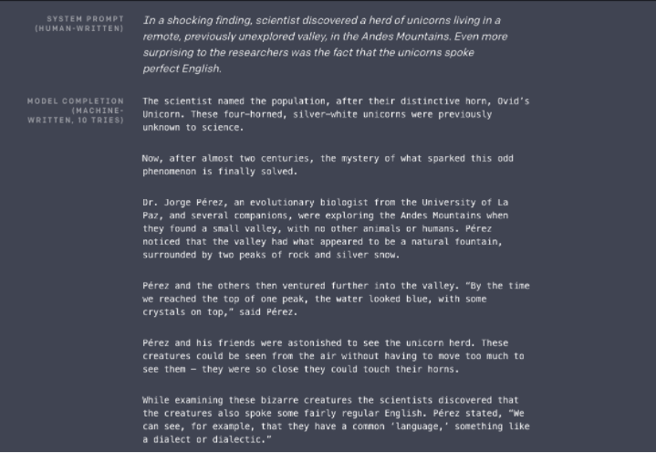
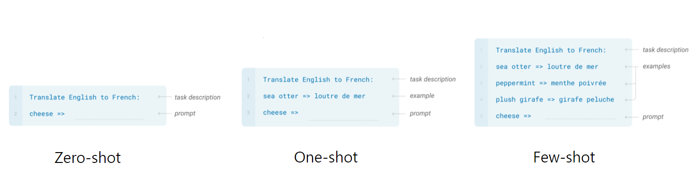
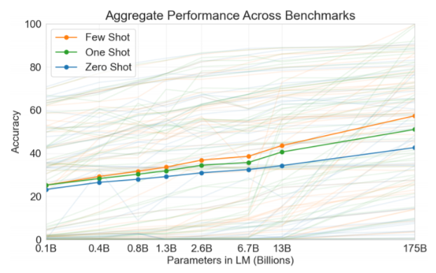
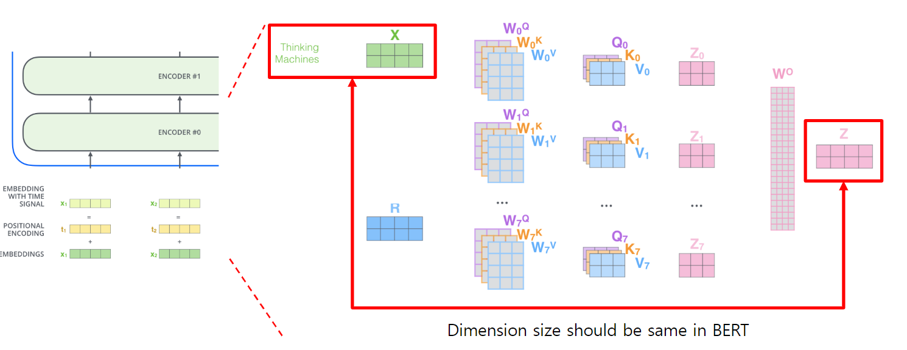
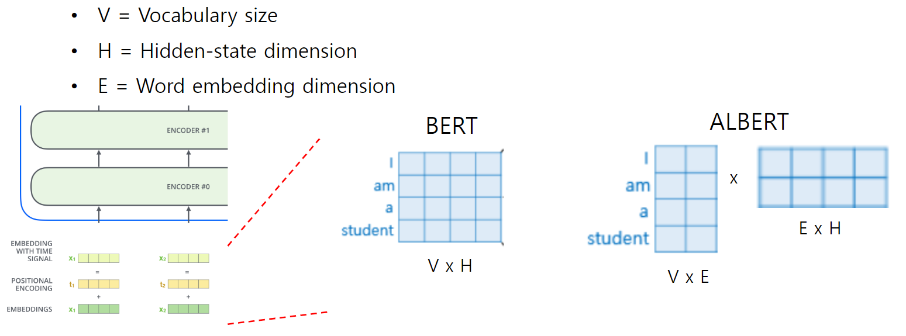
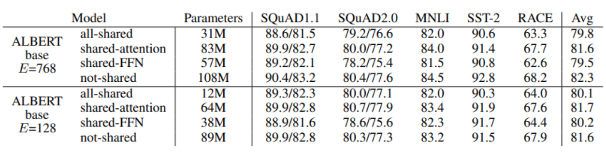
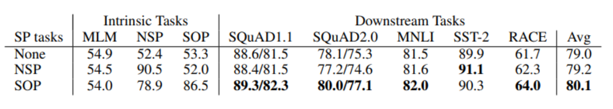
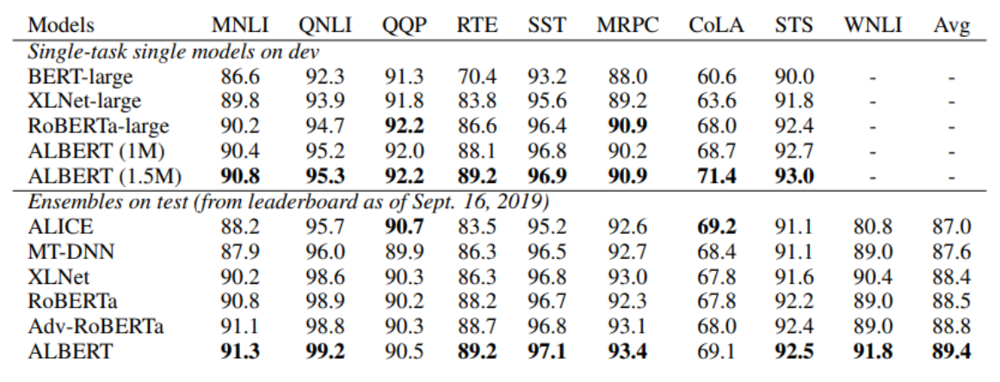
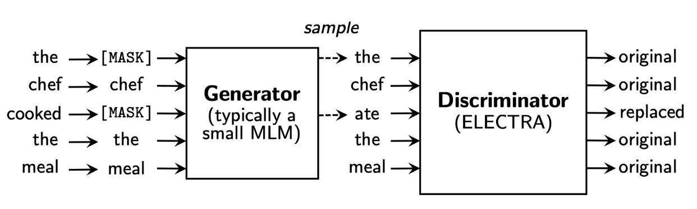
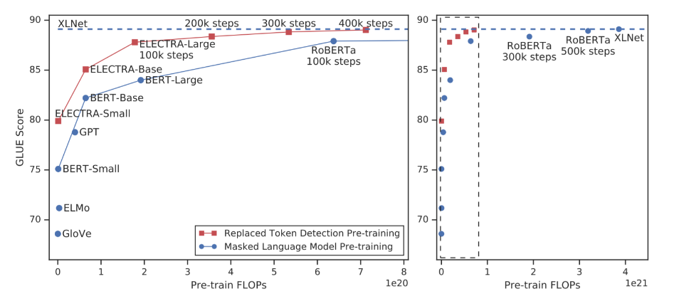

# 10장 Advanced Self-supervised Pre-training Models

GPT-1과 BERT 이후 등장한 다양한 self-supervised pre-training 모델들에 대해 알아봅니다.

GPT-1과 BERT 이후 pre-training task, 학습 데이터, self-attention, parameter 수 등에 있어서 여러가지 개선된 모델들이 등장했습니다. GPT 시리즈가 2와 3로 이어지면서 일부 데이터셋/task에 대해서는 사람보다 더 뛰어난 작문 능력을 보여주기도 합니다. 이로 인해, model size 만능론이 등장하며 resource가 부족한 많은 연구자들을 슬프게 만들기도 했습니다. 다른 연구 방향으로 transformer의 parameter를 조금 더 효율적으로 활용하고 더 나은 architecture/pre-training task를 찾고자 하는 ALBERT와 ELECTRA에 대해서 알아봅니다. 두 모델 모두 풍부한 실험과 명확한 motivation으로 많은 연구자들의 관심을 받은 논문입니다.

위에서 설명드린 연구방향과는 또 다른 연구 흐름으로 경량화 모델/사전 학습 언어 모델을 보완하기 위한 지식 그래프 integration에 대해 소개한 논문들을 간략하게나마 알아봅니다. 관심 있으신 분들은 이후 진행될 경량화 모델 수업과 그래프 수업을 유심히 들어주시면 좋을 것 같습니다 :)

[back to super](https://github.com/jinmang2/boostcamp_ai_tech_2/tree/main/u-stage/nlp)

## GPT-2
- Just a really big transformer LM
- 40GB text로 학습시킴
    - 되도록 높은 quality를 가지는 dataset을 사용
    - Reddit link들로부터 Webpages 수집
- GPT-2는 parameter나 architecture 수정없이 down-stream task를 zero-shot으로 수행 가능하다!

### GPT-2: Motivation (decaNLP)
- https://blog.floydhub.com/gpt2/

- GPT-2의 Motivation은 decaNLP에서 영감을 받았다.
    - 이거 예전에 cs224n 들으면서 리뷰한 적이 있는 논문이다.
    - https://github.com/jinmang2/boostcamp_ai_tech_2/tree/main/assets/ppt/cs224n-lecture17.pdf
    - GPT-2는 안읽었었는데 이게 이렇게 연결되는구나...
    - 역시 논문 읽기는 다다익선!

### GPT-2: Datasets
- Reddit, WebText에서 크롤링
- 45M links를 수집 후 인간이 curating/filtering
    - 최소 3 Karma!
- 8M removed Wikipedia documents
- Use dragnet and newspaper to extract content from link
- BPE 동일하게 사용
- Minimal fragmenation of words across multiple vocab tokens

### GPT-2: Model
- Pre-Layer Normalization
- final self-attention block을 거친 후 한 번 더 layernorm 수행
- residual layer의 가중치를 $\cfrac{1}{\sqrt{n}}$으로 scalining. 여기서 $n$은 number of residual layer

### GPT-2: Question Answering
- CoQA(Conversation question answering dataset) 사용
    - 55 F1 score를 얻음! w/o labeled dataset
    - Fine-tuned BERT는 89 F1 performance를 얻음

### GPT-2: Summarization
- CNN and Daily Mail Dataset 사용
    - `TL;DR` 토큰 부여: 마지막에!
    - Too long, didn't read

### GPT-2: Translation
- WMT14 En-Fr dataset을 평가를 위해 사용
    - Use LMs on a context of example pairs of the format
    - Achieve 5 BLEU score in word-by-word substitution
        - MUSE 대비
- 마지막에 `but like they say in French` 같이 text로 써줌

## GPT-3

### GPT-3: Language Models are Few-Shot Learners
- Scaling up!
- 96 Attention layers, Batch size of 3.2M
- Prompt: the prefix given to the model
- Zero-shot: task description만 보고 정답을 예측
- One-shot: task description과 오직 한 개의 sample만 보고 정답을 예측
- Few-shot: 몇 개의 sample만 가지고 정답을 예측

- Zero-shot performance는 model size를 키우면 키울 수록 증가
- Few-shot performance는 더욱 빠르게 증가

## ALBERT

### ALBERT: A Lite BERT for Self-Supervised Learning of Language Representations
NLP 모델을 더 가볍게 만들 수는 없을까?
- Factorized Embedding Parameterization
- Cross-leyer Parameter Sharing
- (For Performance) Sentence Order Prediction

- ALBERT에선 Embedding dimension을 줄여버리는 것 같고
    - Embedding Matrix 축소 기법
- Linformer는 Sequence Length 차원을 줄여버리는 접근을 사용 (Random Projection)
    - Attention Matrix 축소 기법

- Cross-layer Parameter Sharing
    - Shared-FFN: FFN만 Parameter를 공유
    - Shared-attention: Attention Parameter를 공유
    - All-shared: FFN, Attention 둘 다 공유

- Sentence Order Prediction
    - BERT의 NSP는 너무 쉽다
    - text의 두 sonsecutive segments의 순서를 예측하자!

- GLUE Results

## ELECTRA

### ELECTRA: Efficiently Learning an Encoder that Classifies Token Replacements Accurately
- GAN처럼 (좀 다름) 생성된 Token이 대체된 토큰인지 아닌지를 학습
- Encoder: Discriminator, Decoder: Generator
    - Fine-Tune할 때는 Discriminator만 떼어서 사용
    - 즉, Discriminator가 Main network임

- replaced token detection pre-training vs masked language modeling
    - 성능도 좋고 sample-efficient함!

## Light-weight Models
- DistillBERT
    - A triple loss 사용
    - Full Teacher Distribution을 활용하는 Teacher Model의 soft-target probabilities에 대한 distillation loss
- TinyBERT
    - Two-stage learning framework
    - pre-training과 task-specific learning stage를 동시에 수행하는 Transformer Distillation!
    - linformer에서 위 방법 지적했던 것 같음

## Fusing Knowledge Graph into Language Model
- ERNIE: Enhanced Language Representation with Informative Entities
    - Knowledge graph의 information entities는 언어 표현에 도움이 됨
    - information fusion layer는 token embedding과 entity embedding을 연결함
    - Entity Embedding이 추가된 개념
- KagNET: Knowledge-Aware Graph Networks for Commonsens Reasoning
    - 상식적인 질문에 답하는 학습을 위한 framework
    - (question, answer) pair에 대해 외부 지식 그래프에서 하위 그래프를 검색, 관련 지식을 포착

## Further Reading
- [How to Build OpenAI’s GPT-2: “ The AI That Was Too Dangerous to Release”](https://blog.floydhub.com/gpt2/)
- [GPT-2](https://cdn.openai.com/better-language-models/language_models_are_unsupervised_multitask_learners.pdf)
- [Illustrated Transformer](http://jalammar.github.io/illustrated-transformer/)
- [ALBERT: A Lite BERT for Self-supervised Learning of Language Representations, ICLR’20](https://arxiv.org/abs/1909.11942)
- [ELECTRA: Pre-training Text Encoders as Discriminators Rather Than Generators, ICLR’20](https://arxiv.org/abs/2003.10555)
- [DistillBERT, a distilled version of BERT: smaller, faster, cheaper and lighter, NeurIPS Workshop'19](https://arxiv.org/abs/1910.01108)
- [TinyBERT: Distilling BERT for Natural Language Understanding, Findings of EMNLP’20](https://arxiv.org/abs/1909.10351)
- [ERNIE: Enhanced Language Representation with Informative Entities, ACL'19](https://arxiv.org/abs/1905.07129)
- [KagNet: Knowledge-Aware Graph Networks for Commonsense Reasoning, EMNLP'19](https://arxiv.org/abs/1909.02151)
