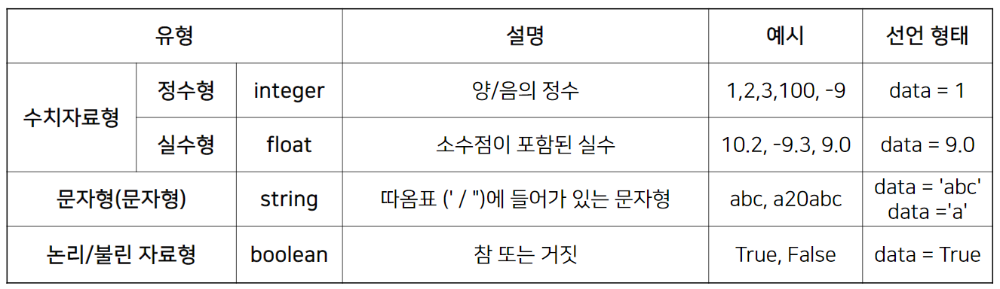
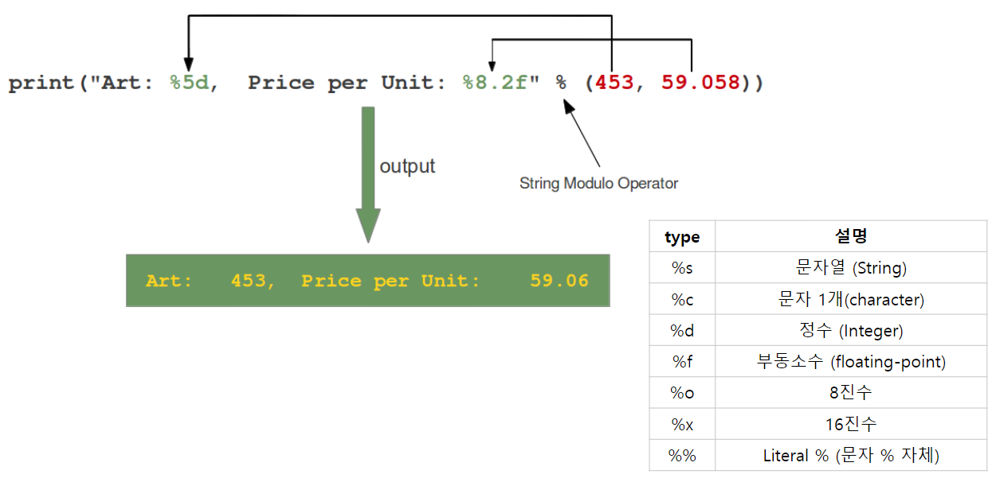
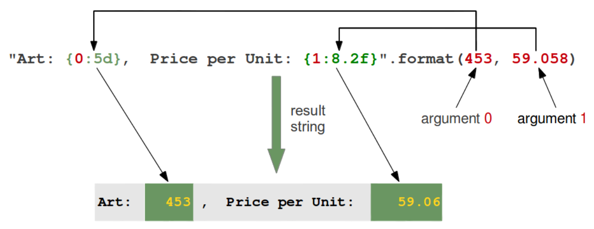
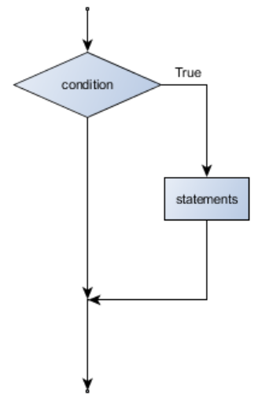
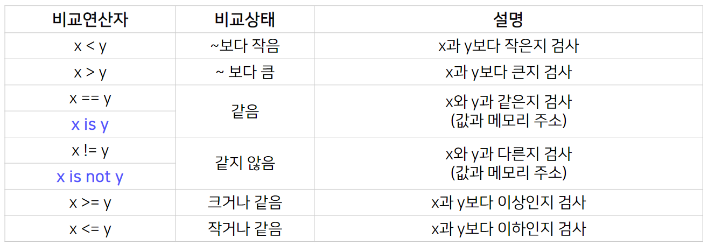
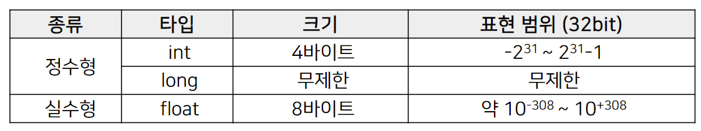

# 2강 파이썬 기초 문법

[back to super](https://github.com/jinmang2/boostcamp_ai_tech_2/tree/main/u-stage/python_basic)

## 2.1 Variable & List

### 변수의 개요
- 가장 기초적인 프로그래밍 문법 개념
- 데이터 값을 저장하기 위한 메모리 공간의 프로그래밍 상 이름
- a라는 변수에 5라는 값을 할당하라!
```python
>>> a = 5
>>> b = 3
>>> a + b
8
```
- 변수는 값을 저장하는 장소
- 변수는 메모리 주소를 가지고 있고
- 변수에 들어가는 값은 메모리 주소에 할당됨
- [참고]: 폰 노이만(John von Neumann) 아키텍처
- 선언되는 순간 메모리 특정영역에 물리적인 공간이 할당됨
- 변수 이름 작명법
    - 알파벳, 숫자, 언더스코어(_)로 선언 가능 `data_name`
    - 의미있는 단어로 표기 `professor_name`
    - 대소문자 구분 `ABC != abc`
    - 예약어 사용 X `for`, `if`, `else`

### Basic Operation
- 기본 자료형

```python
>>> a =1 # Integer
>>> b =1 # Integer
>>> print(a,b)1 1
>>> a =1.5 # Float
>>> b =3.5 # Float
>>> print(a,b)
1.5 3.5
>>> a ="ABC"# String
>>> b ="101010"# String
>>> print(a,b)ABC 101010
>>> a =   True# Boolean 대소문자 구분
>>> b =   False# Boolean 대소문자 구분
>>> print(a,b)
True False
```
- Dynamic Typing: 코드 실행 시점에 데이터의 Type을 결정하는 방법
- 연산자(Operator): `+`, `-`, `*`, `/` 같은 기호들
- 피연산자: 연산자에 의해 계산이 되는 숫자들
- 문자들 사이에도 + 연산이 가능함 --> concatenate
- `**`는 제곱승 연산자
- `%`는 나머지를 구하는 연산자
- `-=`, `+=`는 증가형
- 데이터 형 변환
    - `float`, `int`
- 데이터 타입은 중요! `type`으로 항상 체크한다는 마인드
- 컴퓨터 반올림 오차
    ```python
    >>> c = 38.8
    >>> print(c)
    38.8
    >>> c
    38.7999999999999999997
    ```
    - 파이썬 2.7에서만 이렇게 나온다고 함
    - 뭐... 부동소수점 오차지!
        - https://ko.wikipedia.org/wiki/%EB%B6%80%EB%8F%99%EC%86%8C%EC%88%98%EC%A0%90
    - 다만, 이게 사실 큰 차이긴 함. 왜냐? gradient 연산이 중첩되면 될수록 큰 차이가 발생하기 때문
    - float32냐 float64냐 mix-precision이냐 차이 굉장히 중요!
- [참고] 컴퓨터는 왜 이진수를 쓰나? --> 반도체
    - http://samsungsemiconstory.com/1

### List
- 데이터가 100개 이상이면 어떻게 관리할 것이냐?
- sequence 자료형, 여러 데이터들의 집합
- 특징
    - indexing
        - list 값들은 주소(offset)을 가짐
        - huggingface offset이 생각나네 ㄷㄷ 주소 기억!
    - slicing
        - 리스트의 값을 잘라서 사용!
    - list Operation
        - concatenation, is_in, 연산 함수들
    - append / delete
        - `append`, `extend`, `insert`, `remove`, `del`
    - memory storage
        - python list만의 특징!
        - 다양한 data type이 하나에 list에 들어감!
        - 파이썬은 해당 리스트 변수에 리스트 주소값이 저장되는 구조
    - packing / unpacking
        - 패킹: 한 변수에 여러 개의 데이터를 넣는 것
        - 언패킹: 한 변수에 데이터를 각각의 변수로 반환
    - 2d list
        - list of list
- 필요할 때 찾을 수 있도록 개념만 파악!

## 2.2 Function and Console I/O

### Function
- 함수란? 어떤 일을 수행하는 코드의 덩어리
    ```python
    def calculate_rectangle_area(x, y):
        return x * y
    ```
    - 반복적인 수행을 1회만 작성 후 호출
    - 코드를 논리적인 단위로 분리
    - 캡슐화: 인터페이스만 알면 타인의 코드 사용
- 함수 선언 문법
    ```python
    def 함수 이름(parameter1, ..., ):
        수행문 1(statements)
        수행문 2(statements)
        return <반환값>
    ```
- 함수의 수행 순서
    - 함수 부분을 제외한 메인프로그램부터 시작
    - 함수 호출 시 함수부분을 수행 후 돌아옴
- parameter vs argument
    - parameter: 함수의 입력 값 인터페이스
    - argument: 실제 parameter에 대입된 값

### Console in/out
- 어떻게 프로그램과 데이터를 주고 받을 것 인가?
- `input` 함수는 콘솔창에서 문자열을 입력받는 함수'
- `,`를 사용할 경우 `print`문이 연결됨

### print formatting
- `%`, `format`, `f-string`이 존재함
- 개인적으로 `f-string`이 편함





- padding, naming 등, 자릿수 맞추기 여러 기능 꼭 검색해서 자주 사용하기!!

## 2.3 Conditionals and Loops

### Conditionals
- 조건문이란?
    - 조건에 따라 특정한 동작을 하게하는 명령어
    - 조건을 나타내는 기준과 실행해야할 명령으로 구성
[](http://bit.ly/37Mwt6U)

```python
print("Tell me your age?")
my_age = int(input()) # 나이를 입력받아 my_age 변수에 할당
if my_age < 30: # 나이가 30 미만일 때
    print("Welcome to the club")
else: # 나이가 30 이상일 때
    print("Oh! No. You are not accepted.")
```
- 조건 판단 방법
    - `if` 다음 조건을 표기하여 참 또는 거짓을 판단



- 삼항 연산자
    - 허깅페이스 구현체에서도 심심찮게 등장하는 친구
```python
is_even = True if value % 2  == 0 else False
```

### Loop
- 정해진 동작을 반복적으로 수행하게 하는 명령문
- 반복 시작 조건, 종료 조건, 수행 명령으로 구분

#### For-Loop
```python
for i in range(0, 5, 1):
    # 0부터 4까지 1씩 증가시키며 출력
    print(i)
```
```
0
1
2
3
4
```
- [알아두면 상식] 반복문
    - 반복명 변수명
        - 임시적인 반복 변수는 `i`,`j`, `k`로 정함
    - 0으로 시작하는 반복문
        - 1부터 시작하는 것도 있긴 함(MATLAB)
    - 무한 Loop
        - CPU와 메모리 등 리소스 과다 점유! 꼭 피할 것
```python
# 문자열을 하나하나 리스트로 처리
for i in "abcdefg":
    print(i)

# 각각의 문자열 리스트로 처리
for i in ["americano", "latte", "frafuchino"]:
    print(i)

# 간격을 두고 세기
for i in range(1, 10, 2):
    # 1부터 10까지 2씩 증가시키면서 반복문 수행
    print(i)

# 역순으로 반복문 수행
for i in range(10, 1, -1):
    print(i)
```
#### While-Loop
- while은 보통 반복 실행횟수가 명확하지 않을 때 사용한다
- `break`, `continue` 기억하기

### debugging
- 문법적 에러를 찾기 위해 에러 메시지 분석
    - 들여쓰기, 오탈자, 대소문자, 인터프리터 참고!
- 논리적 에러를 찾기 위한 테스트도 중요
    - 뜻대로 실행이 안되는 코드
    - print 혹은 break point 걸기
- 구글링해라!

## 2.4 String and advanced function concept

### string
- 시퀀스 자료형, 문자형 data를 메모리에 저장
- 영문자 한 글자는 1btye의 메모리공간을 사용
- 1 bit는 0 또는 1
- 1 byte = 8 bit = 256 까지 저장 가능
- http://goo.gl/K7Uz38

- 데이터 타입은 메모리의 효율적 활용을 위해 필수임!
- 문자열의 각 문자는 개별 주소(offset)을 가짐!
