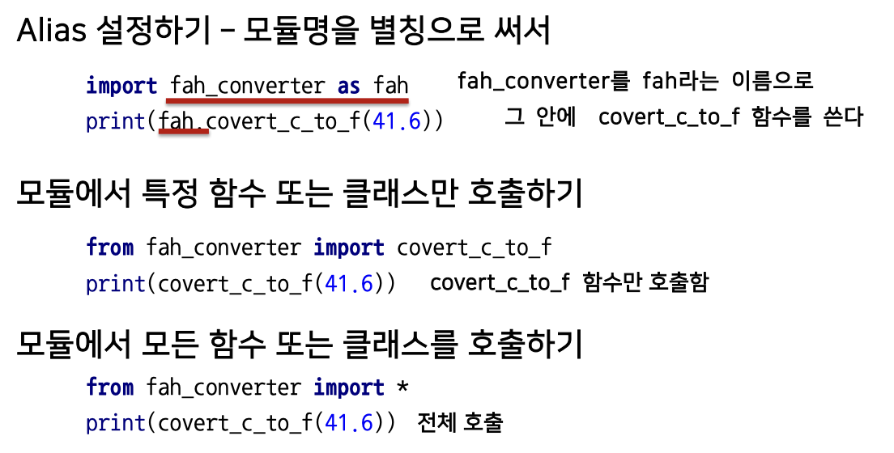

# 4강 파이썬 객체 지향 프로그래밍

[back to super](https://github.com/jinmang2/boostcamp_ai_tech_2/tree/main/u-stage/python_basic)

## 4.1 Python Object Oriented Programming
- `클래스와 인스턴스`
```python
### Dataset 클래스를 dataset 인스턴스에 할당
dataset = Dataset()
```
- `naming_rule`
  - snake_case : 파이썬 함수, 변수명에 사용
  - CamelCase : Class 명에 사용
  - __ 는 특수한 예약 함수나 변수 등에 사용 __str_:return "pallete" print(이 클래스)

- `inheritance` 부모클래스로부터 속성과 Method를 물려받은 자식 클래스 생성
    - CRAFT OCR Dataset 클래스 하나를 여러 벤치마크 데이터셋 클래스가 상속하고 있었습니다.

- `Visibility` 변수앞에 __있으면 클래스 안에서만 접근

- `decorator function` `@`는 함수를 인자로 받음

## 4.2 Module and Project
- 파이썬의 Module == py, import 문으로 module 호출



- 패키지는 기능들을 세부적으로 나눠 폴더로 만듭니다. 폴더별로 `__init__.py` 를 구성해야합니다.(3.3+부터는 x).
    - sys.path로 추가해줬었는데...

- `가상환경` conda나 virtualenv 사용가능

- [pyenv](https://lhy.kr/configuring-the-python-development-environment-with-pyenv-and-virtualenv) pyenv를 추천드립니다! 현재 디렉토리에 진입하면 가상환경이 자동으로 활성화됩니다
