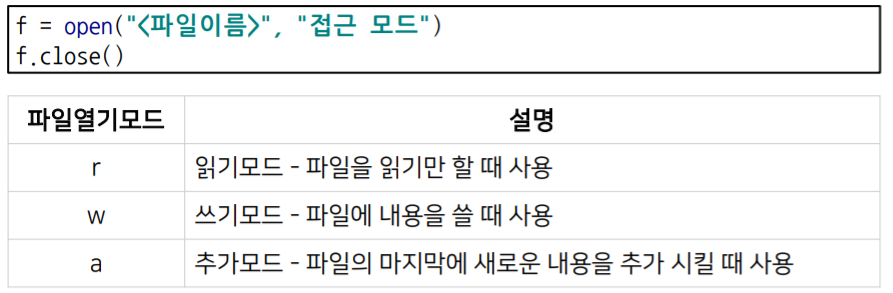
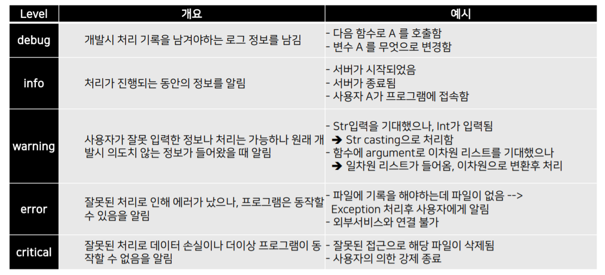
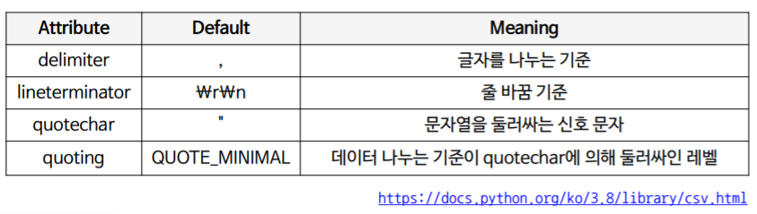
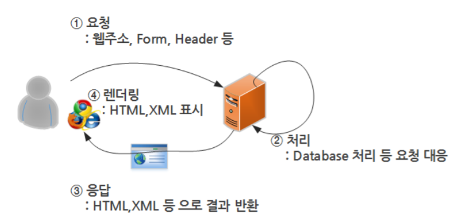
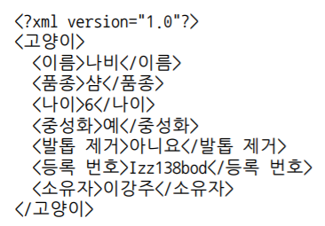
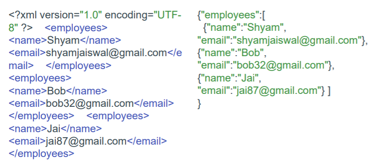
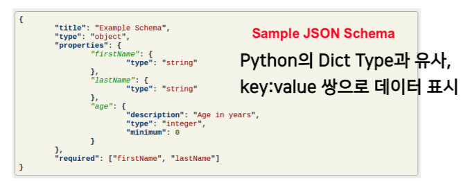
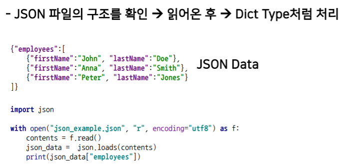
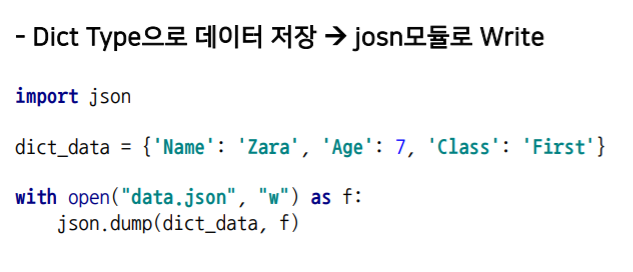

# 5강 파이썬으로 데이터 다루기

## 5.1 File / Exception / Log Handling
## Exception

- 예상이 가능한 예외
- 예상이 불가능한 예외
    - logic 문제이거나 예상이 가능한 경우 : IF문
    - logic 문제가 아니거나 예상이 불가능한 경우 : exception handling

### Exception Handling

- **try ~ except**

    ```python
    try:
        예외 발생 가능 코드
    except <exception type>:
        예외 발생시 대응 코드
    ```

- **try ~ except ~ else**

    ```python
    try:
        예외 발생 가능 코드
    except <exception type>:
        예외 발생시 대응 코드
    else:
        예외가 발생하지 않을 때 코드
    ```

- **try ~ except ~ finally**

    ```python
    try:
        예외 발생 가능 코드
    except <exception type>:
        예외 발생시 대응 코드
    finally:
        예외 발생 여부와 상관없이 실행
    ```

- **raise**
    - 강제로 exception 발생

    ```python
    raise <Exception Type>(오류 발생 시 출력할 내용)
    ```

- **assert**
    - 특정 조건에 만족하지 않는 경우 exception 발생

    ```python
    assert 조건
    ```

### File Handling
- 파일의 종류

- 컴퓨터 내부에는 Text파일 역시 binary형식으로 저장되어야 하기 때문에 ASCII/Unicode 등을 통해서 Text 형식의 데이터를 binary형식으로 변환한다.

### File I/O


- **읽기모드**
    - `f.read()` : 전체 내용을 반환
    - `f.readlines()` :  파일의 전체 내용을 한 줄 씩 나눠서 list형태로 반환
    - `f.readline()` : 실행 시 마다 한 줄 씩 반환

- **쓰기모드**
    - `f.write(data)` : data를 파일에 입력
    - 파일이 존재할 경우 : 덮어쓴다
    - 파일이 존재하지 않을 경우 : 새로 생성

- **추가모드**
    - `f.write(data)` : data를 파일에 입력
    - 파일이 존재할 경우 : 이어쓴다
    - 파일이 존재하지 않을 경우 : 새로 생성

### Python Direcotory 다루기

1. **os**
2. **pathlib**
    - path를 객체로 다루기 때문에 편하다고 한다!

### Pickle
- 파이썬 객체를 영속화(저장)하는 built-in 객체
    - `pickle.dump(data,file)` : 데이터 저장
    - `data = pickle.load(file)` : 데이터 불러오기
- pickle 객체는 python용 binary 파일이기 때문에 모드를 설정할 때 'wb', 'rb' 등으로 설정해야 한다!

## Logging Handling

### 로그를 남기는 이유 !

1. 프로그램이 실행되는 동안 일어나는 정보를 기록하기 위함
2. 특정 함수나 이벤트 발생 여부를 확인하기 위함
3. 기록된 로그를 분석해 의미있는 결과를 도출할 수도 있다!

### logging level


- DEBUG > INFO > WARNING > ERROR > CRITICAL
    - 일반적으로 WARNING단계부터 사용자에게 알린다.

### logging 모듈
- 파이썬의 기본 log관리 모듈
```python
import logging

logger = logging.getLogger("main")        # Logger 선언
stream_handler = logging.StreamHandler()  # Logger의 output 방법 선언
logger.addHandler(stream_handler)         # Logger의 output 등록
```

### 프로그램 세팅
```python
import configparser

config = configparser.ConfigParser
config.sections()

config.read("example.cfg")
config.sections()

for key in config["SectionOne"]:
    print(key)

config["SectionOne"]["status"]
```

```python
import argparse

parser = argparse.ArgumentParser(description="Sum two integers.")

parser.add_argument("-a", "--a_value", dest="A_value", help="A integers", type=int)
parser.add_argument("-b", "--b_value", dest="B_value", help="B integers", type=int)

args = parser.parse_args()
print(args)
print(args.a)
print(args.b)
print(args.a + args.b)
```

- Log config file을 미리 설정해서 사용할 수 있다!
```
[loggers]
keys=root

[handlers]
keys=consoleHandler

[formatters]
keys=simpleFormatter

[logger_root]
level=DEBUG
handlers=consoleHandler

[handler_consoleHandler]
class=StreamHandler
level=DEBUG
formatter=simpleFormatter
args=(sys.stdout,)
```
```python
logging.config.fileConfig("logging.conf")
logger = logging.getLogger()
```

## 5.2 Python data handling

### CSV(Comma Separate Values)

- 엑셀 양식의 데이터를 쉼표로 구분한 텍스트 파일
- 탭, 빈칸 등으로 구분해서 만들기도 하며 이 또한 통칭해서 CSV라고 부른다

### CSV I/O

1. **Text 파일 형태로 데이터 처리**

    `f = open('csv_file.csv')`

    → 문자 내에 있는 쉼표에 대해 전처리가 별도로 필요하다!

2. **csv module을 이용**

    `reader = csv.reader(f, delimiter=',', quotechar='"', quoting=csv.QUOTE_ALL)`

    

3. **pandas module 이용**
    - 대부분 pandas를 사용하게 된다 !

### WEB
- Web의 동작 방식



- 이 때 서버가 사용자에게 반환하는 언어가 **HTML**이다.

- `HTML`(Hyper Text Markup Language) : 웹 상의 정보를 구조적으로 표현하기 위한 언어로 모든 요소가 **tag**에 둘러쌓여 있다


### 정규표현식

- 문자 표현 공식으로 특정한 규칙을 가진 문자열의 집합을 추출

    → 구조화된 html에서 특정 데이터를 추출하기에 적합!!

- **정규표현식 문법**

    `. ^ $ * + ? { } [ ] \ | ( )`

    

    - `.` : Dot(.) 메타문자는 줄바꿈 문자인 `\n` 를 제외한 모든 문자와 매치된다.
        - a.b == a+모든문자+b
        - ex) aab, a0b, ~~abc~~
        - `a[.]b` == a+Dot(.)문자+b (a.b, ~~a0b~~)
    - ` ` : ab*c == a+b(0번 이상 반복)+c
        - ex) ac, abc, abbbbbbc,
    - `+` : ab+c == a+b(1번 이상 반복)+c
        - ex) abc, abbbbbc, ~~ac~~
    - `{m}` : 반드시 m번 반복
        - ex) ca{2}t → ~~cat~~, caat
    - `{m, n}` : m~n번 반복
        - ex) ca{2,5}t → ~~cat~~, caat, caaaaat
    - `?` : ab?c == a+b(1개 있거나 없거나)+c
        - ex) ac, abc, ~~abbbc~~

    ### **Character classes**

    

    - `[ ]` : 사이의 문자들과 매치
    - `\d` : 숫자 (==`[0-9]`)
    - `\D` : 숫자 아닌 것 (==`[^0-9]`)
    - `\s` : 공백문자 (== `[ \t\n\r\f\v]`)
    - `\S` : 공백문자 아닌 것 (== `[^ \t\n\r\f\v]`)
    - `\w` : 모든 알파벳+숫자+_ (== `[a-zA-Z0-9_]`)
    - `\W` : 알파벳+숫자+_ 아닌 것 ==`[^a-zA-Z0-9_]`)

    

    > 출처 : [https://gungadinn.github.io/data/2019/07/14/RegularExpression/](https://gungadinn.github.io/data/2019/07/14/RegularExpression/)

정규식 연습장 : https://regexr.com/

### XML(eXtensible Markup Language)
- HTML과 같이 웹 상에서 사용되며 데이터의 구조와 의미를 설명
    - Q. HTML와 XML의 차이점이 무엇일까?



### Beautifulsoup

- XML을 parsing할 때 가장 많이 쓰인다.
- 속도는 상대적으로 느리지만 간편히 사용할 수 있다는 장점이 있다
- beautilfulsoup 설치
    ```
    conda install lxml
    conda install -c anaconda beautifulsoup4=4.5.1
    ```
- beatifulsoup 사용
    ```python
    from bs4 import Beautifulsoup

    soup = Beautifulsoup(books_xml, "lxml")
    soup.find_all("author")
    ```

### JSON(JavaScript Object Notation)
- java script의 데이터 객체 표현 방식
- 데이터 용량이 적고, code로의 전환이 용이



- xml에 비해 코드가 상당히 적다!
- python의 dict type과 호환이 가능



- JSON READ


- JSON WRITE

