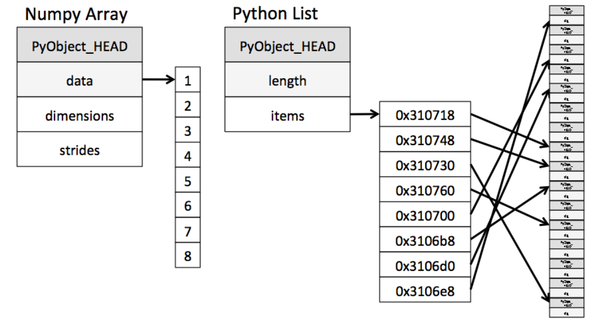
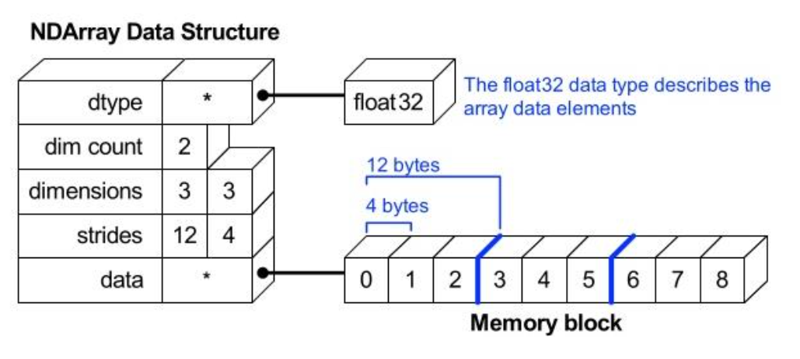
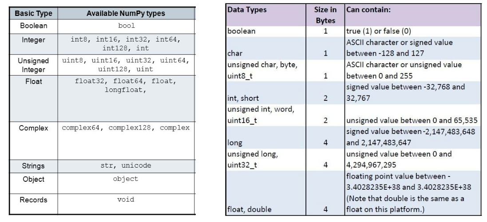
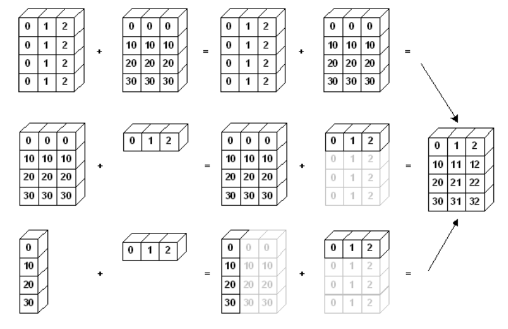

# 6강 Numpy 기초
선형대수의 계산식을 다루는 라이브러리를 다뤄봅니다.

[back to super](https://github.com/jinmang2/boostcamp_ai_tech_2/tree/main/u-stage/python_basic)

## 코드로 방정식 표현하기
```python
coefficient_matrix = [[2, 2, 1], [2, -1, 2], [1, -1, 2]]
constant_vector = [9, 6, 5]
```
- 다양한 Matrix 계산을 어떻게 만들 것인가?
- 굉장히 큰 Matrix에 대한 표현
- 처리 속도 문제 >> python은 interpreter 언어

## numpy: 파이썬 과학 처리 패키지
- Numerical Python
- 파이썬의 고성능 과학 계산용 패키지
- Matrix와 Vector와 같은 Array 연산의 표준
- 일반 list에 비해 빠르고 메모리 효율적
- 반복문 없이 데이터 배열에 대한 처리를 지원함
- 선형대수와 관련된 다양한 기능을 제공
- C, C++, 포트란 등의 언어와 통합 가능

```python
import numpy as np
```
- 일반적으로 np라는 alias(별칭)으로 호출

### array creation
```python
test_array = np.array([1, 4, 5, 8], float)
print(test_array) # [1. 4. 5. 8.]
type(test_array[3]) # [1. 4. 5. 8.]
numpy.float64
```
- numpy는 `np.array` 함수를 활용하여 배열을 생성
- 하나의 데이터 type만 넣을 수 있음
- List와 가장 큰 차이점?
    - dynamic typing not supported
- C의 Array를 사용하여 배열을 생성
- https://jakevdp.github.io/blog/2014/05/09/why-python-is-slow/
  

- https://www.slideshare.net/enthought/numpy-talk-at-siam
  

- `shape`: dimension 구성을 반환
- `dtype`: data type을 반환

```python
test_array = np.array([1, 4, 5, "8"], float) # array([1., 4., 5., 8.])
type(test_array[3]) # numpy.float64
test_array.dtype # dtype('float64')
test_array.shape # (4,)
```
- numpy의 shape, axis와는 굉장히 친숙해져야 이후 attention shape 측정에서 애먹지 않는다.



- `nbytes`: ndarray object의 메모리 크기를 반환
- `reshape`: array의 shape의 크기를 변경, element 갯수는 동일

```python
test_matrix = np.array([[1,2,3,4], [1,2,5,8]]) # (2, 4)
test_matrix = test_matrix.reshape(8,) # (8,)
```

- `flatten`: 다차원 array를 1차원 array로 반환
- `ravel`: flatten과 동일, 다만 copy하지 않음
    - https://m.blog.naver.com/wideeyed/221533365486

- **Indexing**: list와 달리 이차원 배열에 `[0,0]` 표기를 지원
- **Slicing**: list와 달리 행과 열 부분을 나눠서 slicing이 가능

```python
arr = np.array([[1,2,3],[4,5,6]])
arr[:2,:2] = 0
arr
# array([[0, 0, 3],
#        [0, 0, 6]])
```

- `arange`: array의 범위를 지정, 값의 list를 생성하는 명령어
- `zeros`: 0으로 가득찬 ndarray 생성
- `ones`: 1로 가득찬 ndarray 생성
- `empty`: shape만 주어지고 비어있는 ndarray 생성
    - momory initialization이 되지 않음!!
- `{}_likes`: 0, 1, 혹은 empty array를 반환 (입력 텐서와 동일한 차원의)
- `identity`: 단위 행렬
- `eye`: 대각성분이 1인 행렬, k값의 시작 index의 변경 가능
- `diag`: 대각 행렬의 값을 추출
- `random sampling`: 데이터 분포에 따른 sampling으로 array 생성
```python
np.random.uniform(0, 1, 10).reshape(2, 5) # 균등분포
np.random.normal(0, 1, 10).reshape(2, 5) # 정규분포
```
- `sum`: list의 sum과 동일. 차원을 axis parameter로 줄 수 있음
```python
# what is axis?
logits = np.random.randn(32, 3) # (32, 3)
logits.sum(axis=-1) # (32,) 합이 row 차원으로 걸린다.
logits.sum(axis=0)  # (3,)  합이 column 차원으로 걸린다.
```
- axis, dim 개념은 굉장히 중요하다.
    - LayerNorm, BatchNorm, Attention, Softmax 등등
    - 코드 뜯어볼 때 필수적으로 다뤄야할 개념임
- `mean`: 평균 계산
- `std`: 표준 편차 계산.
    - `ddof` parameter로 자유도 부여 가능
- 그 외에도 많은 mathmatical operator 사용 가능
- `concatenate`: ndarray를 붙임
    - concat-based attention도 있음. 중요한 연산
    - `hstack`, `vstack`은 걍 axis를 부여해버린 연산
- 기본 사칙 연산 당연히 지원
- `*`: element-wise operations
- `@`: matrix multiplication
    - ndarray 혹은 np의 `dot`으로도 가능
- `transpose`: 전치
    - torch에선 `permute`, `transpose`로 접근 가능
- **broadcasting**: shape이 다른 배열간 연산을 지원


- numpy performance check
```python
def scalar_vector_product(scalar, vector):
    result = []
    for value in vector:
        result.append(scalar * value)
    return result

iteration_max = int(1e8)

vector = list(range(iteration_max))
scalar = 2

%timeit scalar_vector_product(scalar, vector) # for loop을 이용한 성능
%timeit [scalar * value for value in range(iteration_max)]
%timeit np.arange(iteration_max) * scalar
```
```
9.51 s ± 28.5 ms per loop (mean ± std. dev. of 7 runs, 1 loop each)
8.06 s ± 31.4 ms per loop (mean ± std. dev. of 7 runs, 1 loop each)
189 ms ± 1.21 ms per loop (mean ± std. dev. of 7 runs, 10 loops each)
```
- 일반적으로 for loop < list comprehension < numpy 순
- 4배 이상 ㄷㄷ (100,000,000 번 이상 loop)
- Numpy는 C로 구현! 성능은 확실하지만 dynamic typing 포기
- 대용량 계산에서 가장 흔히 사용됨
- `concatenate`처럼 계산이 아닌 할당에서는 연산 속도의 이점이 없다는 점 명시!
- `all`, `any`: 데이터의 전부 혹은 일부가 조건에 만족하는지 체크
- `>`, `<`: 배열의 크기가 동일할 때, 결과를 boolean type으로 체크
    - mask token만들 때 유용함
- `where`: condition, true, False
    - true인 친구만 반환
- `argmax`, `argmin`: array 내 최대값 또는 최솟값의 index를 반환
- boolean index
    - 특정 조건에 따른 값ㅇ르 배열 형태로 추출
- fancy index
    - numpy array를 index value로 사용해서 값 추출
- 위에 indexing은 걍 자주 써봐야 함
- `loadtxt`, `savetxt`: file i/o 기능
    -  굳이 쓰진 않음
