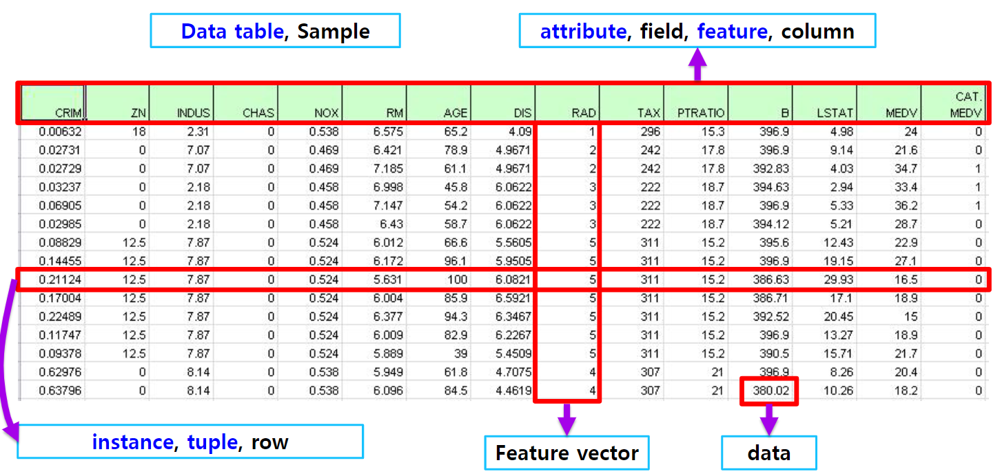

# 7강 Pandas 기초

[back to super](https://github.com/jinmang2/boostcamp_ai_tech_2/tree/main/u-stage/python_basic)

## Pandas I

### What is pandas?
- 구조화된 데이터의 처리를 지원하는 python library!
- panel data analysis --> pandas
- 고성능 array 계산 라이브러리인 numpy와 통합, 강력한 스프레드시트 처리 기능 제공



- `pd.read_{}`: 가장 기본적인 읽어오는 메서드
    - csv 모듈 혹은 xlrd 등을 사용하는 것으로 보임
    - 난 그냥 huggingface datasets 쓸래

- `pd.Series`: column vector를 표현하는 object
    - https://www.slideshare.net/wesm/pandas-powerful-data-analysis-tools-for-python
- `pd.DataFrame`: Data TAble 전체를 포함하는 object
    - https://www.slideshare.net/wesm/pandas-powerful-data-analysis-tools-for-python
- `.iloc`은 index number, `.loc`은 index name
- numpy랑 통합되어 있어서 대부분의 method들의 이름은 numpy와 동일
- `.head`, `.tail`로 selection 가능
- slicing도 사용함
- row, column을 numpy처럼 indexing
- `.drop` 으로 빈 값 등 처리 가능
- numpy 처럼 연산자로 연산 가능
- 만일 NaN값이 있거나 shape이 안맞으면 빈칸처리가 됨
    - 이 때 `fill_value` parameter로 채워주는 것이 가능
- `.map`은 각 원소에, `.apply`는 배열 그 자체에, `.applymap`은 데이터 프레임을 위한 map임
- `.describe`는 numeric type 데이터의 요약 정보를 출력
- `.unique`는 유일한 값을 list로 반환
- `.isnull` NaN(null)값의 index를 반환
    - 어마어마하게 자주 사용됨
- `.sort_values` column 기준으로 데이터를 sorting
- `corr`, `cov`, `corrwith` 상관계수, 공분산 계산

## Pandas II
- `.groupby`: SQL groupby와 동일
    - split -> apply -> combine
    - 진짜 걍 많이 써봐야 익숙해짐
    - groupby로 묶으면 hierarchical index가 나옴
    - 이거 panel data 만지면서 지겹게 해봄
    - 차후에 노하우 공유
    - `hierarchical_index.swaplevel()`
    - `hierarchical_index.sortlevel(0)`
- `grouped`: groupby에 의해 추출된 값 활용 가능
    - `.get_group` 특정 key값을 가진 그룹의 정보만 추출 가능
    - **Aggregation**: 요약된 통계정보를 추출
    - **Transformation**: 해당 정보를 변환
    - **Filteration**: 특정 정보를 제거하여 보여주는 필터링 기능
- `pivot_table`
    - excel의 그 것
    - index 축은 groupby와 동일함
    - column에 추가로 labeling 값을 추가하여
    - value에 numeric type 값을 aggregation 하는 형태
- `Crosstab`
    - 특허 두 칼럼에 교차 빈도, 비율, 덧셈 등을 구할 때 사용
    - Pivot table의 특수한 형태
    - User-Item Rating Matix 등을 만들 떄 사용 가능
- `pd.merge`: 두 개의 데이터를 하나로 합침
    - 이게 편리하긴한데, 데이터 커지면 진짜 답도 없음
    - join에 익숙해지길
- `pd.concat`: 같은 형태의 데이터를 붙이는 연산작업
- Database connection
    - 이거 알고보니 다른 것들도 다 해줌
```python
import sqlite3

conn = sqlite3.connect("./data/flights/db")
cur = conn.cursor()
cur.execute("select * from airlines limit 5;")
results = cur.fetchall()
results

df_airlines = pd.read_sql_query("select * from airlines;", conn)
```
- XLS persistence
    - Dataframe의 엑셀 추출 코드
    - XLS 엔진으로 openpyxl 또는 XlsxWrite 사용
```python
writer = pd.ExcelWriter("./data/df_routes/xlsx", engine="xlsxwriter")
df_routes.to_excel(writer, sheet_name="Sheet1")
```
- Pickle persistence
    - 가장 일반적인 python 파일 persistence
    - `to_pickle`, `read_pickle` 함수 사용
