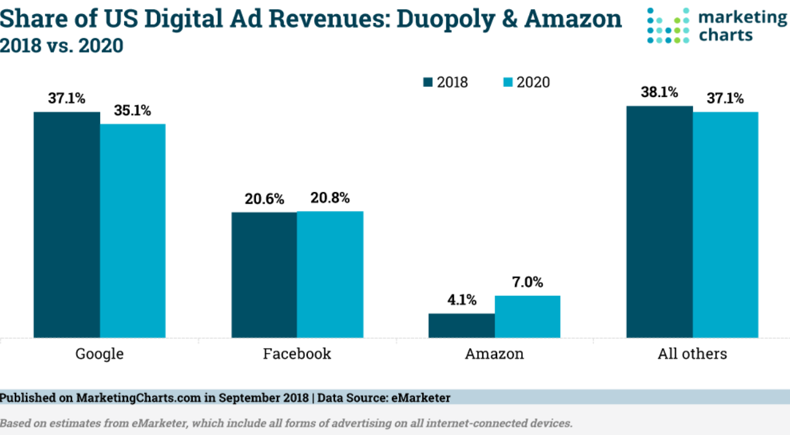
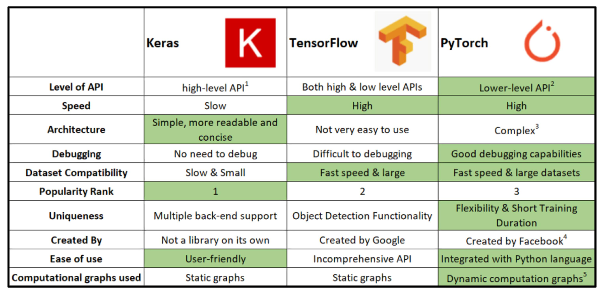
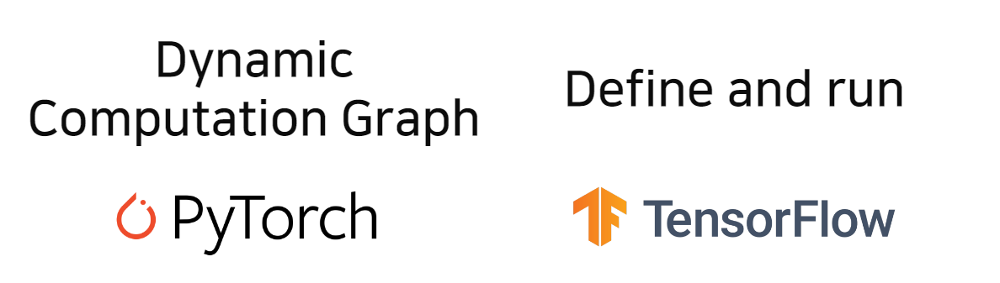
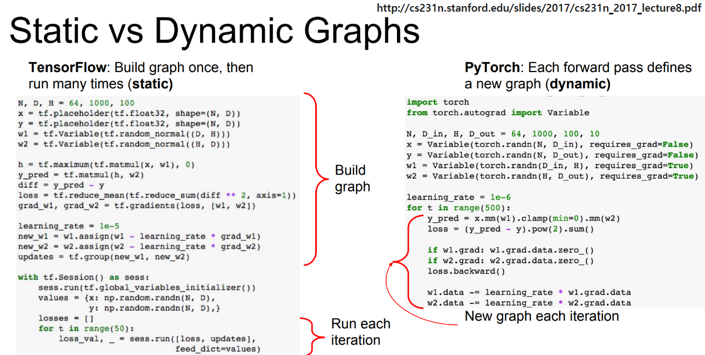
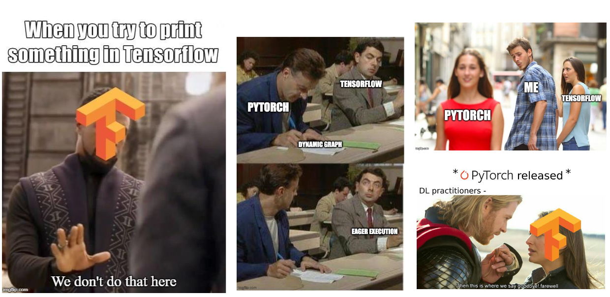
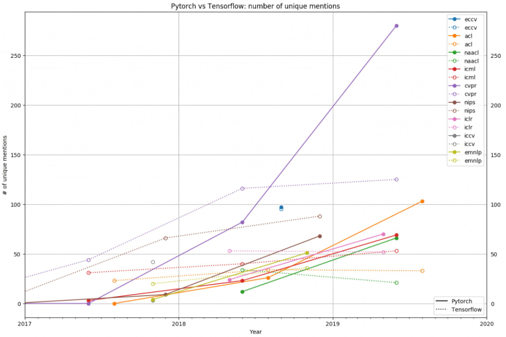

# 1강 Introduction to PyTorch
이번 강의에선 **딥러닝 프레임워크의 종류와** PyTorch의 기본적인 작동 구조에 대해 학습합니다.

우리는 딥러닝의 모든 수식과 연산을 직접 개발하기에는 어려움이 있어 이를 손쉽게 개발할 수 있도록 제공되는 딥러닝 프레임워크를 사용합니다.

PyTorch는 TensorFlow와 함께 가장 대표적인 딥러닝 프레임워크로 대부분의 연구에서 사용되고 있습니다.

[back to super](https://github.com/jinmang2/boostcamp_ai_tech_2/tree/main/u-stage/pytorch)

- 딥러닝을 할 때 코드는 `처음`부터 다 짠다?
  - 죽을 수도 있어요...ㄷㄷ
  - 뷰노, 한동대 등 이런 시도를 한 팀들이 있긴 함!
  - 밑바닥부터 시작하는 딥러닝 3 책 좋음 (구현보기)
- 지금은 남이 만든 걸 씁니다...
  - 자료도 많고, 관리도 잘되고, 표준이라서...

## 다양한 딥러닝 프레임 워크들...
- 엄청나게 많음
  - Tensorflow
  - julia
  - mxnet
  - keras
  - deep learning
  - theano
  - caffe2
  - chainer
  - R
  - etc...
- 왜 공개했을까? 문서화?

## Tensorflow vs PyTorch




- https://datasciencecareer.wordpress.com/2020/12/09/ml03-pytorch-vs-tensorflow/

- Tensorflow는 `Define and run`
- PyTorch는 `Dynamic Computation Graph`

## Computation Graph
- 연산의 과정을 그래프로 표현
- `Define and Run`: 그래프를 먼저 정의하고 실행시점에 데이터를 feed
- `Define by Run`: 실행을 하면서 그래프를 생성하는 방식
  - Dynamic Computational Graph, DCG



```python
train_X = numpy.asarray([...])
train_Y = numpy.asarray([...])

n_samples = train_X.shape[0]

# tf Graph Input
X = tf.placeholder("float")
Y = tf.placeholder("float")

# Set model weights
W = tf.Variable(rng.randn(), name="weight")
b = tf.Variable(rng.randn(), name="bias")

# Construct a linear model
pred = tf.add(tf.multiply(X, W), b)

# Mean squared error
cost = tf.reduct_sum(tf.pow(pred-Y, 2)) / (2*n_samples)
# Gradient decent
# Note, minimize() knows to modify W and b!
# Because Variable objects are trainable=True by default
optimizer = tf.train.GradientDescentOptimizer(learning_rate).minimize(cost)

# Start training
with tf.Session() as sess:

    # Run the initializer
    sess.run(init)

    # Fit all training data
    for epoch in range(training_epochs):
        for (x, y) in zip(train_X, train_Y):
            sess.run(optimizer, feed_dict={X: x, Y: y})

        # Display logs per epoch step
        if (epoch+1) % display_step == 0:
            c = sess.run(cost, feed_dict={X: train_X, Y: train_Y})
            print(f"Epoch: {epoch+1:04d}, cost={c:.9f}, "
                  f"W={sess.run(W)}, b={sess.run(b)}")

    print("Optimization Finished!")
    training_cost = sess.run(cost, feed_dict={X: train_X, Y: train_Y})
    print(f"Training cost={training_cost}, W={sess.run(W)}, "
          f"b={sess.run(b)}\n")

    # Graphic display
    plt.plot(train_X, train_Y, 'ro', label='Original data')
    plt.plot(train_X, sess.run(W) * train_X + sess.run(b), label='Fitted line')
    plt.legend()
    plt.show()
```




## Why PyTorch?
- Tensorflow의 Define and Run 너무 디버깅하기 어려워요 ㅠㅠ



- 구글 검색, arxiv, Andrej Karpathy 등 대가의 지지


- 논문에 사용된 언어도 pytorch가 우세



- 그러면 Tensorflow는 별로인가?
  - Nope! 각각의 장단점이 존재!
  - Tensorflow는 production과 scalability에 장점이 있음!

## PyTorch
- `Numpy` + `AutoGrad` + `Function`
- numpy 구조를 가지는 `Tensor` 객체로 array를 표현
- 자동미분을 지원하여 DL 연산을 지원
- 다양한 형태의 DL을 지원하는 함수와 모델을 지원

## Reference
- [Deep Learning 프레임워크 비교](https://en.wikipedia.org/wiki/Comparison_of_deep-learning_software)
- [PyTorch로 시작하는 딥러닝 입문](https://wikidocs.net/book/2788)
- [WELCOME TO PYTORCH TUTORIALS](https://pytorch.org/tutorials/)
