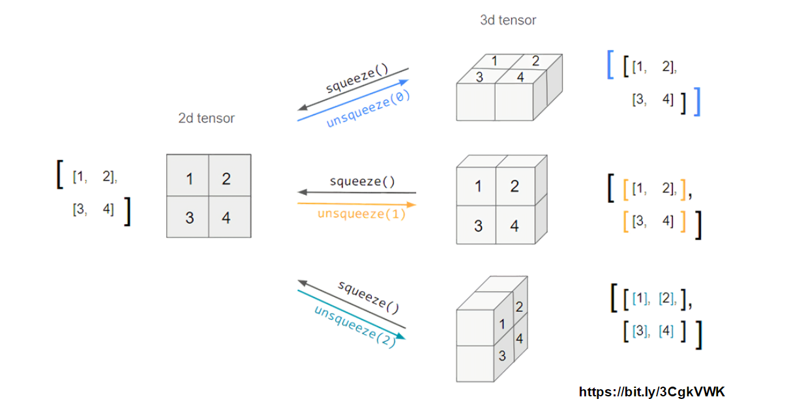

# 2강 PyTorch basics
이번 강의에선 PyTorch에서 데이터들의 연산을 위한 Tensor 사용법 및 자동 미분 기능인 AutoGrad에 대해 학습합니다. Tensor를 학습하여 추후 Custom Network를 작성할 수 있는 기본 지식을 익히고, AutoGrad의 작동 원리를 배워 backward 함수가 학습 시 어떻게 내부적으로 동작되는지 확인합니다.

[back to super](https://github.com/jinmang2/boostcamp_ai_tech_2/tree/main/u-stage/pytorch)

## `Tensor`
- 다차원 Arrays를 표현하는 PyTorch 클래스
- 사실항 numpy의 ndarray와 동일
- Tensor를 생성하는 함수도 거의 동일

### `Tensor` vs `ndarray`
```python
import numpy as np

n_array = np.arange(10).reshape(2,5)
print(n_array)
print("ndim :", n_array.ndim, "shape :", n_array.shape)


import torch

t_array = torch.FloatTensor(n_array)
print(t_array)
print("ndim :", t_array.ndim, "shape :", t_array.shape)
```
```
[[0 1 2 3 4]
 [5 6 7 8 9]]
ndim : 2 shape : (2, 5)

tensor([[0., 1., 2., 3., 4.],
        [5., 6., 7., 8., 9.]])
ndim : 2 shape : torch.Size([2, 5])
```
- 기본적으로 tensor가 가질 수 있는 data타입은 `numpy`와 동일
- 대부분의 사용법이 `numpy`와 동일
- pytorch의 tensor는 GPU에 올려서 사용 가능

```python
x_data.device
# device(type='cpu')

if torch.cuda.is_available():
    x_data_cuda = x_data.to('cuda')
x_data_cuda.device
# device(type='cuda', index=0)
```

### Tensor Handling
- `.view`: reshape과 동일하게 tensor의 shape을 변환
- `.squeeze`: 차원의 개수가 1인 차원을 삭제 (압축)
- `.unsqueeze`: 차원의 개수가 1인 차원을 추가

```python
tensor_ex=torch.rand(size=(2,3,2))
tensor_ex
# tensor([[[0.6784, 0.4867],
#          [0.9390, 0.8433],
#          [0.7575, 0.8696]],
#
#         [[0.9230, 0.2886],
#          [0.5495, 0.4444],
#          [0.9659, 0.9677]]])

tensor_ex.view([-1,6])
# tensor([[0.6784, 0.4867, 0.9390, 0.8433, 0.7575, 0.8696],
#         [0.9230, 0.2886, 0.5495, 0.4444, 0.9659, 0.9677]])

tensor_ex.reshape([-1,6])
# tensor([[0.6784, 0.4867, 0.9390, 0.8433, 0.7575, 0.8696],
#         [0.9230, 0.2886, 0.5495, 0.4444, 0.9659, 0.9677]])
```
- `view`와 `reshape`은 contiguity 보장의 차이
```python
a = torch.zeros(3, 2)
b = a.view(2, 3)
a.fill_(1)
print(b)
# tensor([[1., 1., 1.],
#         [1., 1., 1.]])

a = torch.zeros(3, 2)
b = a.t().reshape(6)
a.fill_(1)
print(b)
# tensor([0., 0., 0., 0., 0., 0.])
```



```python
tensor_ex = torch.rand(size=(2, 1, 2))
tensor_ex.squeeze()
# tensor([[0.6496, 0.3429],
#         [0.2252, 0.5408]])

tensor_ex = torch.rand(size=(2, 2))
tensor_ex.unsqueeze(0).shape
# torch.Size([1, 2, 2])

tensor_ex.unsqueeze(1).shape
# torch.Size([2, 1, 2])
```

## Tensor Operation
- 기본적으로 numpy와 동일
- `mm`과 `matmul`은 broadcasting 지원 차이
  - https://sunghee.kaist.ac.kr/entry/torch-mm-bmm-matmul-%EC%B0%A8%EC%9D%B4
  - `matmul`이 강의에선 좋은 것처럼 말씀하셨지만 반대로 말하면 불필요한 `if`문 등 다양한 처리가 들어있다는 얘기

```python
a = torch.rand(5, 2, 3)
b = torch.rand(3)
a.mm(b)
# RuntimeError: self must be a matrix

a.matmul(b)
# tensor([[0.9981, 1.1272],
#         [1.1400, 0.8385],
#         [1.3785, 0.7835],
#         [0.9932, 1.2084],
#         [0.9730, 1.3580]])
```

- `torch.nn.functional`이 중요한 모듈이긴 하지만
  - 토치의 최신 버전에선 deprecate! 전부 torch 하위 모듈로 연결하는 중

## Autograd
- Pytorch의 핵심은 자동 미분의 지원

```python
w = torch.tensor(2.0, requires_grad=True)
y = w**2
z = 10*y + 2
y.retain_grad()
z.retain_grad()
z.backward()

w.grad
# tensor(40.)
y.grad
# tensor(10.)
z.grad
# tensor(1.)
```

## Reference
- [AutoGrad 튜토리얼](https://pytorch.org/tutorials/beginner/blitz/autograd_tutorial.html)
- [Tensor와 AutoGrad 튜토리얼](https://pytorch.org/tutorials/beginner/examples_autograd/two_layer_net_autograd.html)
