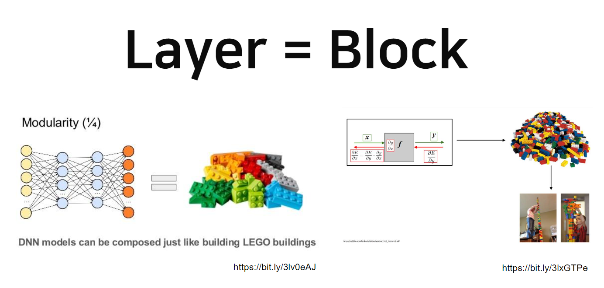
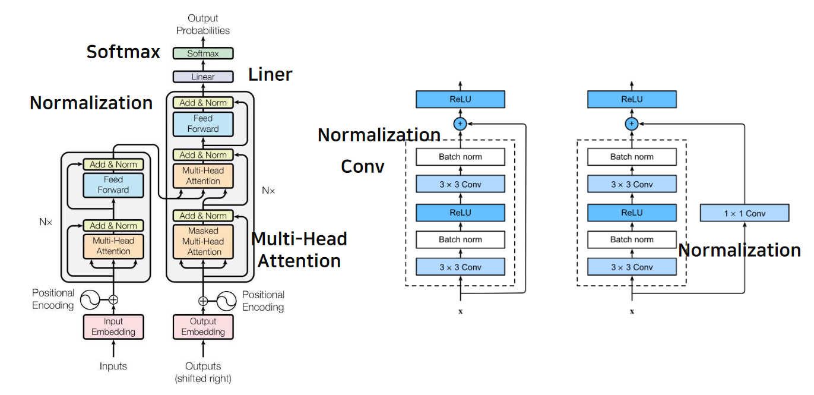

# 4강 Autograd and Optimizer
- 이번 강의에선 Pytorch의 Module, Parameter와 Backward 과정 - Optimizer에 대해 학습합니다. nn.Module을 통해 기본적으로 PyTorch에 구현되어 있는 네트워크 텐서 모듈들을 살펴보고 nn.Parameter이 Module 내부에서 어떤 역할을 하는지 학습합니다. 마지막으로 Backward 함수가 작동하는 방식을 확인해 직접 구현해보는 시간을 가집니다.

[back to super](https://github.com/jinmang2/boostcamp_ai_tech_2/tree/main/u-stage/pytorch)

## 논문을 구현해보자!
- 재미난 블럭 쌓기 게임을 시작합니다!





### `torch.nn.Module`
- 딥러닝을 구성하는 Layer의 base class
- Input, Output, Forward, Backward 정의
- 학습의 대상이 되는 parameter(tensor) 정의


### `nn.Parameter`
- Tensor 객체의 상속 객체
- nn.Module내에 attribute가 될 때는 `requires_grad=True`로 지정되어 학습 대상이 되는 Tensor
- 우리가 직접 지정할 일은 잘 없음!

### Backward
- Layer에 있는 parameter들의 미분을 수행
- Forward의 결과값과 실제값 간의 차이(loss)에 대해 미분을 수행
- 해당 값으로 parameter 업데이트
- 실제 backward는 Module 단계에서 직접 지정 가능!
  - 정확히는 `Function`
  - 아니면 상위 버전에서 바뀌었나?
- Module에서 backward와 optimize 오버라이딩
  - 아니 이런 설명이 있는거 보니까... 뭔가 많이 바뀌었아 보네...
  - 쓸 일은 없으나 순서를 이해할 필요가 있음
- 아니, 없는데?

```python
class LR(nn.Module):
    def __init__(
        self,
        dim: int,
        lr: torch.Tensor = torch.scalar_tensor(0.01),
    ):
        super(LR,self).__init__()
        # intialize parameters
        self.w = torch.zeros(dim, 1, dtype=torch.float).to(device)
        self.b = torch.scalar_tensor(0).to(device)
        self.grads={
            "dw":torch.zeros(dim,1,dtype=torch.float).to(device),
            "db":torch.scalar_tensor(0).to(device)
        }
        self.lr = lr.to(device)

    def forward(self, x: torch.Tensor) -> torch.Tensor:
        ## compute forward
        z = torch.mm(self.w.T, x)
        a = self.sigmoid(z)
        return a

    def sigmoid(self, z: torch.Tensor) -> torch.Tensor:
        return 1 / (1 + torch.exp(-z))

    def backward(
        self,
        x: torch.Tensor,
        yhat: torch.Tensor,
        y: torch.Tensor,
    ):
        ## compute backward
        self.grads["dw"] = (1/x.shape[1]) * torch.mm(x,(yhat-y).T)
        self.grads["db"] = (1/x.shape[1]) * torch.sum(yhat-y)

    def optimize(self):
        ## optimization step
        self.w = self.w - self.lr * self.grads["dw"]
        self.b = self.b - self.lr * self.grads["db"]
```
