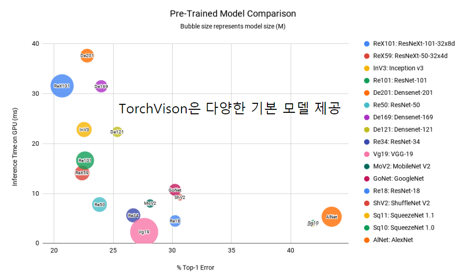
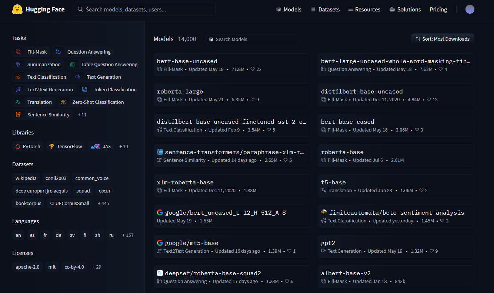
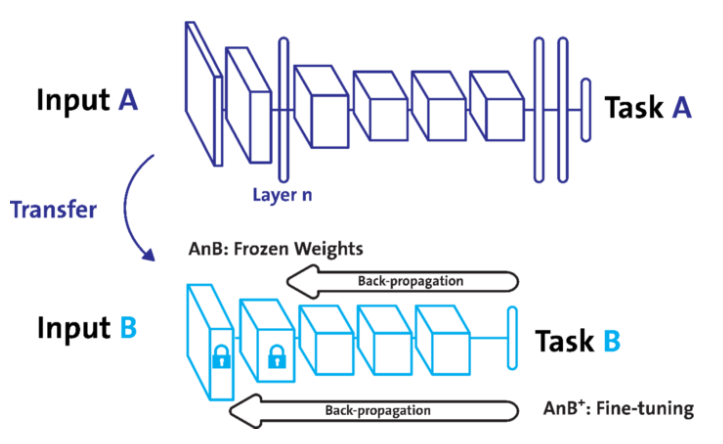

# 6강 모델 불러오기
- 이번 강의에선 **PyTorch 모델 저장 및 불러오는** 방법과 이어 학습하기(Transfer Learning)를 학습합니다. state_dict의 의미와 모델의 파라미터를 여러 정보들과 함께 저장하고 불러오는 법을 배우고 전에 학습되어 있는 모델을 활용하는 법을 배웁니다.

- 본 강의에서 배운 것을 통해 Loss와 Metric에 따라 모델을 저장하고, 이어학습하기, 더 나아가 public site에 있는 학습해둔 모델 활용법까지 익힙니다.

[back to super](https://github.com/jinmang2/boostcamp_ai_tech_2/tree/main/u-stage/pytorch)

## 학습 결과를 공유하고 싶다!


## `model.save()`
- 학습의 결과를 저장하기 위한 함수
- 모델 형태(architecture)와 파라미터를 저장
- 모델 학습 중간 과정의 저장을 통해 최선의 결과 모델을 선택
- 만들어진 모델을 외부 연구자와 공유하여 학습 재연성 향상

```python
print("Model's state_dict")
for param_tensor in model.state_dict():
    print(param_tensor, "\t", model.state_dict()[param_tensor].size())

torch.save(model.state_dict(), os.path.join(MODEL_PATH, "model.pt"))

new_model = ModelClass()
new_model.load_state_dict(torch.load(os.path.join(MODEL_PATH, "model.pt")))

torch.save(model, os.phat.join(MODEL_PATH, "model.pt"))
model = torch.load(os.path.join(MODEL_PATH, "model.pt"))
```

## checkpoints
- 학습의 중간 결과를 저장, 최선의 결과를 선택
- early stopping 기법 사용시 이전 학습의 결과물을 저장
- loss와 metric값을 지속적으로 확인 저장
- 일반적으로 epoch, loss, metric을 함께 저장하여 확인

```python
e_loss = epoch_loss / len(dataloader)
e_acc = epoch_acc / len(dataloader)
torch.save(
    {
        'epoch': e,
        'model_state_dict': model.state_dict(),
        'optimizer_state_dict': optimizer.state_dict(),
        'loss': epoch_loss,
    },
    f"saved/ckpt_model_{e}_{e_loss}_{e_acc}.pt"
)

checkpoint = torch.load(PATH)
model.load_state_dict(checkpoint['model_state_dict'])
optimizer.load_state_dict(checkpoint['optimizer_state_dict'])
epoch = checkpoint['epoch']
loss = checkpoint['loss']
```

## Transfer learning
- 다른 데이터셋으로 만든 모델을 현재 데이터에 적용!
- large corpora -> fine-tune!
- backbone architecture가 잘 학습된 모델에서 일부만 변경하여 학습을 수행

### Vision
- https://github.com/rwightman/pytorch-image-models#introduction



### NLP
- nlp는 huggingface가 표준
- huggingface.co



### Freezing
- pretrained model을 활용 시 모델의 일부분을 frozen시킴
- https://purnasaigudikandula.medium.com/deep-view-on-transfer-learning-with-iamge-classification-pytorch-5cf963939575


