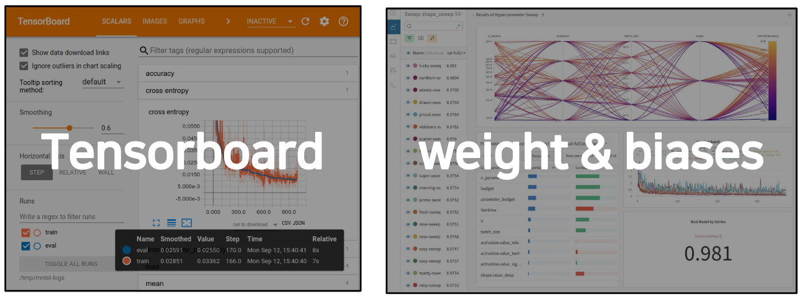
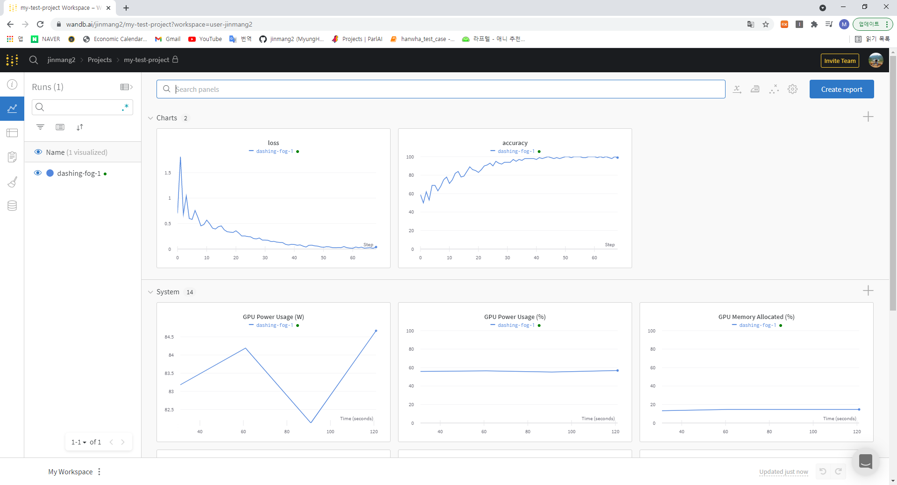

# 7강 Monitoring tools for PyTorch
- PyTorch를 이용한 학습 시 metric등을 기록할 때, cli에 출력하는 print문 외에 사용할 수 있는 Tensorboard, weight & biases를 학습합니다. 이를 통해 딥러닝 모델 학습 실험들을 파라미터와 Metric들을 자동으로 저장하는 실험 관리 프로세스를 익힐 수 있고,  코드 버저닝, 협업 관리, 더 나아가 MLOps의 전체적인 흐름을 확인할 수 있습니다.

[back to super](https://github.com/jinmang2/boostcamp_ai_tech_2/tree/main/u-stage/pytorch)

## 좋은 도구들이 많다!



## Tensorboard
- Tensorflow의 프로젝트로 만들어진 시각화 도구
- 학습 그래프, metric, 학습 결과의 시각화 지원
- PyTorch도 연결 가능 -> DL 시각화 핵심 도구
- `scalar`: metric 등 상수 값의 연속(epoch)을 표시
- `graph`: 모델의 computational graph 표시
- `histogram`: weight 등 값의 분포를 표현
- `Image`: 예측 값과 실제 값을 비교 표시
- `mesh`: 3D 형태의 데이터를 표현하는 도구

### `SummaryWriter`
```python
from torch.utils.tensorboard import SummaryWriter
import numpy as np

exp  = f"{logs_base_dir}/ex3"
writer = SummaryWriter(exp)
for n_iter in range(100):
    writer.add_scalar('Loss/train', np.random.random(), n_iter)
    writer.add_scalar('Loss/test', np.random.random(), n_iter)
    writer.add_scalar('Accuracy/train', np.random.random(), n_iter)
    writer.add_scalar('Accuracy/test', np.random.random(), n_iter)
writer.flush()
```

- 디렉토리 안에 넣기
```python
from tensorboard import notebook
notebook.list() # View open TensorBoard instances

from torch.utils.tensorboard import SummaryWriter
writer = SummaryWriter(logs_base_dir)
r = 5
for i in range(100):
    writer.add_scalars(
        'run_14h',
        {
            'xsinx':i*np.sin(i/r),
            'xcosx':i*np.cos(i/r),
            'tanx': np.tan(i/r)
        },
        i
    )
writer.close()
```

- `add_histogram`: 분포를 그려줌
```python
from torch.utils.tensorboard import SummaryWriter
import numpy as np
writer = SummaryWriter(logs_base_dir)
for i in range(10):
    x = np.random.random(1000)
    writer.add_histogram('distribution centers', x + i, i)
writer.close()
```

- `add_images`: 이미지를 그려줌
```python
from torch.utils.tensorboard import SummaryWriter
import numpy as np

img_batch = np.zeros((16, 3, 100, 100))
for i in range(16):
    img_batch[i, 0] = np.arange(0, 10000).reshape(100, 100) / 10000 / 16 * i
    img_batch[i, 1] = (1 - np.arange(0, 10000).reshape(100, 100) / 10000) / 16 * i

writer = SummaryWriter(logs_base_dir)
writer.add_images('my_image_batch', img_batch, 0)
writer.close()
```

- `add_mesh`: 3D 분석
```python
import torch
from torch.utils.tensorboard import SummaryWriter
vertices_tensor = torch.as_tensor([
    [1, 1, 1],
    [-1, -1, 1],
    [1, -1, -1],
    [-1, 1, -1],
], dtype=torch.float).unsqueeze(0)
colors_tensor = torch.as_tensor([
    [255, 0, 0],
    [0, 255, 0],
    [0, 0, 255],
    [255, 0, 255],
], dtype=torch.int).unsqueeze(0)
faces_tensor = torch.as_tensor([
    [0, 2, 3],
    [0, 3, 1],
    [0, 1, 2],
    [1, 3, 2],
], dtype=torch.int).unsqueeze(0)

writer = SummaryWriter(logs_base_dir)
writer.add_mesh('my_mesh', vertices=vertices_tensor, colors=colors_tensor, faces=faces_tensor)

writer.close()
```

- `add_hparams`: hyperparameter 확인하기
```python
from torch.utils.tensorboard import SummaryWriter

with SummaryWriter(logs_base_dir) as w:
    for i in range(5):
        w.add_hparams({'lr': 0.1*i, 'bsize': i},
                      {'hparam/accuracy': 10*i, 'hparam/loss': 10*i})
```

### tensorboard 시각화
```python
%load_ext tensorboard
%tensorboard --logdir "logs"
```


## Weights & Biases
- 머신러닝 실험을 원활히 지원하기 위한 상용 도구
- 협업, code versioning, 실험 결과 기록 등 제공
- MLOps의 대표적인 툴로 저변 확대 중



- 아래는 여러 command 모음
```python
!pip install wandb -q
!wandb login
import wandb
wandb.init(project="my-test-project", entity='jinmang2')
wandb.init(project="my-test-project", config=config)
wandb.watch_called = False # Re-run the model without restarting the runtime. unnecessary after our next release
config = wanbd.config
config.batch_size = 4
...
wandb.watch(model, log="all")
wandb.log({'accuracy': train_acc, 'loss': train_loss})
```

## Reference
- [Weights & Biases 모니터링 도구](https://wandb.ai/site)
- [Pytorch Tensorboard](https://pytorch.org/docs/stable/tensorboard.html)
- [Pytorch Lightning Logger 목록](https://pytorch-lightning.readthedocs.io/en/stable/extensions/logging.html)
