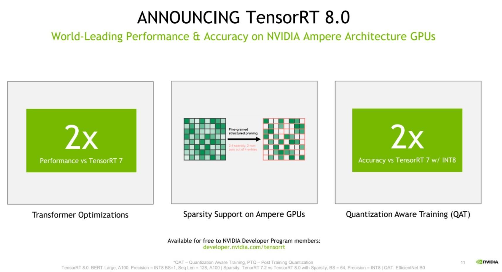
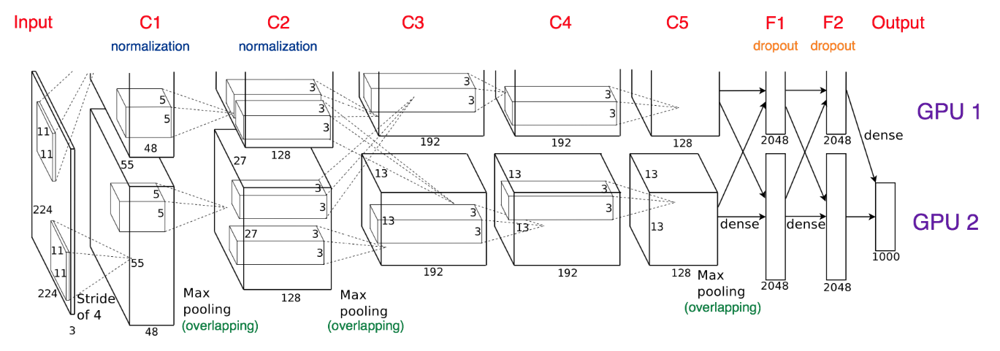
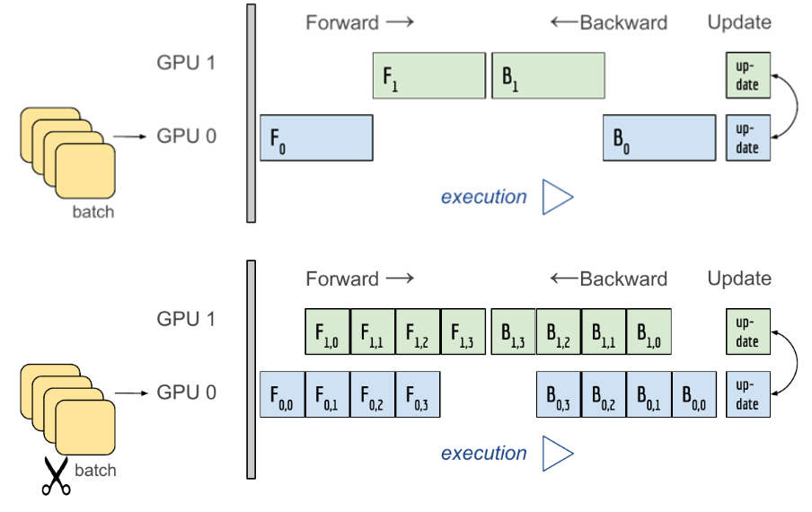
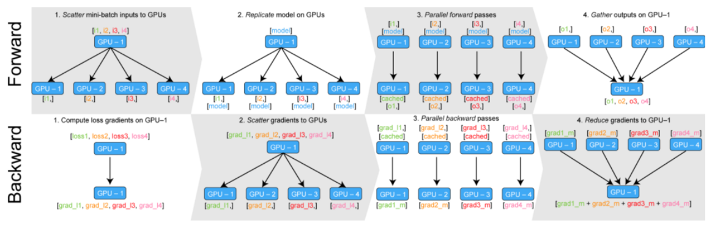
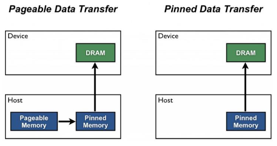

# 8강 Multi-GPU 학습
- PyTorch에서 Multi GPU를 사용하기 위해 딥러닝 모델을 병렬화 하는 Model Parallel의 개념과 데이터 로딩을 병렬화하는 Data Parallel의 개념을 학습합니다. 이를 통해 다중 GPU 환경에서 딥러닝을 학습할 때에 효율적으로 하드웨어를 사용할 수 있도록 하고, 더 나아가 딥러닝 학습 시에 GPU가 동작하는 프로세스에 대한 개념을 익힙니다.

[back to super](https://github.com/jinmang2/boostcamp_ai_tech_2/tree/main/u-stage/pytorch)

## 개념정리
- Single vs Multi
- GPU vs Node
    - Node -> 시스템! 한 대의 컴퓨터를 의미
- Single Node Single GPU
- Single Node Multi GPU
- Multi Node Multi GPU

- NVIDIA는 Multi-GPU 환경을 쉽게 처리할 수 있는 `Tensor-RT`도 소개함



## Model parallel
- 다중 GPU에 학습을 분산하는 두 가지 방법
    - 모델을 나누기 / 데이터를 나누기
- 모델을 나누는 것은 생각보다 예전부터 사용 (alexnet)
- 모델의 병목, 파이프라인의 어려움 등으로 인해 `Model Parallelism`은 고난이도 과정



- http://www.idris.fr/eng/ia/model-parallelism-pytorch-eng.html



```python
class ModelParallelResNet50(ResNet):
    def __init__(self, *args, **kwargs):
        super().__init__(
            Bottleneck,
            [3, 4, 6, 3],
            num_classes=num_classes,
            *args, **kwargs
        )
        self.seq1 = nn.Sequential(
            self.conv1, self.bn1, self.relu, self.maxpool, self.layer1, self.layer2
        ).to('cuda:0')
        self.seq2 = nn.Sequential(
            self.layer3, self.layer4, self.avgpool,
        ).to('cuda:1')
        self.fc.to('cuda:1')

    def forward(self, x):
        x = self.seq2(self.seq1(x).to('cuda:1'))
        return self.fc(x.view(x.size(0), -1))
```

## Data parallel
- 데이터를 나눠 GPU에 할당 후 결과의 평균을 취하는 방법
- mini-batch 수식과 유사, 한번에 여러 GPU에서 수행
- https://bit.ly/37usURV



- PyTorch에서는 아래 두 가지 방식을 제공!
    - `DataParallel`, `DistributedDataParallel`
- `DataParallel`: 단순히 데이터를 분배한 후 평균을 취함
    - GPU 사용 불균형 문제 발생, Batch size 감소 (한 GPU가 병목)
    - GIL (Global Interpreter Lock)
- `DistributedDataParallel`: 각 CPU마다 process를 생성하여 개별 GPU에 할당
    - 기본적으로 DataParallel로 하나 개별적으로 연산의 평균을 냄

- https://bit.ly/37usURV
```python
# Encapsulate the model
parallel_model = torch.nn.DataParallel(model)

# Forward pass on multi-GPUs
predictions = parallel_model(inupts)
# Compute loss function
loss = loss_fn(predictions, labels)
# Average GPU-losses + backward pass
loss.mean().backward()
# Optimizer step
optimizer.step()
# Forward pass with new parameters
predictions = parallel_model(inputs)
```

## DistributedDataParallel
- 이걸 쓴다면 몇 가지 귀찮은 과정을 거쳐야 함
- `pin_memory`



```python
train_sampler = torch.utils.data.distributed.DistributedSampler(train_data)
shuffle = False
# D-RAM에 데이터를 바로바로 올려줄 수 있도록 절차 간소화
pin_memory = True

train_loader = torch.utils.data.DataLoader(
    train_data,
    batch_size=32,
    shuffle=shuffle,
    pin_memory=pin_memory,
    num_workers=3,
    sampler=train_sampler,
)

# Python의 멀티 프로세싱 코드
from multiprocessing import Pool

def f(x):
    return x * x

if __name__ == '__main__':
    with Pool(5) as p:
        print(p.map(f, [1, 2, 3]))    

# Map-Reduce 개념
def main():
    n_gpus = torch.cuda.device_count()
    torch.multiprocessing.spawn(main_worker, nprocs=n_gpus, args=(n_gpus,))


def main_worker(gpu, n_gpus):
    image_size = 224
    batch_size = 512
    num_worker = 8
    epochs = 10

    batch_size = int(batch_size / n_gpus)
    num_worker = int(num_worker / n_gpus)

    # 멀티프로세싱 통신 규약 정의
    torch.distributed.init_process_group(
        backend='nccl',
        init_method='tcp://127.0.0.1:2568',
        world_size=n_gpus,
        rank=gpu,
    )
    model = MODEL

    torch.cuda.set_device(gpu)
    model = model.cuda(gpu)
    model = torch.nn.parallel.DistributedDataParallel(model, device_ids=[gpu])
```
- https://blog.si-analytics.ai/12

## Reference
- [Pytorch Lightning Multi GPU 학습](https://pytorch-lightning.readthedocs.io/en/stable/advanced/multi_gpu.html)
- [DDP 튜토리얼](https://pytorch.org/tutorials/intermediate/ddp_tutorial.html)
- [집현전 Large-Scale LM](https://youtu.be/w4a-ARCEiqU)
    - [presentation](https://github.com/jiphyeonjeon/season2/blob/main/advanced/presentations/Season2-1%EC%A1%B0-Large-sclae%20LM%EC%97%90%20%EB%8C%80%ED%95%9C%20%EC%96%95%EA%B3%A0%20%EB%84%93%EC%9D%80%20%EC%A7%80%EC%8B%9D%EB%93%A4%20(part%201).pdf)
