# Large-Scale LM에 대한 얕고 넓은 지식들!
- https://youtu.be/w4a-ARCEiqU?t=1978
- https://github.com/jiphyeonjeon/season2
- https://medium.com/daangn/pytorch-multi-gpu-학습-제대로-하기-27270617836b

아래의 모든 자료는 위 링크를 참고해서 정리한 글입니다! (제가 보기 편하게...)

공유해주신 고현웅님 및 당근마켓, 집현전분들께 감사말씀 드립니다!


# Parallelism: Theory and Practice
- `nn.DataParallel` to `ZeRO-infinity`

<details open="open">
  <summary>Table of Contents</summary>
  <ol>
    <li>
      <a href="#fundamental">Fundamental</a>
      <ul>
        <li><a href="#data-parallel">Data Parallel</a></li>
        <li><a href="#model-parallel">Model Parallel</a></li>
        <li><a href="#pipeline-parallel">Pipeline Parallel</a></li>
        <li><a href="#message-passing">Message Passing</a></li>
        <li><a href="#mpi">MPI (Message Passing Inferface)</a></li>
        <li><a href="#collective-communication">Collective Communication</a></li>
      </ul>
    </li>
    <li>
      <a href="#data-parallelism">Data Parallelism</a>
      <ul>
        <li><a href="#nndataparallel">nn.DataParallel</a></li>
        <li><a href="#horovod">Horovod</a></li>
        <li><a href="#nnparalleldistributeddataparallel">nn.parallel.DistributedDataParallel</a></li>
      </ul>
    </li>
    <li>
      <a href="#model-parallelism">Model Parallelism</a>
      <ul>
        <li><a href="#inter-layer-model-parallelism">Inter-layer model parallelism</a></li>
        <li><a href="#intra-layer-model-parallelism">Intra-layer model parallelism</a></li>
        <li><a href="#mesh-tensorflow">Mesh-tensorflow</a></li>
        <li><a href="#megatron-lm">Megatron-LM</a></li>
      </ul>
    </li>
    <li>
      <a href="#pipeline-parallelism">Pipeline Parallelism</a>
      <ul>
        <li><a href="#gpipe">GPipe</a></li>
        <li><a href="#fairscale">Fairscale</a></li>
        <li><a href="#pytorch-lightning">Pytorch-lightning</a></li>
        <li><a href="#pipedream">PipeDream</a></li>
        <li><a href="#interleaved-scheduling">Interleaved Scheduling</a></li>
        <li><a href="#3d-parallelism">3D Parallelism</a></li>
      </ul>
    </li>
    <li>
      <a href="#deep-speed">Deep Speed</a>
      <ul>
        <li><a href="#mixed-precision">Mixed Precision</a></li>
        <li><a href="#zero-redundancy-optimizer">Zero Redundancy Optimizer</a></li>
        <li><a href="#zero-dp">ZeRO-DP</a></li>
        <li><a href="#zero-r">ZeRO-R</a></li>
        <li><a href="#zero-offload">ZeRO-offload</a></li>
        <li><a href="#zero-infinity">ZeRO-infinity</a></li>
        <li><a href="#deep-speed">Deep Speed</a></li>
      </ul>
    </li>
  </ol>
</details>


## Fundamental
- Parallelism (병렬화)
    - 병렬화는 여러 개를 동시에 처리하는 기술!
    - 머신러닝에서는 주로 여러 개의 디바이스에서 연산을 병렬화하여 속도나 메모리 효율성을 개선하기 위해 사용


<br/>
<div align="right">
    <b><a href="#large-scale-lm에-대한-얕고-넓은-지식들">↥ back to top</a></b>
</div>
<br/>

### Data Parallel
- 데이터가 많을 때, 데이터를 병렬처리하여 학습 속도를 끌어 올림
- 모든 device에 모델을 복사, 서로 다른 데이터를 각 device에 입력
- 이로 인해 batch size를 device의 수 배수만큼 더 입력 가능
- 그러나 이러한 병렬화는 모델 하나가 device에 온전히 올라갈 때만 사용 가능!

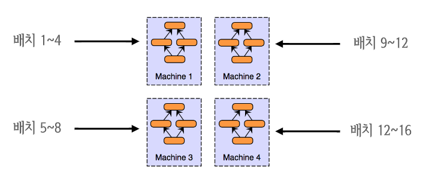

### Model Parallel
- 만약 모델이 너무 커서 하나의 device에 담을 수 없을 때 parameter를 쪼개서 올리는 방법
- 각 device에 모델의 parameter 일부분들이 담겨있음
- 이로 인해 큰 모델도 작은 device 여러 개를 이용하여 device에 올릴 수 있다!

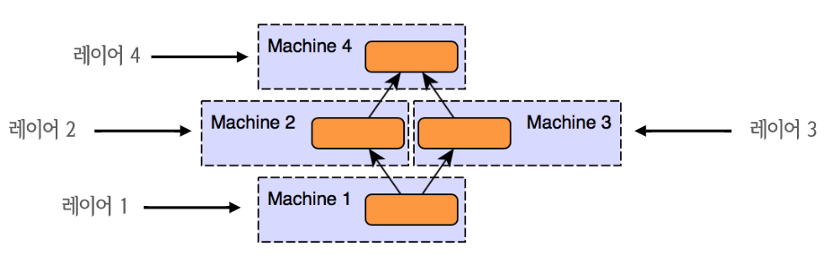

### Pipeline Parallel
- 만약 layer 단위로 모델 병렬화를 수행했다면 반드시 레이어들을 순서대로 실행해야 한다.
- 즉, layer 단위의 모델 병렬화를 수행하면 연산과정의 순서가 생길 수 밖에 없음
- 이 연산 과정을 병렬적으로 pipelining하는 것이 pipeline 병렬화!
    - GPipe 등!

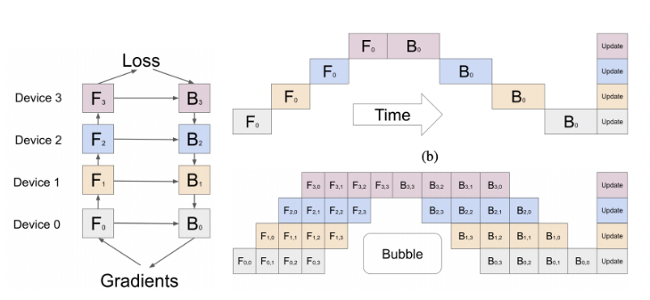

- micro-batch size란 개념을 도입함!!

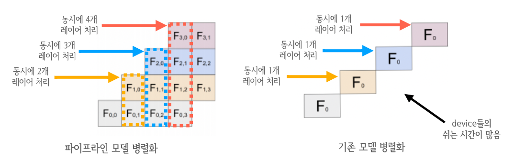

### Message Passing
- Message Passing은 동일한 주소 공간을 공유하지 않는 프로세스들이 데이터를 주고받을 수 있도록 메시지라는 간접 정보를 전달하고 주고 받는 것!
- 예를 들어, Process1이 특정 tag가 달린 data를 message queue에 send하도록, Process2는 해당 tag가 달린 data를 메시지에서 receive받로고 코딩해놓으면 메모리 공유없이도 두 프로세스가 데이터를 주고 받게 된다!

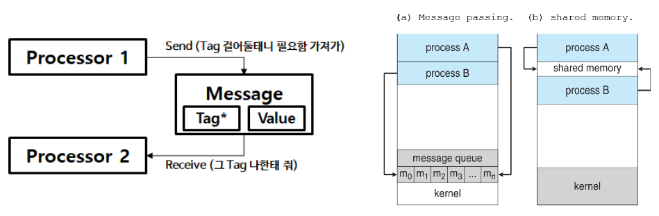

<br/>
<div align="right">
    <b><a href="#large-scale-lm에-대한-얕고-넓은-지식들">↥ back to top</a></b>
</div>
<br/>

### MPI
- `Message Passing Inferface`
- Message Passing에 대한 표준 인터페이스!
- 대표적으로 OpenMPI라는 오픈소스가 존재함
- 프로세서간 message passing에 사용되는 여러가지 연산들이 정의되어 있음!

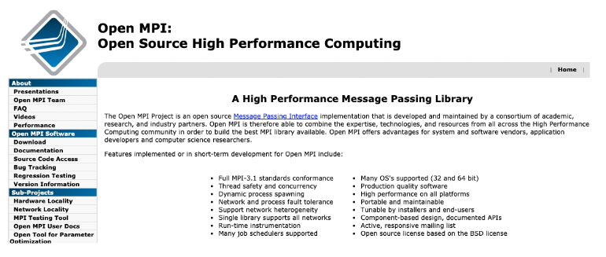

#### MPI 기본 용어
- Node: 일반적으로 computer라고 생각하면 됨! 하나의 Node에 여러 대의 device가 존재할 수 있음
- Global Rank: ML에서는 GPU의 ID라고 생각하면 됨
    - 원래는 프로세스의 우선 순위
- Local Rank: ML에서는 Node 안에서의 GPU ID!
    - 원래는 Node 내 프로세스의 우선 순위
- Size (World Size): ML에서는 전체 GPU의 수
    - 원래는 총 프로세스의 수

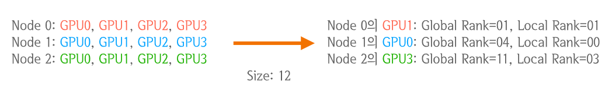

<br/>
<div align="right">
    <b><a href="#large-scale-lm에-대한-얕고-넓은-지식들">↥ back to top</a></b>
</div>
<br/>

### Collective Communication
- MPI에서 제공하는 병렬처리 연산들!
- 더 많은 종류가 있지만 여기선 주요 4개 + 2개만 소개
- 여러 프로세스들이 협력해서 통신하는 것이기 때문에 `Collective Communication`
- GPU에서 데이터나 Gradient를 전송할 때, 실제로 이러한 Collective Communication을 수행!

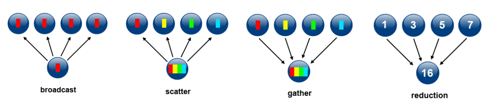

#### BroadCast
- 특정 Process에서 하나의 값을 복사해서 여러 Process들로 전송

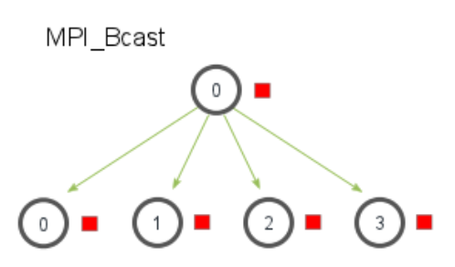

#### Scatter
- 특정 Process가 가진 배열의 값들을 다른 Process들로 쪼개서 전송하는 연산

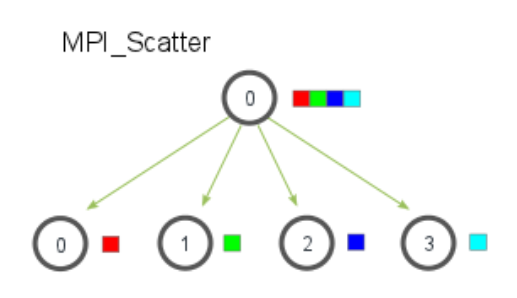

#### Gather
- 각 Process가 가진 값들을 특정한 하나의 Process에게 모으는 연산

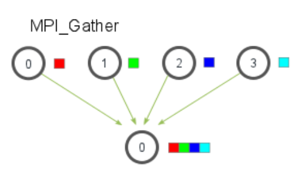

#### Reduce
- 각 Process가 가진 값들을 특정한 하나의 Process에게 연산해서 모으는 연산
- Gather와 비슷할 수 있지만, 각 Process가 가진 연산을 하나의 값으로 만드는 것이 차이점

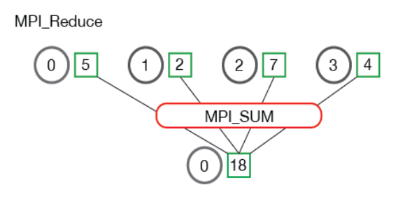

#### 정리하면?

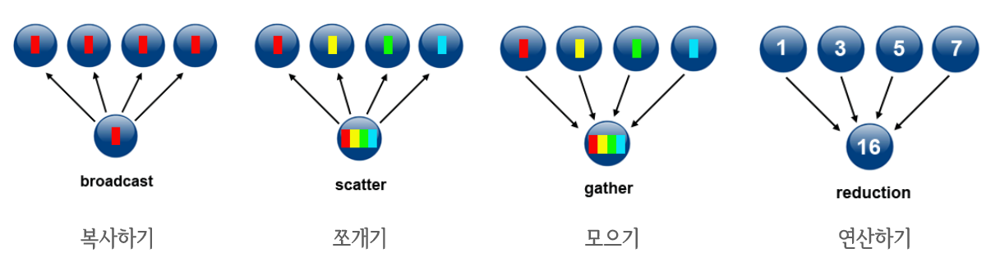

#### Collective Communication: All + ???
- 기본적인 4개의 연산 이외에 All + ???와 같은 이름을 가진 연산들이 있음
- 이름 앞에 All이 붙으면 연산 결과를 참여한 모든 프로세스가 동일하게 반환받는 연산!

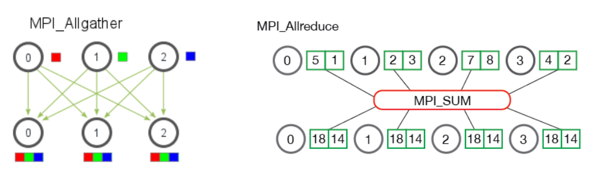


#### All-Gather
- 기존의 Gather는 하나의 Process가 결과를 반환받음
- All-Gather는 Gather 연산을 수행해서 모인 값들을 참여한 모든 Process가 반환받음

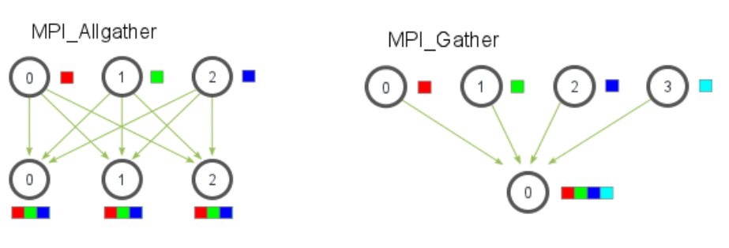


#### All-Reduce
- 마찬가지로 Reduce 연산을 수행해서 계산된 결과를 참여한 모든 Process가 반환!
- 기존 Reduce 연산에서 하나의 Process가 결과를 반환받는 것과 대조됨

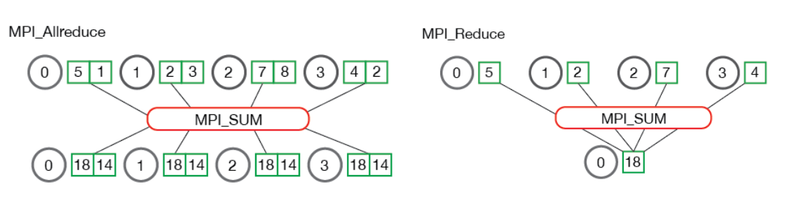

#### NCCL (Nvidia Collective Communication Library)
- 우리가 `backend=nccl`할 때 그 nccl!
- Nvidia에서 개발한 GPU 특화 Collective Communication Library ('Nickel'이라고 읽음)
- Nvidia GPU에서 사용 시 다른 도구에 비해 월등히 탁월한 성능을 보이는 것으로 알려짐
- Nvlink (다중 GPU 연결 인터페이스)를 직접 활용해서 매우 높은 대역폭에서 전송 가능

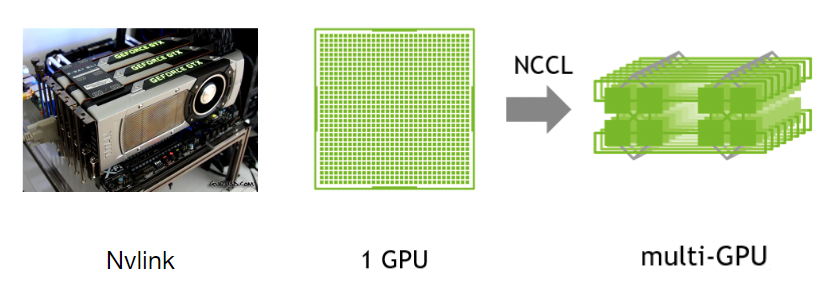

<br/>
<div align="right">
    <b><a href="#large-scale-lm에-대한-얕고-넓은-지식들">↥ back to top</a></b>
</div>
<br/>

## Data Parallelism
- `Pytorch`, `Horovod`, `Pytorch-distributed`

### `nn.DataParallel()`
- Data Parallelism은 All-reduce 연산을 활용하기 전과 후로 나뉨!
- `torch.nn.DataParallel(model)`이 어떻게 동작할까?
- single-node & multi-gpu에서 모델을 학습하기 위한 멀티 쓰레드 모듈

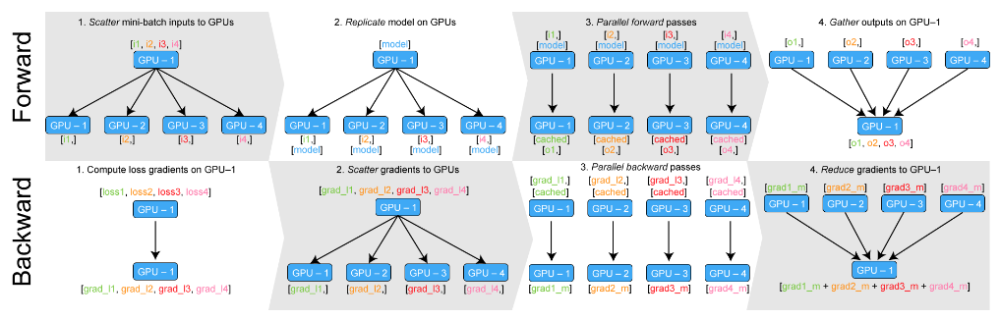

#### Forward Pass
1) 입력된 mini-batch를 scatter하여 각 device로 전송
2) GPU1에 저장된 모델의 파라미터를 GPU 2, 3, 4로 replicate하여 전송
3) 각 device로 복사된 모델로 Forward하여 출력값을 구함
4) 출력값들을 gather하여 GPU1에 모음

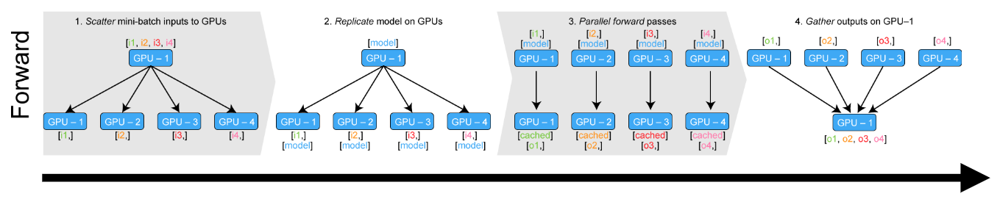

#### Backward Pass
1) GPU1의 Gather된 출력값과 Label을 이용하여 각각의 loss를 계산
2) 계산된 각각의 Loss를 각각의 device에 scatter함
3) 전달받은 Loss를 이용해서 각 device에 backward를 수행
4) 모든 gradient를 GPU1로 reduce하여 GPU1의 모델 파라미터로 업데이트!

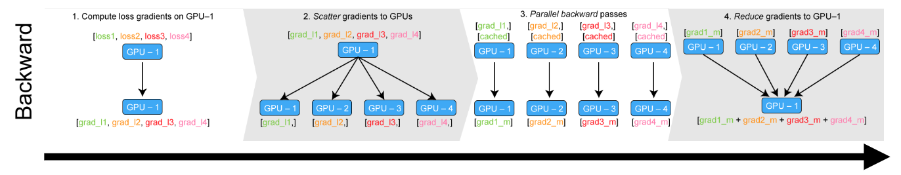

- 생각해봅시다...!
    - `loss.backward()`: 기울기를 미분해서 gradient만 계산 (parallel)
    - `optimizer.step()`: Gradient를 이용해서 파라미터 업데이트 (Sequential)
    - Computation Cost는 backward > step

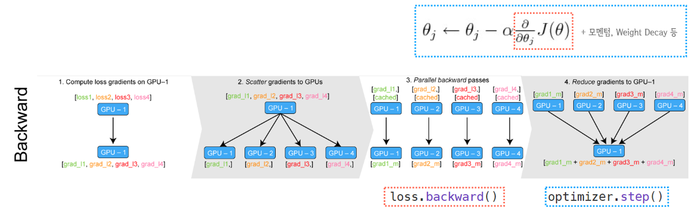

#### Codes

```python
import torch
import torch.nn as nn

model = BERT(args)
model = nn.DataParallel(model)
model.cuda()
...
for i, (inputs, labels) in enumerate(train_loader):
    outpust = model(inputs)
    loss = criterion(outputs, labels)
    optimizer.zero_grad()
    loss.backward()
    optimizer.step()
```

- `forward`를 코드로 나타내면?

```python
def data_parallel(module, input, device_ids, output_device):
    # 입력 데이터를 device_ids들에 scatter
    inputs = nn.parallel.scatter(input, device_ids)
    # 모델을 device_ids들에 복사
    replicas = nn.parallel.replicate(module, device_ids)
    # 각 device에 복제된 모델이 각 device의 데이터를 forward
    outputs = nn.paralle.parallel_apply(replicas, inputs)
    # 모델의 출력값을 output_device(하나의 device)로 모음
    return nn.parallel.gather(outputs, output_device)
```

- `pytorch-lightning`을 사용하면 매우 쉽게 사용 가능!

```python
from pytorch_lightning import Trainer

lightning_model = ...

trainer = Trainer(
    args,
    accelerator='dp', # 여기 한 줄만 바꾸면 됨!
)

trainer.fit(
    lightning_model, train_loader, val_loader,
)
```

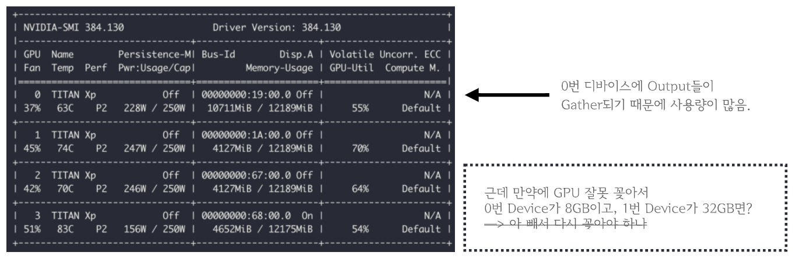

- `os.environ['CUDA_VISIBLE_DEVICE']`를 이용해 사용할 GPU 선택
- `nn.DataParallel(model)`에 output_device를 설정해서 output을 gather받을 device 선택

```python
import os
import torch.nn as nn

# 4개의 device를 사용함
os.environ["CUDA_VISIBLE_DEVICE"] = '0, 1, 2, 3'
# Gradient를 1번 device에 Gather함
model = nn.DataParallel(model, output_device=1)
```

#### 문제점
1) multi-thread 모듈이기 때문에 python에서 비효율적임 (GIL 참고)
2) GPU1에서 업데이트된 모델의 매 스텝마다 모든 device로 replicate해야 함
3) 메모리 불균형이 일어나서 GPU를 100% 활용할 수 없음

생각해보자! 1)은 multi-thread 문제임! (python 고질적)

#### Memory Imbalance
- 3번 문제를 해결하자!
- 왜 불균형이 일어나는가? Loss함수가 Parallel하지 않기 때문!
- 즉, GPU 1개로 모든 output을 모아서 Loss를 계산!
    - 그러면 어떻게 해결하느냐? Parallel Loss 함수를 구현해서 Output을 모으지 않고 각 device에서 계산하면 된다!

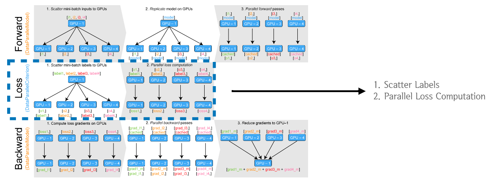

```python
from torch.nn.parallel.data_parallel import DataParallel

class DataParallelCriterion(DataParallel):

    def forward(self, inputs, *targets, *kwargs):
        # 라벨을 각 device로 scatter함
        targets, kwargs = self.scatter(targets, kwargs, self.device_ids)
        # self.module(loss함수)을 device들에 복제!
        replicas = self.replicate(self.module, self.device_ids)
        # 병렬 criterrion을 이용해 각 device의 loss를 계산
        outputs = _criterion_parallel_apply(replicas, inputs, targets, kwargs)
        # 계산한 outputs을 Reduce하여 Backward 연산할 수 있도록 한다.
        return Reduce.apply(*outputs) / len(outputs), targets
```

```python
import torch
import torch.nn as nn
from parallel import DataParallelModel, DataParallelCriterion

model = BERT(args)
# 커스텀 ParallelCriterion을 사용하려면 nn.DataParallel이 아니라
# nn.DataParallelModel()을 사용해야 한다
# nn.DataParallel()은 기본적으로 Outputs을 Gather하여 구현된다.
model = DataParallelModel(model)
model.cuda()

...
criterion = nn.NLLLoss()
# 커스텀 ParallelCriterion 사용
criterion = DataParallelCriterion(criterion)

for i, (inputs, labels) in enumerate(trainloader):
    outputs = model(inputs)
    loss = criterion(outputs, labels)
    optimizer.zero_grad()
    loss.backward()
    optimizer.step()
```

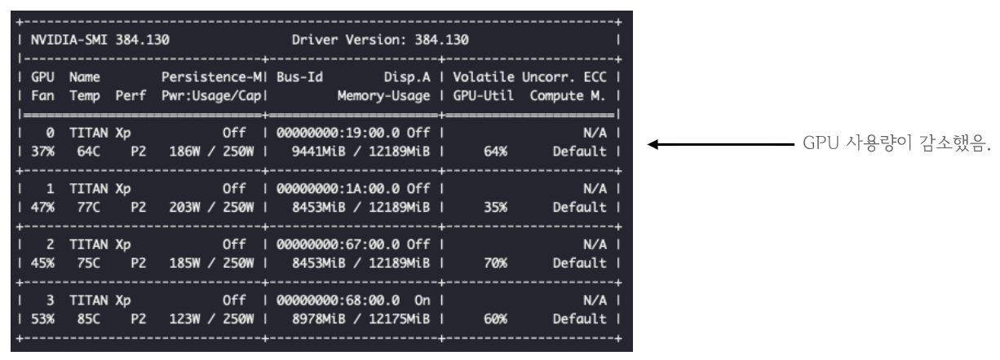

#### All-reduce
- 2번 문제를 해결하자!
    - GPU1에서 업데이트된 모델을 매 스텝마다 모든 device로 replicate해야 하는 문제...
- 만약 Gradient를 Reduce하지 않고 평균을 계산해서 모든 device로 전송할 수 있다면??
- Gradient의 평균으로 각 device에서 파라미터를 자체적으로 업데이트!
    - 그러면 replicate할 필요가 없어짐!

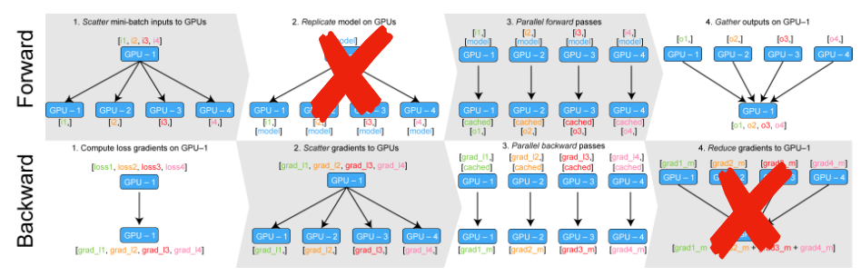

- 즉, DataParallel을 개선하려면 all-reduce를 사용해서 Gradient의 평균을 모든 device로 전송하면 되지만...
    - All-reduce는 상당히 비용이 높은 연산임

**(1) Reduce -> Broadcast**

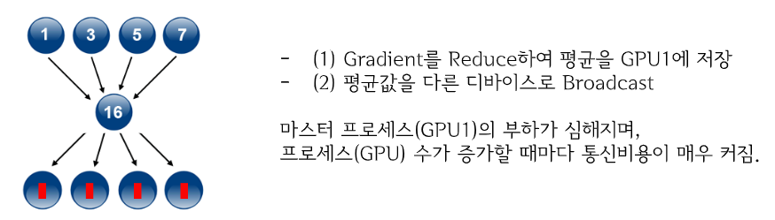

**(2) All-to-All (Collective Communication 연산 중 하나)**

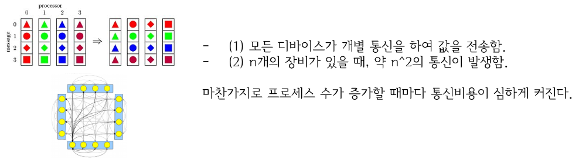

**(3) Ring All-reduce**
- Baidu에서 Ring All-reduce 알고리즘을 제안

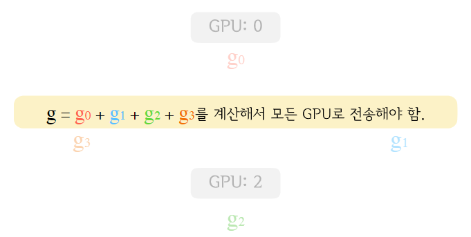

- GPU 0에서 3으로 쭉쭉 더한 값들을 전달

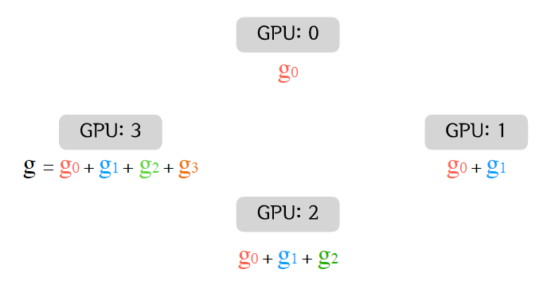

- 이 총합을 다시 쭉쭉 전달

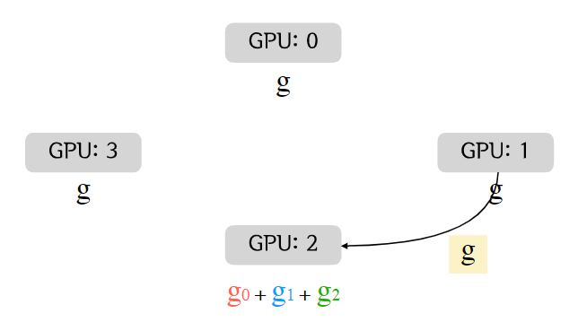

- 이제 모든 device에서 계산된 gradient를 가지고 있음! weight update 실시

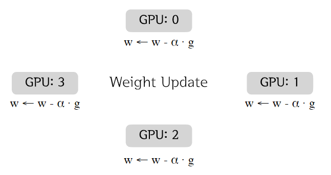

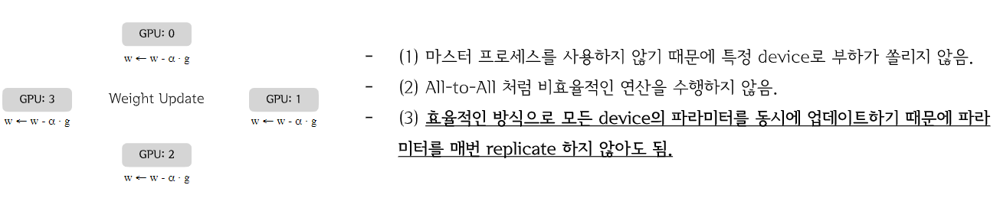

<br/>
<div align="right">
    <b><a href="#large-scale-lm에-대한-얕고-넓은-지식들">↥ back to top</a></b>
</div>
<br/>

### Horovod


- Ring All-reduce를 사용, Uber에서 개발한 Distributed Deep Learning Library
- Tensorflow, Pytorch, MXNet, Keras 등 다양한 백엔드 지원
- single/multi-node & multi-gpu 모델을 학습하기 위한 멀티프로세싱 모듈
    - Not multi-thread 모듈
- All-reduce를 사용하면 마스터 프로세스 개념이 없어지기 때문에 학습 과정이 심플해짐!


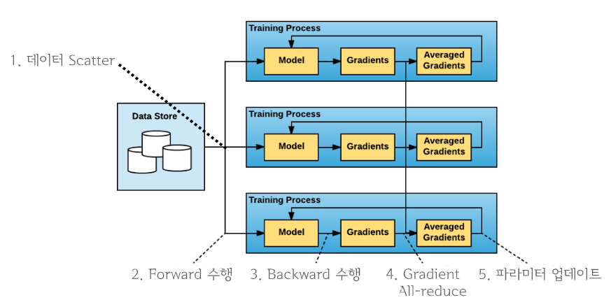

#### Parameter Server의 문제점
- All-reduce가 도입되기 이전, multi-node distributed training은 주로 `Parameter Server`를 통해 이루어짐!
- `Parameter Server`란? nn.DP에서 Gradient를 Reduce받는 마스터 프로세스와 비슷한 역할을 하는 서버
- 노드의 개수가 많아지면 Parameter Server 한대로는 감당이 안되기 때문에 여러 대의 서버를 사용하기도 함

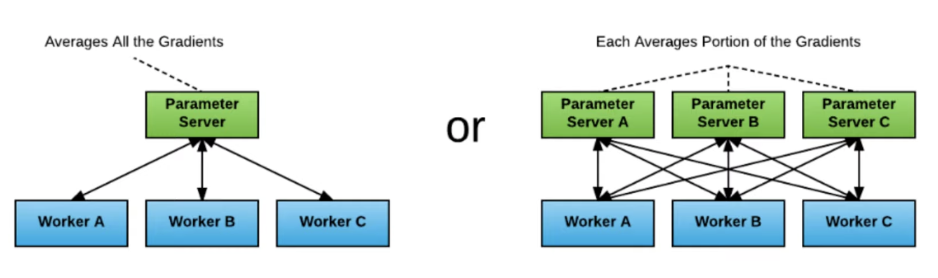

- (1) 몇 대의 worker node와 몇 대의 parameter server를 쓰는지에 따라 속도 차이가 생기는데 이를 configure하기가 어려움!

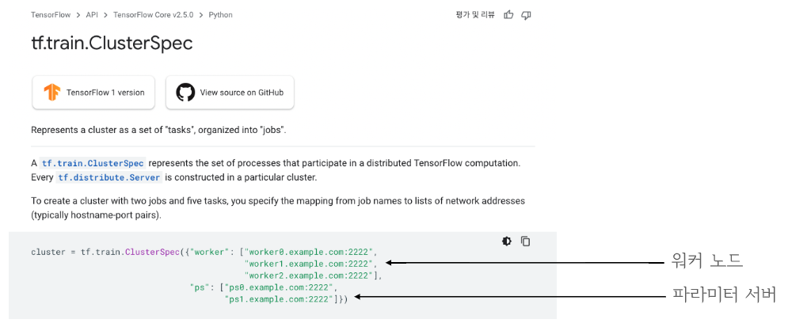

- (2) 또한 communication이 느리고 Worker가 줄어들기 때문에 이론적인 속도에 비해 한참 못 미치는 속도를 보여줌

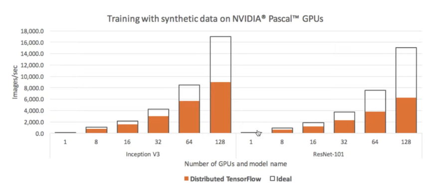

#### Ring All-reduce
- Horovod는 Ring All-reduce를 사용하여 문제를 해결!
- Parameter Server 없이 모든 노드를 Worker를 사용해서 성능을 개선!
    - All-reduce 덕분에 중앙 서버가 필요 없게 되었잖아!

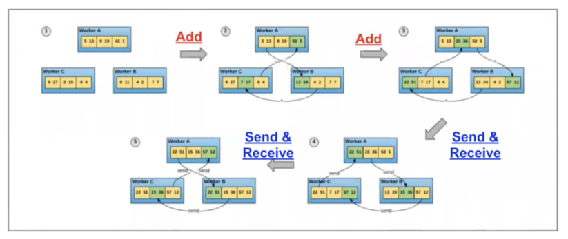

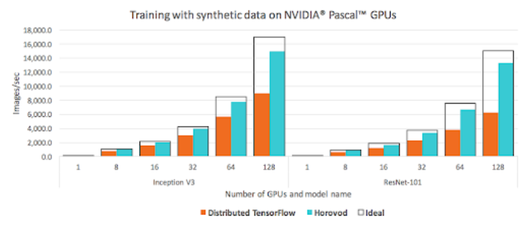

#### Tensor Fusion
- Tensor Fusion으로 성능을 개선! (65% 상승!)
- 전송하는 데이터의 크기가 작은 경우, All-reduce 연산 시에 overhead가 매우 많이 발생하여 성능이 떨어졌다고 한다.
- 그래서 일정한 사이즈의 Buffer를 만들어 놓고 tensor를 저장하다 buffer가 가득 차면 전송하는 방식을 채택!
- 이후의 DDP의 `Gradient Bucketing`과 비슷한 메커니즘!

#### RDMA
- Remote device의 memory에 직접 access하여 값을 쓰거나 읽는 방법
- TCP 통신에 비해 RDMA가 속도가 더 빨랐다고 한다.

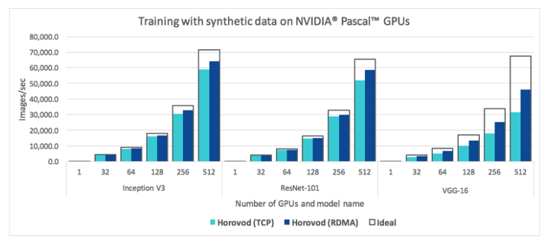

#### Codes
1) 먼저 Open MPI 설치
    - https://www.open-mpi.org/software/ompi/v4.0/ 다운로드 후 압축 해제
    ```
    $ cd openmpi-VERSION
    $ ./configure --prefix=/usr/local
    $ make all install
    ```

2) 그리고나서 NCCL 설치!
    - http://solarisailab.com/archives/%22https:/docs.nvidia.com/deeplearning/sdk/nccl-install-guide/index.html

3) 마지막으로 Horovod를 설치
    ```
    $ HOROVOD_GPU_ALLREDUCE=NCCL
    pip install horovod
    ```

- Horovod 코드 작성

```python
import torch
import horovod.torch as hvd
# device에 맞게 batch를 쪼개주는 과정이 필요!
from torch.utils.data.distributed import DistributedSampler
from torch.utils.data import DataLoader

# horovod initialization 수행
hvd.init()
# Local rank로서 사용할 GPU 고정
torch.cuda.set_devices(hvd.local_rank())
# 데이터셋 정의
train_dataset = ...
# sampler 생성
train_sampler = DistributedSampler(
    train_dataset,
    num_replicas=hvd.size(),
    rank=hvd.rank(),
)
# 데이터로더 생성
train_loader = DataLoader(
    train_dataset,
    batch_size-...,
    sampler=train_sampler,
)

# 모델 생성
model = BERT(args)
model.cuda()

# 옵티마이저를 DistributedOptimizer로!
optimizer = torch.optim.SGD(model.parameters())
optimzier = hvd.DistributedOptimizer(
    optimizer,
    named_parameters=model.named_parameters(),
)

# all-reduce 기반의 프레임워크들은 최초 1회만 모델을 broadcast
hvd.broadcast_parameters(
    model.state_dict(),
    root_rank=0,
)

for epoch in range(100):
    for idx, (data, target) in enumerate(train_loader):
        optimizer.zero_grad()
        output = model(data)
        loss = torch.nn.functional.nll_loss(output, target)
        loss.backward()
        optimizer.step()
```

- np: number of process (world size)
- H: hosted servers + ":n_gpu"
    ```
    $ horovodrun -np=8 \
        -H XXX.XXX.XXX>XXX:4, YYY.YYY.YYY.YYY:4 \
        python train.py
    ```

- pytorch-lightning을 사용하면 매우 쉽게 사용 가능!

```python
from pytorch_lightning import Trainer

lightning_model = ...

trainer = Trainer(
    args,
    accelerator='horovod', # 여기 한 줄만 바꾸면 된다!
)
```    

<br/>
<div align="right">
    <b><a href="#large-scale-lm에-대한-얕고-넓은-지식들">↥ back to top</a></b>
</div>
<br/>

### `nn.parallel.DistributedDataParallel()`
- Pytorch로 구현된 All-reduce distributed training 모듈
- single/multi-node & multi-gpu에서 모델을 학습하기 위한 멀티 프로세싱 모듈

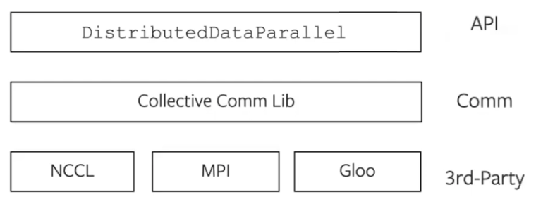

- `backward()`와 `step()` 중에서 언제 All-reduce를 실행하는게 좋을지 실험

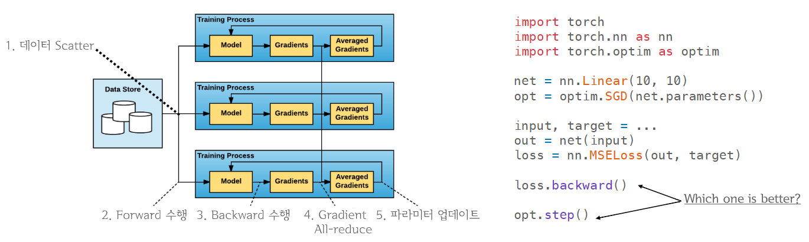

- 결과적으로 `backward`에서 수행하는 것이 훨씬 효율적!
    - backward가 훨씬 무거운 연산
- 따라서 Computation과 Communication을 더 많이 Overlap시킬 수 있어서 효율적

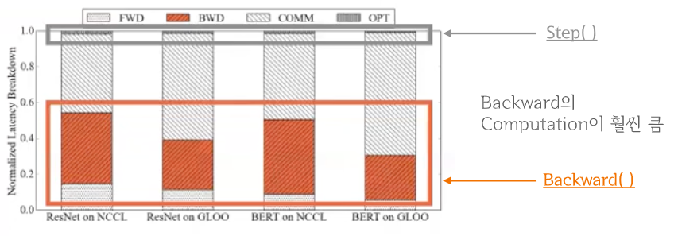

- `backward`연산을 수행하면서 중간중간 나온 Gradient를 계속 All-reduce하는 것
- `backward`연산을 수행하는 동시에 All-reduce하는 것이 기다렸다가 하는 것보다 효율적

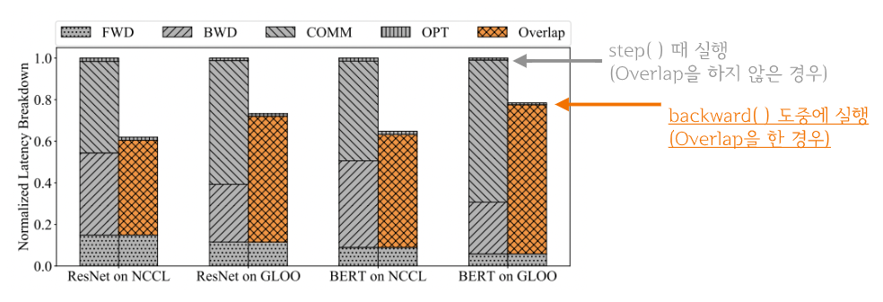

**Q1:** backward() 연산 중에 Gradient가 다 계산되지 않았는데 어떻게 All-reduce를 수행합니까?
- A1: backward()는 뒤쪽 Layer부터 순차적으로 이루어지기 때문에 계산이 끝난 것을 먼저 전송하면 된다.

**Q2:** 그렇다면 언제마다 All-reduce가 수행되나요? 기준이 있나요?
- A2: `Gradient Bucketing`을 수행! Bucket이 가득차면 그 때 All-reduce를 수행

#### Gradient Bucketing
- Horovod의 Tensor Fusion과 유사한 방식!
- `backward()` 연산 도중에 뒤쪽부터 Gradient를 버킷에 저장!
- 버킷에 저장되는 것은 모델의 parameter가 아닌 해당 layer에서 나온 Gradient!
- 모든 Bucket은 일정한 size를 가지고 있으며, `bucket_size_mb`라는 인자를 통해 버킷 사이즈를 변경 가능! (Mega byte level)

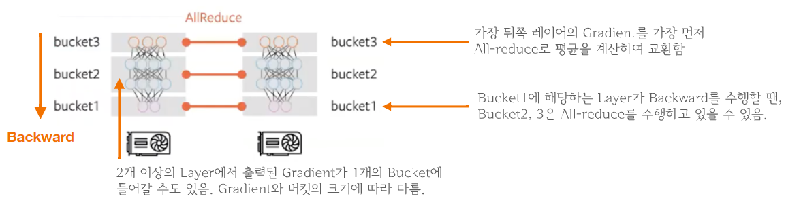

#### Codes

```python
import torch.distributed as dist
import torch.multiprocessing as mp
from torch.nn.parallel import DistributedDataParallel


def worker(rank, ngpus_per_node, args):
    # 현재 프로세스에서 사용 중인 디바이스 등록
    torch.cuda.set_device(rank)
    # 프로세스 그룹 초기화
    dist.init_process(
        backend='nccl',
        init_method='tcp://127.0.0.1:FREEPORT',
        world_size=args.world_size,
        rank=rank,
    )
    model = BERT(args)
    model.cuda(rank)
    # DistributedDataParallel로 모델 Wrapping!
    model = DistributedDataParallel(
        model,
        device_ids=[args.gpus],
        # bucket_size_mb=...,
    )
    for i in range(args.num_epochs):
        ...


def main():
    args = parser.parse_args()
    ngpus_per_node = torch.cuda.device_count()
    # 멀티프로세싱 spawn 시작
    mp.spawn(
        worker,
        nprocs=ngpus_per_node,
        args=(ngpus_per_node, args),
        join=True,
    )


if __name__ == "__main__":
    main()
```

- 아래 명령으로 실행
    ```
    python -m torch.distributed.launch \
        --nprocs_per_node=4 main.py \
        --world_size 2 \
        --gpus 0 1 2 3 \
        --num_epochs 10 \
        --batch_size 60
    ```

- 당연하게도 pytorch-lightning을 사용하면 매우 쉽게 사용 가능!

```python
from pytorch_lightning import Trainer

lightning_model = ...

trainer = Trainer(
    args,
    accelerator='ddp', # 여기 한 줄만 바꾸면 됨!
)

trainer.fit(
    lightning_model, train_loader, val_loader,
)
```

<br/>
<div align="right">
    <b><a href="#large-scale-lm에-대한-얕고-넓은-지식들">↥ back to top</a></b>
</div>
<br/>

## Model Parallelism
- `Mesh-tensorflow`, `Megatron-LM`, `Examples`

### Inter-layer model parallelism
- Layer-wise로 모델을 병렬화
- n번째 layer를 forward하기 위해서는 반드시 n-1번째 layer를 forward해야 함
- 따라서 주로 GPipe나 PipeDream과 같은 pipeline parallelism 도구를 함께 사용해야 한다.

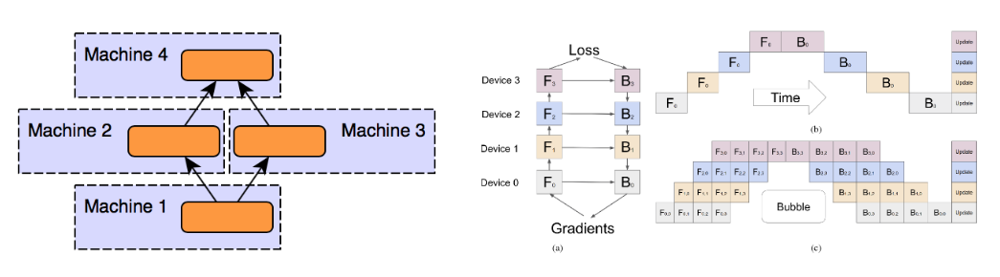

### Intra-layer model parallelism
- 모델을 layer-wise로 쪼개는 것이 아니라 Column 혹은 Row 방향으로 쪼개서 병렬화!
- 대표적으로 Mesh-tensorflow나 Megatron-LM

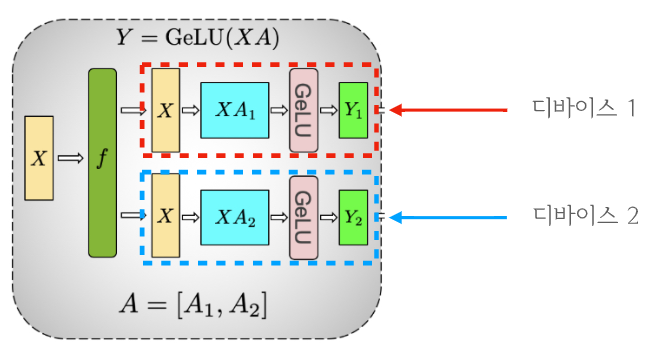

<br/>
<div align="right">
    <b><a href="#large-scale-lm에-대한-얕고-넓은-지식들">↥ back to top</a></b>
</div>
<br/>

### Mesh-tensorflow
- Google에서 개발한 오픈소스 모델/데이터 병렬처리 도구
- Al-reduce 기반의 Data Parallelism + Intra-layer model parallelism 지원
- Tensorflow 2.X 지원 안함...ㅎㅎ
- Mesh: 프로세서들이 포함될 수 있는 가상의 n-차원 배열
- Mesh-shape: Mesh 배열의 shape, 사용자가 원하는대로 병렬화 가능
    - 예를 들어, 32개의 TPU core가 있을 때, (4 x 4 x 2)와 같은 mesh shape으로 병렬화 가능
    - Mesh-shape은 가상의 shape! 실제 device topology와는 상관 X
- Layour Rules: 각각의 mesh-dimension에 원하는 대상을 부여

- Example: (`4:batch` x 4:hidden x 2:embed)

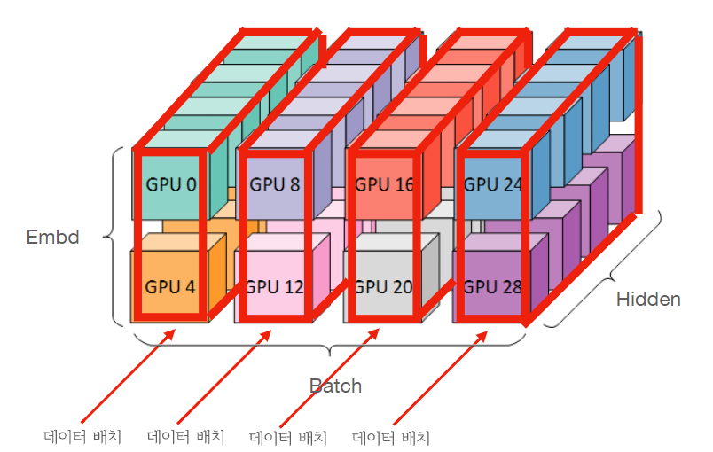

- Example: (4:batch x `4:hidden` x 2:embed)

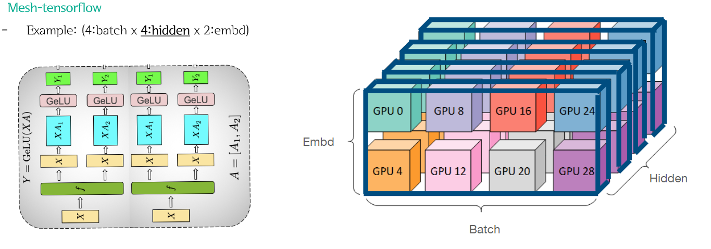

- Example: (4:batch x 4:hidden x `2:embed`)

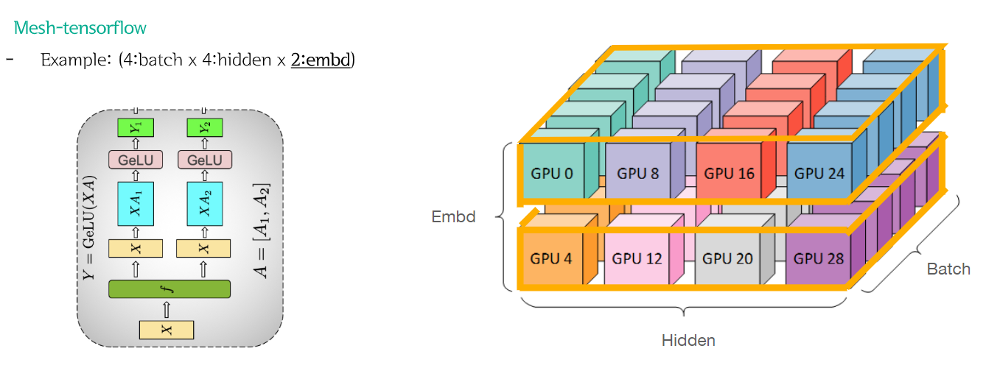

#### Codes
- 나는 안 쓸거라... ㅎㅎ
- 직접 typing은 하지 X

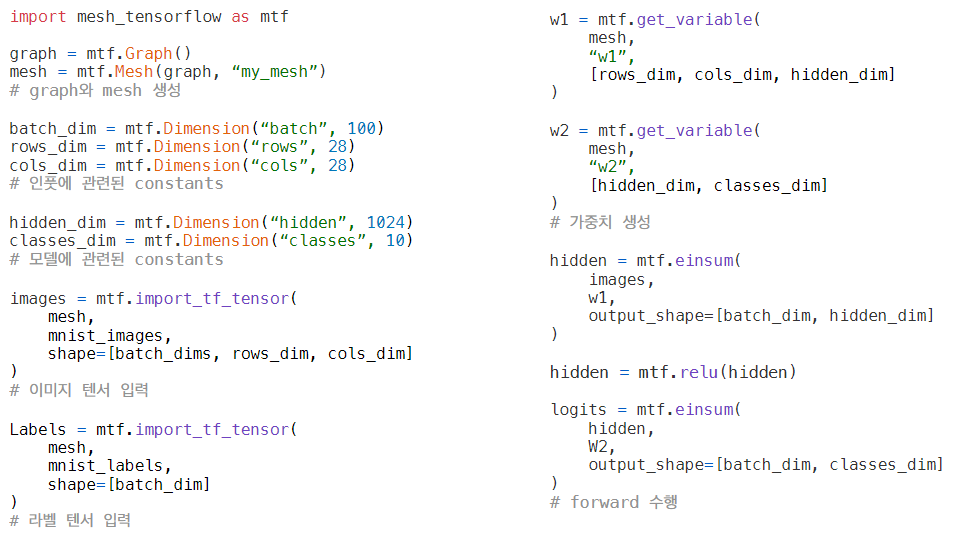

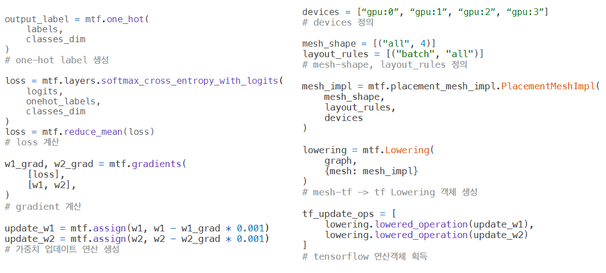

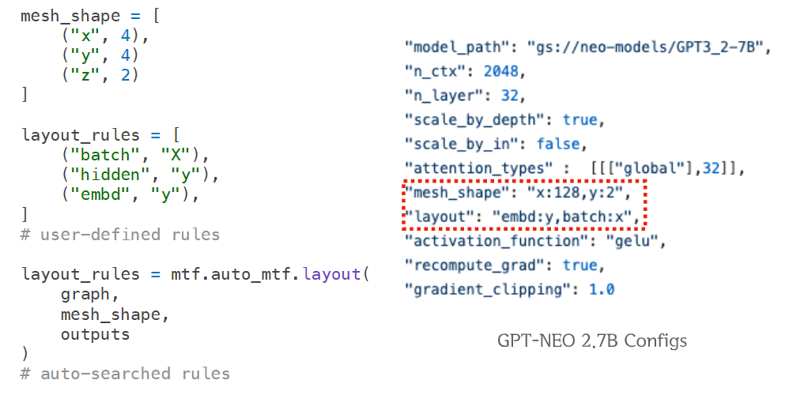

<br/>
<div align="right">
    <b><a href="#large-scale-lm에-대한-얕고-넓은-지식들">↥ back to top</a></b>
</div>
<br/>

### Megatron-LM
- Nvidia에서 개발한 Large-Scale parallel transformer LM
- Pytorch로 작성, Intra-layer model parallelism 지원
- Transformer 각 부분에 대한 병렬화 전략에 대해 이야기

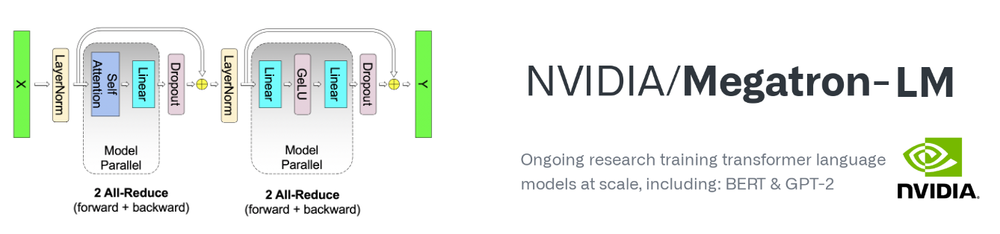

- FFN Weight: `[D, D] (e.g. 512 x 512)`가 있을 때, 두 가지 방식으로 병렬화 가능!
    - Row Parallel Linear: `[D/2 x D] (e.g. 256 x 512)`
        - 입력(TxD)이 들어오면 scatter하고 내적 후에 reduce 수행 (addition)
        - X `(T x D/2)` A `(D/2 x D)` = Y_list `[(T x D), (T x D)]` = Y_1 `(T x D)` + Y_2 `(T x D)` = Y `(T x D)`
    - Column Parallel Linear: `[D x D/2] (e.g. 512 x 256)`
        - 입력(TxD)이 들어오면 replicate하고 내적 후에 gather 수행 (concatenation)
        - X `(T x D)` A `(D x D/2)` = Y_list `[(T x D/2), (T x D/2)]` = Y_1 `(T x D/2)` @ Y_2 `(T x D/2)` = Y `(T x D)`
- 위 연산은 n개 병렬화로 확장 가능!


#### Row Parallel Linear

```python
def forward(self, input_):
    # Set up backprop all-reduce
    if self.input_is_parallel:
        input_parallel = input_
    else:
        input_parallel = scatter_to_tensor_model_region(input_)
    # Matrix multiply
    output_parallel = F.linear(input_parallel, self.weight)
    # All-reduce across all the partitions
    output_ = reduce_from_tensor_model_parallel_region(output_parallel)
    if not self.skip_bias_add:
        output = output_ + self.bias if self.bias is not None else output_
        output_bias = None
    else:
        output = output_
        output_bias = self.bias
    return output, output_bias
```

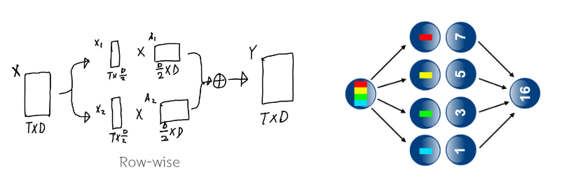


#### Column Parallel Linear

```python
def forward(self, input_):
    # Set up backprop all-reduce
    input_parallel = copy_to_tensor_model_parallel_region(input_)
    # Matrix multiply
    bias = self.bias if not self.skip_bias_add else None
    output_parallel = F.linear(input_parallel, self.weight, bias)
    if self.gather_output:
        # All-reduce across the partitions
        output = gather_from_tensor_model_parallel_region(output_parallel)
    else:
        output = output_parallel
    output_bias = self.bias if self.skip_bias_add else None
    return output, output_bias
```

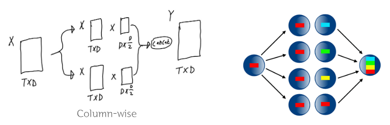

#### h to 4h mlp layer
- `column-wise` 병렬화

#### 4h to h mlp layer
- `row-wise` 병렬화

#### Examples

**Pytorch**

**Huggingface Transformers**

**FairSeq (Standalone)**

**Parlai**


<br/>
<div align="right">
    <b><a href="#large-scale-lm에-대한-얕고-넓은-지식들">↥ back to top</a></b>
</div>
<br/>

## Pipeline Parallelism
- `GPipe`, `PipeDream`, `Interleaved Schedules`, `3D Parallelism`

### GPipe

#### Inter-layer model parallelism 속도 개선!

#### Remarterializatoin

#### Torch GPipe

### Fairscale

### Pytorch-lightning

### PipeDream

#### (1) Weight Version Managing

#### (2) Work Partitioning

#### PipeDream 2BW

#### PipeDream Flush

### Interleaved Scheduling

### 3D Parallelism

<br/>
<div align="right">
    <b><a href="#large-scale-lm에-대한-얕고-넓은-지식들">↥ back to top</a></b>
</div>
<br/>

## Deep Speed
- `ZeRO`, `ZeRO-offload`, `ZeRO-infinity`, `1Bit-Adam`, `Progressive Layer Dropping`

### Mixed Precision

#### Loss Scaling

#### Is memory efficient?

### Zero Redundancy Optimizer
- `ZeRO`

### ZeRO-DP
- ZeRO powered Data Parallelism (3 stages)

### ZeRO-R
- ZeRO powered Residual states solutions

### ZeRO-offload
- Use CPU RAM for memory efficiency

### ZeRO-infinity
- Use External Memory (such as SSD) to break limit of memory

### Deep Speed
- ZeRO가 구현되어 있는 라이브러리

<br/>
<div align="right">
    <b><a href="#large-scale-lm에-대한-얕고-넓은-지식들">↥ back to top</a></b>
</div>
<br/>
