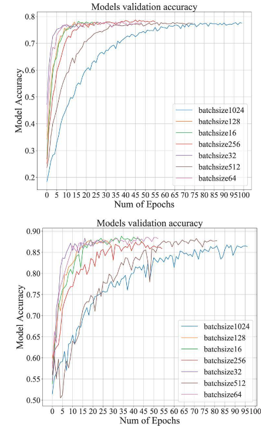
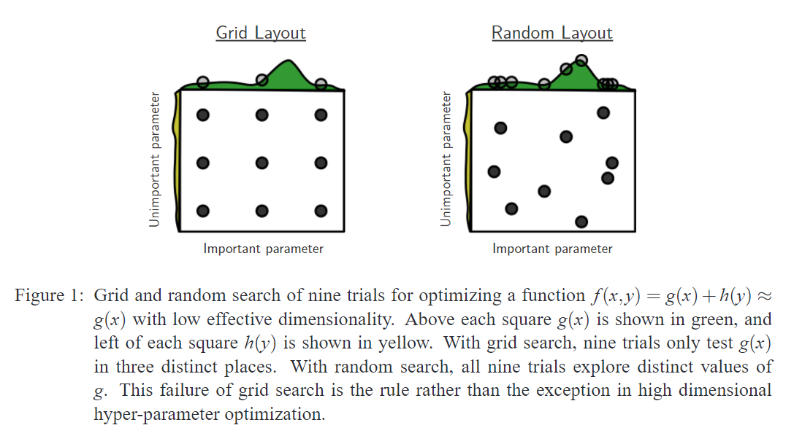
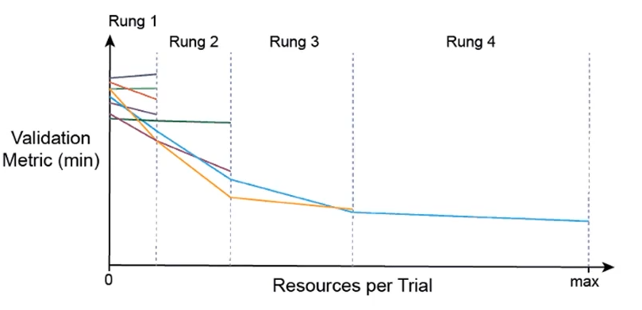

# 9강 Hyperparameter Tuning
- PyTorch 기반으로 여러 config들을 통해 학습할 때에 사용되는 parameter들을 실험자가 손 쉽게 지역 최적해를 구할 수 있도록 도와주는 Ray Tune 프레임워크로 최적화하는 방법을 학습합니다.

- 이를 통해 Grid & Random, 그리고 Bayesian 같은 기본적인 Parameter Search 방법론들과 Ray Tune 모듈을 사용하여 PyTorch 딥러닝 프로젝트 코드 구성을 하는 방법을 익히게 됩니다.

[back to super](https://github.com/jinmang2/boostcamp_ai_tech_2/tree/main/u-stage/pytorch)

- 사실, 데이터가 중요! 0.01을 끌어올릴 때 고려할만한 전략!

## Hyperparameter Tuning
- 모델 스스로 학습하지 않는 값은 사람이 지정!
    - e.g. learning rate, model size, optimizer
- hyperparameter에 의해 값이 크게 좌우될 때도 있음! (요즘은 뭐... 별로?)

    - https://content.iospress.com/articles/journal-of-intelligent-and-fuzzy-systems/ifs190033



- 가장 기본적인 방법? grid vs random
- 최근에는 bayesian 기반 기법들이 주도!
    - https://dl.acm.org/doi/pdf/10.5555/2188385.2188395



## Ray
- multi-node multi processing 지원 모듈
- ML/DL의 병렬 처리를 위해 개발된 모듈
- 기본적으로 현재의 분산 병렬 ML/DL 모듈의 표준
- Hyperparameter Search를 위한 다양한 모듈 제공



```python
# config에 search space 지정
config = {
    "l1": tune.sample_from(lambda _: 2**np.random.randint(2,9)),
    "l2": tune.sample_from(lambda _: 2**np.random.randint(2,9)),
    "lr": tune.loguniform(1e-4, 1e-1),
    "batch_size": tune.choice([2, 4, 8, 16])
}

# 학습 스케줄링 알고리즘 지정
scheduler = ASHAScheduler(
    metric="loss",
    mode="min",
    max_t=max_num_epochs,
    grace_period=1,
    reduction_factor=2,
)
# 결과 출력 양식 지정
reporter = CLIReporter(
    metric_columns=["loss", "accuracy", "training_iteration"]
)

# 병렬 처리 양식으로 학습 시행
result = tune.run(
    partial(train_cifar, data_dir=data_dir),
    resources_per_trial={"cpu": 2, "gpu": gpus_per_trial},
    config=config,
    num_samples=num_samples,
    scheduler=scheduler,
    progress_reporter=reporter,
)
```

## Code 실습
- 라이브러리 설치

```
!pip install ray
!pip install tensorboardX
!pip install wandb
```

- 사용할 모듈 호출

```python
from functools import partial
import numpy as np
import os
import torch
import torch.nn as nn
import torch.nn.functional as F
import torch.optim as optim
from torch.utils.data import random_split
import torchvision
import torchvision.transforms as transforms
from ray import tune
from ray.tune import CLIReporter
from ray.tune.schedulers import ASHAScheduler

import wandb
```

- data 호출, 모델, 학습 스크립트 작성
    - 공유 X
- 학습 스크립트에 추가되는 부분 존재!
- 학습 처리 부분이 함수로 되어있어야 ray에서 호출 가능

```python
def train(config, ckpt_dir=None, data_dir=None):
    # 모델 정의
    # 데이터 병렬화 실시
    # criterion, optimizer 정의
    # ckpt_dir있으면 호출
    # 데이터셋 호출
    # loader 제작
    wandb.init(project='torch-turn', entity='jinmang2')
    wandb.watch(net)
    for epoch in range(10): # loop over the dataset multiple times
        running_loss = 0.0
        epoch_steps = 0
        for i, data in enumerate(trainloader, 0):
            # prepare input
            # zero_grad
            # forward + backward + Optimize
            # print statistics
        # valid phase
        for i, data in enumerate(valloader, 0):
            # 학습과 동일
        wandb.log({"val_loss": val_loss})
        wandb.log({"loss": loss})

        with tune.checkpoint_dir(epoch) as checkpoint_dir:
            path = os.path.join(checkpoint_dir, "checkpoint")
            torch.save((net.state_dict(), optimizer.state_dict()), path)

        tune.report(loss=(val_loss / val_steps), accuracy=correct/total)
```


## Reference
- [Pytorch와 Ray 같이 사용하기](https://pytorch.org/tutorials/beginner/hyperparameter_tuning_tutorial.html)
