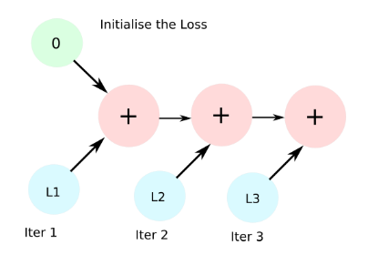

# 10강 PyTorch Trouboleshooting
- PyTorch를 사용하면서 자주 발생할 수 있는 GPU에서의 Out Of Memory (OOM) 에러 상황들의 예시를 보고 해결하는 법까지 학습합니다. 프로그래밍 도중 디버깅하기 어려운 GPU 사용시 발생할 수 있는 문제들이 발생할 때 GPU 메모리 디버깅을 도와주는 툴과 초보자가 쉽게 놓칠 수 있는 사소한 실수들의 예제들을 확인합니다.

[back to super](https://github.com/jinmang2/boostcamp_ai_tech_2/tree/main/u-stage/pytorch)

## OOM이 해결하기 어려운 이유들
- 왜 발생했는지 알기 어려움
- 어디서 발생했는지 알기 어려움
- Error Backtracking이 이상한데로 감
- 메모리의 이전 상황의 파악이 여러움
- 보통은,
    - `Batch Size` 줄이고
    - GPU Clean 시켜서 `Run`!

## GPUitl 사용하기
- nvidia-smi처럼 GPU의 상태를 보여주는 모듈!
- Colab은 환경에서 GPU 상태를 보여주기 편함
- iter마다 메모리가 늘어나는지 확인!

```python
!pip install GPUitl

import GPUtil
GPUtil.showUtilization()
```

## torch의 empty cache 함수 써보기
- `torch.cuda.empty_cache()`
- 사용되지 않는 GPU상 cache를 정리
- 가용 메모리를 확보
- del과는 구분이 필요
- reset 대신 쓰기 좋은 함수

```python
import torch
from GPUtil import showUtilization as gpu_usage

print("Initial GPU Usage")
gpu_usage()

tensorList = []
for x in range(10):
    tensorList.append(torch.randn(10000000, 10).cuda())

print("GPU Usage after all coating a bunch of Tensors")
gpu_usage()

del tensorList

print("GPU Usage after deleting the Tensors")
gpu_usage()

print("GPU Usage after emptying the cache")
torch.cuda.empty_cache()
gpu_usage()
```

## trainig_loop에서 tensor로 축적되는 변수는 확인할 것!
- tensor로 처리된 변수는 GPU 상에 메모리 사용
- 해당 변수 loop안에 연산이 있을 떄 GPU에 computational graph를 생성 (메모리 잠식)

```python
total_loss = 0
for i in range(10000):
    optimizer.zero_grad()
    output = model(input)
    loss = criterion(output)
    loss.backward()
    optimizer.step()
    total_loss += loss
```

- 1-d tensor의 경우 python 기본 객체로 변환하여 처리할 것!
    - https://blog.paperspace.com/pytorch-memory-multi-gpu-debugging/
- 아... 저렇게 item으로 넣어주는 이유가 계산 그래프 간소화구나!

```python
total_loss = 0

for x in range(10):
    # assume loss is computed
    iter_loss = torch.randn(3, 4).mean()
    iter_loss.requires_grad = True
    total_loss += iter_loss.item()
```



## `del` 명령어를 적절히 사용하기
- 필요가 없어진 변수는 적절한 삭제가 필요함
- python의 메모리 배치 특성상 loop이 끝나도 메모리를 차지함

```python
for x in range(10):
    i = x
print(i) # 9 is printed

# 아래는 bad code!
for i in range(5):
    intermediate = f(input[i])
    result += g(intermediate)
output = h(results)
```

## 가능한 batch size 실험해보기
- 학습시 OOM이 발생했다면 batch size를 1로 해서 실험해보기
```python
oom = False
try:
    run_model(batch_size)
except RuntimeError: # Out of memory
    oom = True

if oom:
    for _ in range(batch_size):
        run_model(1)
```

## no_grad 사용하기!
- `torch.no_grad`
- inference 시점에서는 `no_grad` 사용!
- backward pass로 인해 쌓이는 메모리에서 자유로움!

## 예상치 못한 에러 메세지
- OOM말고도 유사한 에러들이 발생
- `CUDNN_STATUS_NOT_INIT`이나 `device-side-assert` 등
- 해당 에러도 cuda 관련하여 OOM의 일종으로 생각 가능!
- 근데 사실 위에 다 cpu로 내려보면 index문제거나 그런 경우가 많음

## Reference
- [PyTorch에서 자주 발생하는 에러 질문들](https://pytorch.org/docs/stable/notes/faq.html)
- [OOM에서 GPU 메모리 flush하기](https://discuss.pytorch.org/t/how-to-clean-gpu-memory-after-a-runtimeerror/28781)
- [GPU 에러 정리](https://brstar96.github.io/shoveling/device_error_summary/)
